# Phase 2 Delivery Update

The following report consolidates the project evolution in the second delivery.

`Phase 2` includes the correction and parameterization of the inclined world, the logical definition of the goal area (where the experiment ends), the acquisition of acceleration stimulus and rattle stimulus, the **initial** implementation of the four-neuron plastic network as a **first version** of the involved equations and its integration into the simulation `LEARNING` mode (at this point for simulation-coupling validation only), experimental telemetry, and artifact generation for each run are also part of this delivery. The final form of the plastic neural network and the learning protocol should be a central topic of `Phase 3`.

In the current state, the engineering implementation and experimental workflow are complete, but the runs carried out at this stage are still exploratory: they demonstrate system operation but do not constitute a controlled experiment nor sufficient evidence to attribute the observed behavior to neural plasticity.

For Phase 3, the plan includes implementing an unsupervised batch simulation mode that can vary specific parameters and compare the outcome of a set of experiments. This will facilitate studying the impact of different neural plasticity mechanisms. More details are in the `Suggested experiment for Phase 3` section.

The experiment and simulation up to this point were created with broad reproducibility in mind. More details are in `Appendix A - Reproduction guide`. The full project code is available at https://github.com/lnncrs/DomanNeurocomputationalModel

Because the report remained extensive even after repeated content removal, and a large part of it was only modified from report 1, I took the liberty of marking excerpts with truly new information or points of special interest for the `Phase 2` delivery with <mark>TEXT MARKER</mark>. A quick reading of the report can be done by reading only the marked excerpts.

**A video with one simulation run and a brief introduction to the new features is available at https://youtu.be/twNaPXXH5lA**


# Neurocomputational model of motor reorganization

Lenin Cristi

CMCC - Federal University of ABC (UFABC)
Santo André - SP - Brazil

lenin.cristi@aluno.ufabc.edu.br

Abstract. This work aims at the computational and robotic reproduction of the experiment Doman's Inclined Floor Method for Early Motor Organization Simulated with a Four Neurons Robot (2011) by Ropero Peláez and Lucas Santana, in which a robot controlled by a four-neuron plastic neural network learns to organize its motor behavior on an inclined plane, inspired by Glenn Doman's early motor stimulation method.

## Summary

- Abstract
- Project Objective
- Introduction
  - The original experiment
  - The neural network used
  - Motor mapping
  - Sensing
- Methodology
  - Incremental construction and validation strategy
  - World simulation
  - Development
  - Project status at the end of Phase 2
  - Running a simulation
  - Detailed mapping of control modes
- Functions and equations
  <!--
  - Sensory normalization and summation
  - Activation, sigmoid output, and competition
  - Synaptic plasticity
  - Intrinsic plasticity
  - Distance, displacement, and movement classification
  - Acceleration, rattle, and learning criteria
  -->
- Experimental parameters
  - Neural network parameters
  - Learning protocol parameters
  - Webots world parameters
  - Robot and sensor parameters
- Conclusion
- References
- Appendices
  - Appendix A - Reproduction guide
    - Software requirements
    - Hardware requirements
    - Installing GCC, G++ and make
    - Installing Git
    - Cloning the repository
    - Installing Webots
    - Recommended Python environment with uv
    - Alternative with pip
    - Alternative with conda
    - Optional editor and extensions
    - Environment validation
    - Minimum checklist
  - Appendix B - Repository structure
    - Root configuration files
    - Model source code
    - Webots simulation structure
    - Documentation, examples and validation
    - Automated tests
  - Appendix C - Historical evolution of the simulation
    - Physics simulation
    - Robot collision simulation
    - Control simulation
  - Appendix D - Parameter location and configuration
    - Neural network parameters
    - Learning protocol parameters
    - Webots world parameters
    - Robot and sensor parameters

## Abstract

This work aims at the computational and robotic reproduction of the experiment *Doman's Inclined Floor Method for Early Motor Organization Simulated with a Four Neurons Robot (2011)* by Ropero Peláez and Lucas Santana, in which a robot controlled by a four-neuron plastic neural network learns to organize its motor behavior on an inclined plane, inspired by Glenn Doman's early motor stimulation method.

The original implementation was carried out using *LEGO Mindstorms NXT* in *MATLAB* and depended on sensors and stimuli related to acceleration, vision, and sound, represented respectively by an acceleration detection mechanism, by a light sensor pointing to the striped ramp to detect transitions, and by a microphone capturing the sound of a rattle at the goal. This project develops a reproducible version of the experiment using a flexible multi-paradigm language and a modular sensing and control architecture. The full project code is available at https://github.com/lnncrs/DomanNeurocomputationalModel

The reconstruction was deliberately conducted incrementally, separating world modeling, physics validation in that world, robot construction and instrumentation with sensors, the Webots control interface, and finally integration with the neural network.

This organization made it possible to test each component in each layer in isolation before integrating it into the complete experiment, reducing the difficulty of identifying failures and increasing system reproducibility. In this phase, however, only acceleration and sound stimuli were integrated, while the visual channel remains planned but disabled.

<mark>
Versioned Webots simulation environments were created under `webots\worlds`, the main one being `webots\worlds\experiment_inclined_plane.wbt`, already integrated with a first attempt at a four-neuron recurrent plastic neural network. This environment simulates the inclined plane, the goal, the robot, and acceleration and sound stimuli, enabling controlled experiments:
</mark>
<br/><br/>


Image: Simulator ready for the experiment

<mark>
This simulation also includes an experiment monitoring screen with detailed telemetry for sensors, experiment, control, and motors, the synthetic rattle stimulus that rewards displacement toward the goal inspired by the paper is visible, and detailed run logs are saved:
</mark>
<br/><br/>

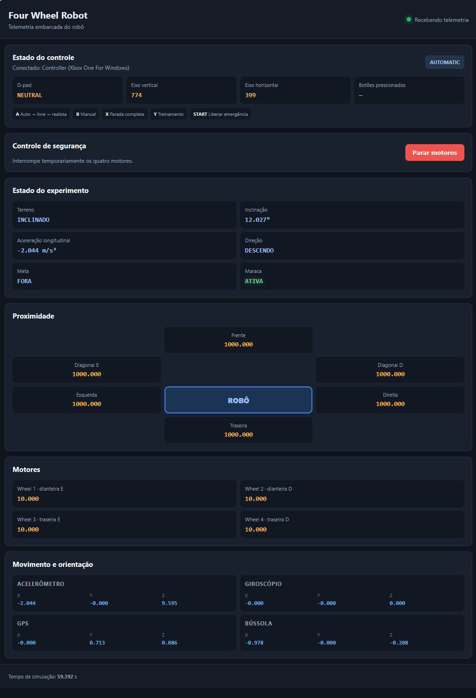

Image: Robot telemetry monitoring screen

## Project Objective

The core objectives of the original experiment are:

- Simulate infant motor learning conditions;

- Observe the emergence of emergent behavior;

- Analyze, from this behavior, possible parallels with neuroplasticity processes.

> **Note:** At this point, we understand that the simulation, the robot, and even learning are treated as means rather than final goals.

## Introduction

### The original experiment

Before building the project, it was essential to perform a detailed reading of the paper describing the original experiment *Doman's Inclined Floor Method for Early Motor Organization Simulated with a Four Neurons Robot (2011)*, also available in the repository at `docs\Testing the inclined plane technique with a four neurons robot.pdf`.

This reading revealed a fundamental point about the experiment: the goal of the experiment was not simply to make the robot learn to move, but rather to use a simple robotic and neural architecture to investigate how sensory stimuli and certain plasticity mechanisms could contribute to the initial organization of motor behavior.

The experiment seeks to reproduce, in a simplified way, some elements present in Doman's inclined plane method:

- acceleration produced during movement on the inclined plane, as an analogy to vestibular stimulation;

- visual transitions generated by the black and white stripes on the ramp;

- sound stimulus produced by a rattle after downward movements toward the goal;

- physical environment formed by the inclined plane;

- simple neural system, composed of four interconnected plastic neurons.

Initially, the robot has no preferred direction. When a sequence of motor commands produces downward movement, gravity results in greater acceleration and faster transitions between the visual stripes of the ramp. In addition, the downward movement is followed by the rattle sound stimulus. These stimuli influence synaptic and intrinsic plasticity mechanisms, favoring the formation of neural sequences associated with displacement on the ramp. In the paper, the robot is considered to have learned when it executes movements in the same direction for five consecutive iterations.

The model does not intend to fully reproduce the infant nervous system or directly demonstrate how a child learns to move. It constitutes a controlled computational analogy, used to observe the relation between sensory stimuli, plasticity, and motor organization and, from that, formulate hypotheses about processes involved in the initial acquisition of movement.

Thus, the robot's learning does not constitute the final objective of the experiment, but a means to investigate, in a simplified and controllable system, how sensory stimuli and plasticity mechanisms may participate in organizing motor behavior.

### The neural network used

<mark>
The paper describes a fully interconnected network composed of four excitatory rate-code neural units. Each neuron receives the sum of sensory stimuli and signals from previous activity of other neurons and from its own recurrent connection. A competition mechanism keeps only the most activated neuron active (highest sigmoid output) in each iteration.
</mark>
<br/><br/>

> **Note:** The implementation presented here is a first attempt to reproduce the one presented in the paper. Just as subsequent readings of the paper led to correcting the locomotion mechanism from differential to axis-based, the network will be revised.

The architecture has four recurrent connections, each connecting one neuron to itself, with fixed weights of *0.7*. The twelve connections between different neurons have modifiable or *plastic* weights.

| **Receives from / Output from** | **N1** | **N2** | **N3** | **N4** |
| ------------------------------- | -----: | -----: | -----: | -----: |
| **N1**                          |    0.7 |    w₁₂ |    w₁₃ |    w₁₄ |
| **N2**                          |    w₂₁ |    0.7 |    w₂₃ |    w₂₄ |
| **N3**                          |    w₃₁ |    w₃₂ |    0.7 |    w₃₄ |
| **N4**                          |    w₄₁ |    w₄₂ |    w₄₃ |    0.7 |

Table: Neural connections in the network

Where:
- $w_{12}$: connection from **N2 to N1**
- $w_{21}$: connection from **N1 to N2**
- The `0.7` values on the diagonal represent fixed self-recurrent connections.

<mark>
Learning occurs incrementally at each iteration through two complementary mechanisms: synaptic plasticity, which alters the weights between neurons, and intrinsic plasticity, which shifts each unit's activation function according to its activity history.
</mark>
<br/><br/>

These neurons are still artificial models, but they differ from those used in many conventional neural networks: There are no deep layers, loss function, labeled data, or error backpropagation.

Adaptation occurs from the sensory feedback produced by the consequences of the robot's actions, which modulates neuronal activity and, indirectly, synaptic changes.

The small number of neurons makes it possible to directly track weights, activations, winner neurons, and produced motor sequences. This interpretability is a useful property of the architecture, although the paper does not explicitly state that choosing four neurons was determined exclusively by this objective.

The model does not intend to reproduce all the complexity of a biological neural system. It represents a simplified computational structure, used to investigate how plasticity, competition, and sensory feedback may contribute to progressive motor behavior organization.

> **Note:** In a first visit to the lecture *Modelagem de redes bioinspiradas. Prof. Javier Ropero Peláez (UFABC)* available at https://www.youtube.com/watch?v=j9ElSxpLWzw I believe this model can be considered phenomenological (because we do not model ion channels, potentials, membranes, etc. in detail) and rate-based due to the *firing rate* characteristic used.

### Motor mapping

<!-- todo this is not clear
The system's general flow is:

```text
previous action
→ environment response
→ acceleration + vision + sound
→ normalization and sensory summation
→ recurrent activation
→ sigmoid output
→ competition
→ winner neuron
→ synaptic and intrinsic update
→ new motor action
→ environment response
→ next iteration
```
-->

<mark>
In the virtual robot, each wheel has an independent motor. To preserve the functional organization of the original experiment, the `LEARNING` mode adapter groups these motors into front and rear sets. Each neuron thus corresponds to one motor primitive, and competition keeps only one neuron active per iteration. The neural model only knows abstract actions, and conversion to the robot's four motors is done by an adapter.
</mark>
<br/><br/>

| Neuron | Motor primitive |
|---|---|
| N1 | front set, clockwise direction |
| N2 | front set, counterclockwise direction |
| N3 | rear set, clockwise direction |
| N4 | rear set, counterclockwise direction |

Table: Translation of abstract actions into motor primitives

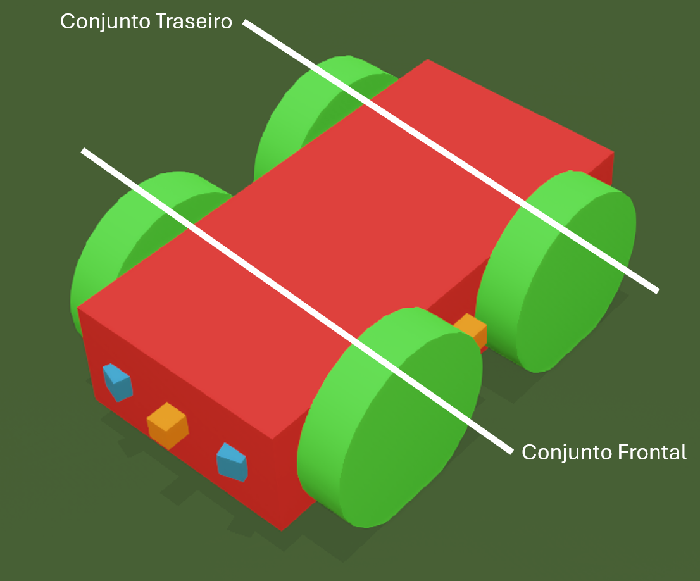

Image: Robot *close-up* showing the two front/rear axes in perspective

> **Implementation note:** **Acceleration** feedback is computed from the variation of longitudinal acceleration measured during each motor window. **Rattle** sound stimulus feedback is produced synthetically when there is a reduction in distance to the rectangular goal area and this reduction is sufficient for movement to be classified as downward. Therefore, the current implementation does not use a physical microphone/speaker pair, and the visual stripe-detection channel remains unimplemented at this stage. These mechanisms are detailed in the functions, equations, and experimental protocol sections.

> **Historical note:** In early simulation versions, `neurons → movement` mapping was incorrectly interpreted as differential configuration between left and right sides. Re-reading the paper led to correction of `LEARNING` mode to `neurons → movement` organization for front/rear axes in clockwise and counterclockwise directions. The manual control `MANUAL` and automatic collision-avoidance `AUTOMATIC` modes continue using differential control and were not affected by this change.

### Sensing

<mark>
The base robot comes from the Webots tutorial preserved at `webots\tutorials\4_wheels_robot.wbt`. It was adapted and gained 4 additional external proximity sensors in each direction, kept the original front diagonal proximity sensors, and received the following additional non-visible sensors:
</mark>
<br/><br/>

- Accelerometer
- Gyroscope
- GPS
- Compass

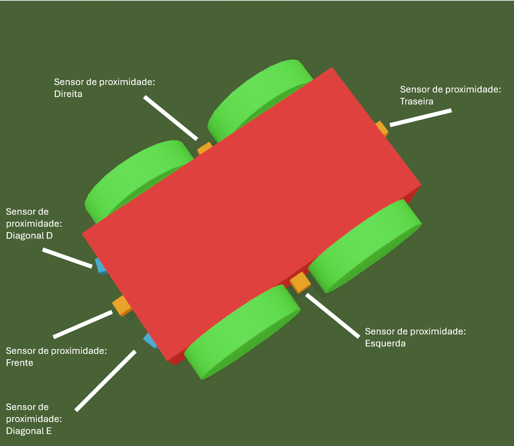

Image: Robot *close-up* showing original and additional proximity sensors (only these are visible)

## Methodology

Reconstructing the experiment involves interdependent components:

- the inclined environment;
- physical dynamics;
- robot structure;
- onboard sensors;
- external stimuli;
- motor control;
- neural network.

Changes to these elements can modify observed behavior and, consequently, make it harder to identify failure origin. In the original experiment, the robotic structure was built with *LEGO Mindstorms NXT*, while the neural network and sensorimotor commands were implemented in *MATLAB* using the *RWTH Mindstorms NXT Toolbox*. Direct reproduction of this structure on a new physical platform would require handling mechanical, electronic, sensory, and computational issues simultaneously.

### Incremental construction and validation strategy

To reduce the chance of unidentified or untraceable failure, an incremental layered strategy was adopted. Each component is built and validated in isolation and later integrated with others. This approach allows distinguishing issues related to environment, physics, robot, control, and neural model.

Simulation was used as the initial development environment because it allows:

- controlling experimental conditions;
- repeating trials under equivalent settings;
- directly observing positions, velocities, accelerations, and motor commands;
- testing components in isolation;
- reducing cost of mechanical changes;
- systematically recording variables for each run.

Building a physical robot was kept as a stage after validating behavior in the simulated environment. The neural core and experimental protocol were separated from the simulator interface to favor future reuse.

> **Note:** Although the layered structure favors code reuse, a physical implementation will still require a specific adapter for platform sensors, motors, measurement units, and timing constraints.

<mark>
To avoid confusion with project delivery and documentation phases, the five development blocks are treated in this report as technical implementation stages.
</mark>
<br/><br/>

| Stage | Scope | Status at end of Phase 2 |
|---|---|---|
| 1 - Environment | Construction of inclined and horizontal planes and validation of their geometry | completed |
| 2 - Physics | Gravity, collision, ramp contact, and solid behavior tests | completed |
| 3 - Robot | Modeling body, wheels, motors, joints, and sensors | completed |
| 4 - Control and instrumentation | Implementation of `MANUAL` and `AUTOMATIC` control modes, telemetry, and acquisition of experimental variables | completed |
| 5 - Neural integration | Implementation of initial four-neuron network and integration with `LEARNING` mode | integration completed validation pending |

Table: Project technical completeness

> **Note:** In technical stage 4, two additional unplanned control modes had to be implemented: `PASSIVE_FREE` and `PASSIVE_REALISTIC`. In the first, available motor torque is disabled, leaving wheels free. In the second, available torque is limited to 0.03 N·m per wheel, representing small motor resistance. These modes were essential to test sliding and gravity influence on the robot on inclined planes.

Completion of a technical stage indicates that its essential components are implemented and functionally integrated.

### World simulation

For simulation, research was performed considering two main environments: *Webots* and *PyBullet*. Webots was chosen because it offers greater ability to represent motors, actuators, and sensors in a way close to physical implementation, within an integrated simulation environment. The platform also supports Python, C, and C++ controllers, as well as a library of reusable worlds and components.

The main reasons for choosing Webots were:

- integrated modeling of sensors, motors, and actuators;
- support for Python, C, and C++ controllers;
- simulation of interactions between bodies, joints, and surfaces;
- reusable world and component library;
- conceptual proximity to a future physical implementation.

An important point of Webots is allowing initial controller development in Python, providing greater flexibility for implementing and validating the neural model. The platform also supports C and C++ controllers, broadening integration possibilities with other platforms and future adaptations to physical hardware.

<mark>
Implementation was organized so that the neural model and experimental protocol do not directly depend on internal details of the simulated robot. This separation favors core system reuse, although a physical implementation still requires a specific adapter for sensors, motors, measurement units, and timing constraints of chosen hardware.
</mark>
<br/><br/>

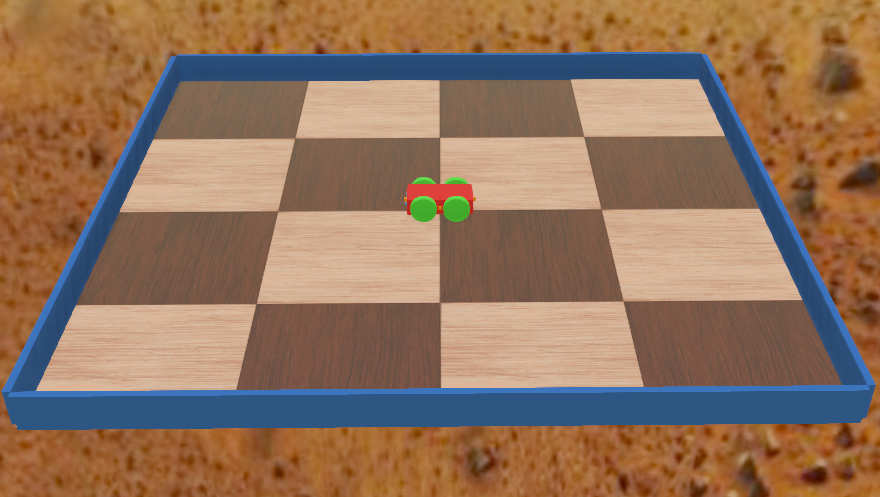

Image: Non-inclined *half-size* plane used in tests

The Webots library of worlds, objects, and examples, partially preserved in `webots\tutorials`, was also a relevant factor in the choice, because it provided references for initial construction of environments, joints, sensors, and controllers used in the project.

### Development

The project was developed with open tools and organized to favor experiment reproduction.

Webots is used for physical simulation, while Python implements the neural network, controller integration, and artifact generation for each run. System dependencies such as *gcc* and *make*, as well as Python dependencies, are fully mapped in the appendix.

A preliminary listing of the software used is as follows:

- *Windows* and *Linux* platforms supported with instructions available for both, since experiment reproduction is operating-system agnostic.

- *Git* tools to clone and operate the project repository;

- *Webots R2025a* to run simulations;

- *gcc* compiler with *make* and *sh* available, as it is used by *Webots R2025a* when creating *controllers* and *plugins* libraries;

- *uv* environment recommended, but *pip* or *conda* can also be used;

- Python 3.13 provided by the chosen environment above;

- A network validation with synthetic data uses a *Jupyter* notebook; additionally, *numpy*, *pandas*, and *matplotlib* are recommended;

- Automated tests use *pytest*;

### Project status at the end of Phase 2

<mark>
By the end of Phase 2, the physical environment, robot, instrumentation, and first neural network are integrated in `LEARNING` mode. The neural network executes a displacement that is classified as "downward or not" toward the goal, and in the positive case, the "virtual rattle" is activated and combined with the accelerometer stimulus that feeds the next neural step.
</mark>
<br/><br/>

<mark>
The full experimental workflow already produces telemetry, per-iteration records, metadata, summaries, and HTML reports. Automated tests validate software components, and exploratory runs demonstrate that the robot can complete the path.
</mark>
<br/><br/>

<mark>
These results confirm only system integration. It is still not possible to attribute observed behavior (the cart indeed goes down the ramp) to neural plasticity. The paper's ramp is deliberately and slightly slippery, and this was faithfully reproduced in the simulated environment. Therefore, it is necessary to simulate different ramp adhesions to rule out sliding as the key cause of descent. In other words, rattle activation confirms that the action was classified as downward by the protocol; however, it does not constitute learning evidence, because it is produced deterministically from that same classification.
</mark>
<br/><br/>

A list of key project capabilities functional in this phase is as follows:

- Webots maps were created separately from robot artifacts, which in turn have onboard sensing independent of the map. This may allow reusing the robot and generated network in different maps and, in the future, measuring training robustness, for example by training on one map and testing on another;
- Goal area created in green for easy identification (this color is used only for the goal in the project), decoupled and parameterized to facilitate reuse in different maps;
- Robot with support for different modes and controls, including manual mode via *joystick*;
- Simulation and experiment variables identified;
- Interactive simulation monitoring screen with telemetry and real-time training data;
- Generation of experiment metadata and JSONL logs accompanied by an HTML report with details of the generated network;

> **Note:** There is duplication in delivery of the goal and controller parameter, because both need to receive goal location; this will be removed in the future.

> **Note:** Experiment variables and parameters are mapped but not centralized. They will be centralized and completely decoupled (possibly in different locations) in the future.

### Suggested experiment for Phase 3

<mark>
A suggested set of experiments for Phase 3 is as follows:
</mark>
<br/><br/>

| Condition                | Synaptic plasticity | Intrinsic plasticity | Stimuli            |
| ------------------------ | ------------------: | -------------------: | ------------------ |
| Full network             |              enabled |              enabled | acceleration + sound |
| No plasticity            |             disabled |             disabled | acceleration + sound |
| Synaptic only            |              enabled |             disabled | acceleration + sound |
| Intrinsic only           |             disabled |              enabled | acceleration + sound |
| No sound                 |              enabled |              enabled | acceleration |
| Random motor control     |        not applicable |       not applicable | — |
| Passive sliding          |      passive motors |       not applicable | — |

<mark>
For each condition:
</mark>
<br/><br/>

- multiple seeds;
- same initial position or controlled set of positions;
- same initial orientation;
- same friction condition;
- maximum iteration limit;
- number of arrivals at the goal;
- iterations until criterion;
- proportion of descents;
- time to goal;
- weight evolution;
- shift evolution.

<mark>
Question: Does the network with plasticity show significantly different performance compared with the network without plasticity and with passive/random controls?
</mark>
<br/><br/>

> **Note:** The experiment set and question above are only suggestions. Final definition of the experimental protocol will be discussed with the advisor in Phase 3.

### Use of artificial intelligence tools

<mark>
During Phase 2, artificial intelligence tools were used to support implementation, refactoring, and documentation.
</mark>
<br/><br/>

<mark>
The level of participation of these tools was not uniform across project components. Component nature and need for scientific understanding were used as criteria for usage. The table below summarizes AI participation in each component category:
</mark>
<br/><br/>

<!--
| Category | Examples | Domain requirement | Usage |
|---|---|---|---|
| Webots simulation Phase 1 | Maps, artifacts  | Based on tutorials | -
| Webots simulation Phase 2 | Maps, artifacts  | Based on valid examples in repository | Assisted
| Report | Report, update and README  | Fully based on previous report with assisted review | Review
| Scientific core | equations, stimuli, plasticity, competition and learning criterion | Manual with assistance, with full review of formulas extracted from paper and provided lecture when applicable | Assisted
| Experimental integration | Webots, sensors, motors, displacement computation and runtime | Manual with assistance, with declared assisted adaptations | Assisted
| Telemetry plugin | Telemetry window | AI-assisted with functional adaptations and verified result | Medium
| Auxiliary artifacts | Experiment log and report, telemetry collection | AI generation with file-by-file review and verified result | High
| Verification | automated tests | AI generation with file-by-file review and verified result | High
-->

| Category | Examples | Tool usage | Validation performed |
|---|---|---|---|
| Webots world and robot (Phase 1) | Maps, artifacts  | - | - |
| Webots world and robot (Phase 2) | Maps, artifacts  | Occasional editing support | Visual inspection and physical tests in simulator |
| Text | Report, documentation and README  | Linguistic and structural review | Full review by the author |
| Initial neural core (Phase 2) | equations, stimuli, plasticity, competition and learning criterion | Implementation and review support | Equation comparison with paper, code inspection or refactoring |
| Experimental integration | Webots, sensors, motors, displacement computation and runtime | Implementation and refactoring support | Sensor, motor, telemetry, drivability, simulation physics tests |
| Telemetry plugin | Telemetry window | Greater support in initial generation | Code review and verification of produced files |
| Auxiliary artifacts | Experiment log and report, telemetry collection, unit tests | Greater support in initial generation | Code review and verification of produced files |

<mark>
The "Initial neural core" and "Experimental integration" are in the process of being rewritten for better didactics, simpler class and method organization, reduced verbosity, and closer alignment between code and the scientific basis adopted from the paper and lecture. In Phase 2, the goal was to make the experiment feasible with metric collection; fine reconstruction and evolution of the plastic network architecture should be central themes of Phase 3.
</mark>
<br/><br/>

> **Note:** Even components with greater assisted participation can be rewritten or removed. This will be discussed with the advisor for Phase 3, during implementation of the formal hardware experiment (which may require rewriting the network in C or C++) and when focus shifts to result analysis. Emphasizing that the tools were not used as a scientific source.

#### Brief curiosity about context

Initial Webots worlds and prototypes developed during Phase 1 had to be built entirely manually, through tutorial exploration, progressive object assembly, and collision, physics, and elasticity tests performed in the simulator.

This happened because language models (LLMs), interestingly (or specifically due to being *decoders* based on *Transformers* architecture), did not have or do not have any spatial reasoning capability, even in simple tasks such as generating or joining two cubes on a plane, adding a rotation joint to a cube, or even including a collidable surface on a plane.

Several visits to documentation were needed for simple systems such as joints and rotation joints. This is visible in the extensive legacy world library preserved for reference and historical purposes.

Initial Webots controls in C, C++, and Python likewise had to be adapted directly from provided tutorials with progressive object assembly and simulator tests.

In Phase 2, these same assistive tools were able to make fine adjustments to these elements, such as joining slightly uneven surfaces, adding sensors, and changing physics parameters. I believe the context generated by valid Webots and Proto files in the repository enabled AI assistance to make these adjustments that were not possible for it in Phase 1.

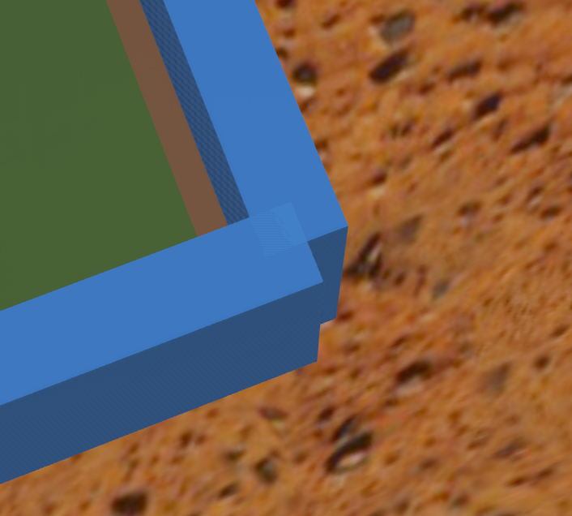

Image: Example of a fine adjustment in simulation that was previously impossible for the LLM, deliberately left incomplete in simulation to be used here as an example

### Running a simulation

> **Note:** You must set up the development environment as described in appendix *Reproduction guide* before starting simulation.

<mark>
Below is how to start a simulation and interact with the environment.
</mark>
<br/><br/>

<mark>
After validating the simulation environment:
</mark>
<br/><br/>

1. Connect the compatible controller.

2. Start Webots from the terminal associated with the Python environment configured for simulation.


Image: Webots icon in system tray

3. Open the world `webots/worlds/experiment_inclined_plane.wbt`.

4. Start or restart simulation using the "play" button.

5. Open the experiment telemetry window by right-clicking on "InclinedFourWheelRobot" and then clicking "Show Robot Window"

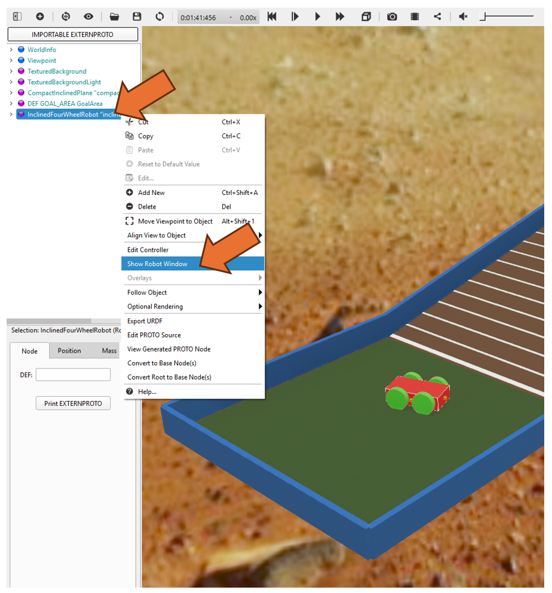

Image: Location of the command to open the telemetry window

6. Observe the opening of a browser window like this:

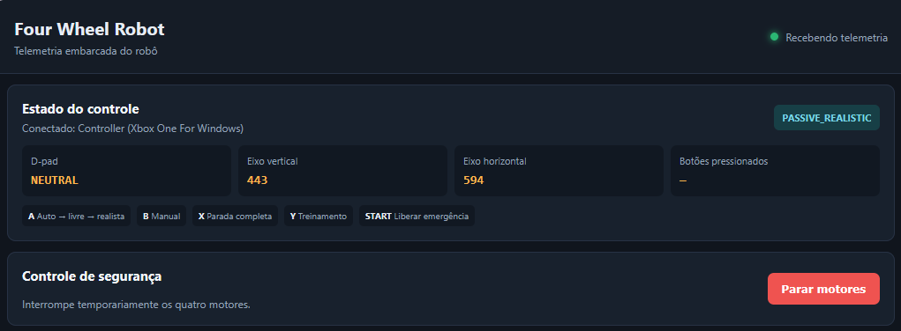

Image: Top of telemetry window

> **Note:** The integrated world starts in `PASSIVE_REALISTIC`, according to its `controllerArgs`; therefore, simply starting simulation does not automatically enable learning. In the current implementation, selecting `LEARNING` is done via the controller.

6. Press the desired mode button on the controller (example: **A** for `AUTOMATIC`, **B** for `MANUAL`, **Y** for `LEARNING`).

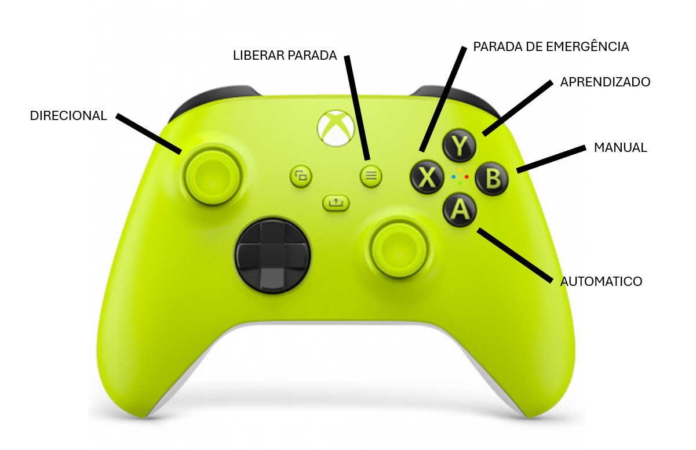

Image: Diagram of button mapping for Xbox One S model *joystick*

> **Note:** The mapping matrix is open to adapt other controllers, and feedback from pressed buttons appears in the Webots console, which helps porting to other controllers. Keyboard support will be added in the future.

8. Monitor in console and telemetry the selected action, experiment state, proximity sensors, motors, and internal sensors.

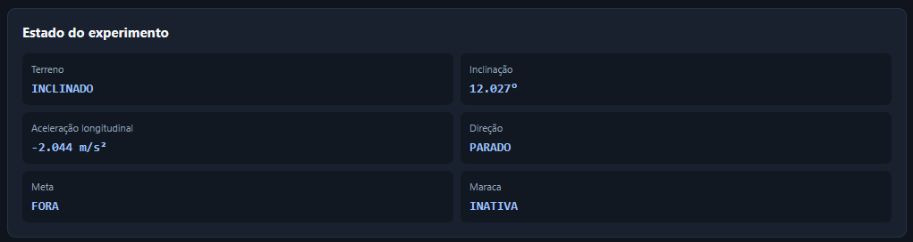

Image: Telemetry section corresponding to experiment state

9. Only in `LEARNING` mode: Each learning simulation generates a directory inside `experiments/runs`:

```text
experiments/runs/learning_{timestamp_UTC}_{seed}/
```

This directory contains:

- `metadata.json`, with neural, experimental, and runtime configuration;

- `iterations.jsonl`, with a structured record for each iteration;

- `summary.json`, with consolidated run result;

- `report.html`, with visualization derived from records.

Files from one run must remain together, because HTML report and summary are derived from the same metadata and per-iteration records.


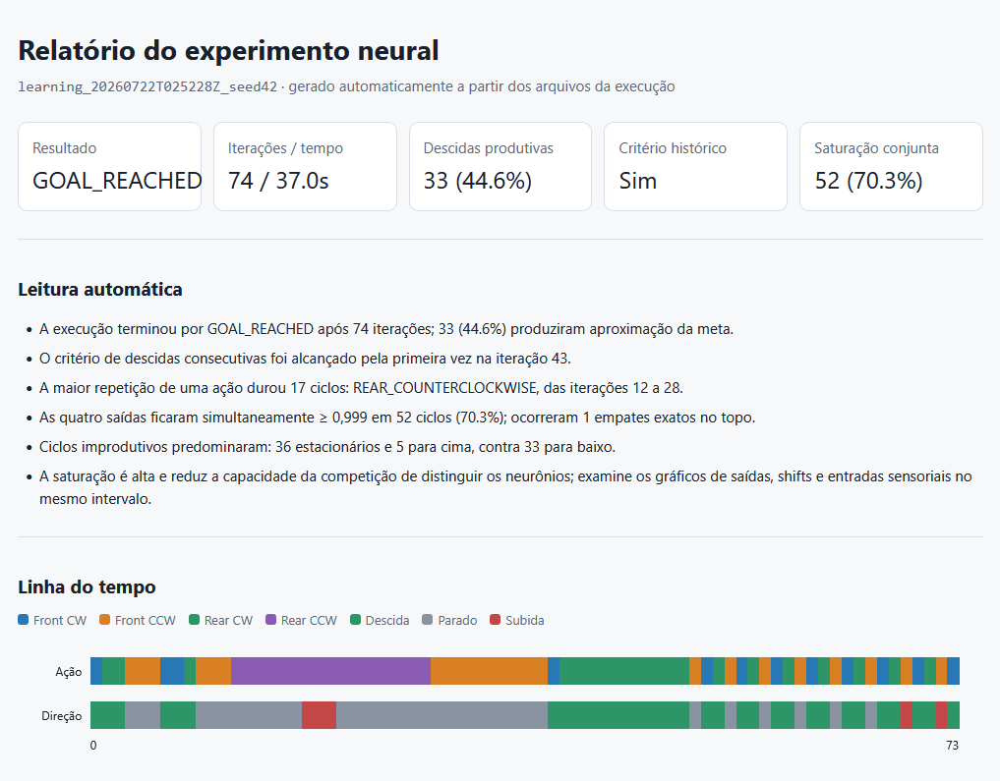

Image: Top of HTML report generated in one run

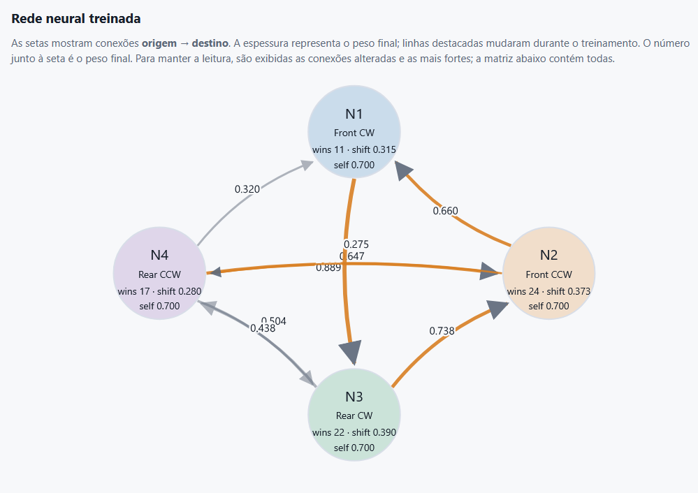

Image: Report section with sketch of generated network

> **Note:** Like the network, the report at this stage of development is provided as beta functionality.

### Detailed mapping of control modes

| Mode | Trigger on joystick | Description |
|---|---|---|
| `AUTOMATIC` | **A** button, when completing passive mode cycle; or **START** button when leaving emergency stop | Executes automatic obstacle-avoidance control. Uses proximity sensors and differential wheel control. It is also the initial mode when no mode is informed in controller arguments. |
| `MANUAL` | **B** button | Allows manual driving using digital directional pad (*D-pad*). Releasing the directional pad sets wheel speed to zero. |
| `PASSIVE_FREE` | **A** button, from `AUTOMATIC` | Disables available torque of all four motors, leaving wheels free for sliding and gravity-action tests. |
| `PASSIVE_REALISTIC` | **A** button, from `PASSIVE_FREE` | Keeps wheels without movement command, but limits available torque to `0.03 N·m` per wheel, representing small motor resistance. |
| `LEARNING` | **Y** button | Activates the experimental protocol controlled by neural network. Each winner neuron selects one of four motor primitives, while sensors, stimuli, plasticity, and telemetry are updated at each action window. |
| `EMERGENCY_STOP` | **X** button | Immediately interrupts motor commands and keeps all speeds at zero. While this mode is active, other selection buttons are ignored. |

Table: Robot control modes

Button **A** cycles through modes:

```text
AUTOMATIC
→ PASSIVE_FREE
→ PASSIVE_REALISTIC
→ AUTOMATIC
```

## Functions and equations

<mark>
The current implementation uses a first version of activation, competition, and plasticity equations described in the reference paper. Formal presentation, parameter justification, detailed analysis of these equations, and final code locators (they will be derived into dedicated methods to facilitate inspection) will be developed in Phase 3, after conceptual review and systematic implementation validation.
</mark>
<br/><br/>

| Function or equation | Purpose | Origin |
|---|---|---|
| normalization and sensory summation | transform and combine acceleration, vision, and sound | sensory summation described in paper; normalization applied |
| activation, sigmoid output, and competition | compute activity and select winner neuron | sigmoid corresponding to equation 3 in paper; activation and competition adapted |
| synaptic plasticity | update weights between different neurons | equation 2 in paper |
| intrinsic plasticity | update sigmoid function shift | equation 4 in paper |
| distance, displacement, and classification | measure approach to goal and classify movement | not presented as equation in paper, but immediate |
| acceleration, rattle, and criteria | aggregate stimulus, produce stimulus, and record learning | criterion described in paper; aggregation and additional criterion adapted |

> **Note:** With an initial implementation of defined equations, adaptation complexity is considerably lower.

<!--
### Sensory normalization and summation

The three sensory channels are represented by acceleration, vision, and sound. Before being presented to the network, their values go through an independent normalization transformation, composed of correcting a reference value and applying a scale factor:

$$
\widetilde{x}_k(t) =
\left(x_k(t)-o_k\right)s_k,
\qquad k \in \{a,v,s\}
$$

Where:

- $t$: iteration of the experimental protocol;
- $k$: sensory channel considered;
- $a$, $v$ and $s$: acceleration, vision and sound, respectively;
- $x_k(t)$: value of channel $k$ received by normalizer at iteration $t$;
- $o_k$: displacement or *offset* applied to channel $k$;
- $s_k$: scale factor of channel $k$;
- $\widetilde{x}_k(t)$: channel value after normalization.

Each sensory input can have its reference point corrected and its intensity adjusted before being presented to the network, i.e.:

> **This equation means:** Take the value received from a sensor, subtract a reference value, and multiply the result by a scale factor.

> **Code locator:** `src/experiments/sensory_processing.py` - `SensoryProcessor.process`.

Normalized values are summed and form a common sensory input to all four neurons:

$$
S(t)
=
\sum_{k \in \{a,v,s\}}\widetilde{x}_k(t)
=
\widetilde{x}_a(t)
+
\widetilde{x}_v(t)
+
\widetilde{x}_s(t)
$$

Where:

- $S(t)$: total sensory input presented to each neuron at iteration $t$;
- $\widetilde{x}_a(t)$: aggregated and normalized longitudinal acceleration;
- $\widetilde{x}_v(t)$: normalized visual input;
- $\widetilde{x}_s(t)$: normalized intensity of rattle stimulus.

> **This equation means:** total input = transformed acceleration + transformed vision + transformed sound

> **Code locator:** `src/experiments/sensory_processing.py` - `SensoryProcessor.process`; and `src/neural/four_neuron_network.py` - `SensoryInput.total`.

In current configuration:
- All *offsets* are zero and all scales are `1.0`.
- Visual channel remains disabled and receives `0.0`.
- Sound channel receives `0.1` when previous iteration is classified as downward and `0.0` otherwise.

### Activation, sigmoid output, and competition

After normalization and summation of sensory stimuli, the network computes activation of each neuron. This activation combines sensory input of current iteration with activity produced by network in previous iteration:

$$
a_i(t)
=
S(t)
+
\sum_{j=1}^{4} W_{ij}(t)O_j^c(t-1)
+
\eta_i(t)
$$

Where:

- $t$: current protocol iteration;
- $i$: neuron whose activation is being computed;
- $j$: neuron sending output to neuron $i$;
- $a_i(t)$: activation of neuron $i$ at iteration $t$;
- $S(t)$: sum of normalized sensory inputs;
- $W_{ij}(t)$: weight of connection from neuron $j$ to neuron $i$;
- $O_j^c(t-1)$: output of neuron $j$ after competition in previous iteration;
- $\eta_i(t)$: optional noise added to activation.

> **This equation means:** To compute neuron activation, sum current sensory input, outputs from previous iteration multiplied by connection weights, and optional noise.

> **Code locator:** `src/neural/four_neuron_network.py` - `FourNeuronNetwork.step`, in `activation` computation.

Since competition keeps only one neuron active, usually only previous winner output contributes to recurrent term. In first iteration, previous outputs are zero and initial choice depends on competition among outputs produced from this initial state.

Then activation is transformed into output limited to interval between zero and one through a sigmoid function, corresponding to equation 3 in the paper:

$$
O_i(t)
=
\frac{1}
{1+\exp\left[-g\left(a_i(t)-\theta_i(t)\right)\right]}
$$

Where:

- $O_i(t)$: output of neuron $i$ before competition;
- $a_i(t)$: activation computed for neuron $i$;
- $\theta_i(t)$: individual shift of neuron $i$ sigmoid, called
  `shift` in implementation;
- $g$: sigmoid gain;
- $\exp$: exponential function.

> **This equation means:** Compare neuron activation with its sigmoid shift and transform this difference into an output between zero and one. The larger the activation relative to shift, the closer output will be to one.

> **Code locator:** `src/neural/four_neuron_network.py` - functions `sigmoid_output` and `_stable_sigmoid`; called by `FourNeuronNetwork.step` in `raw_output` computation.

When $a_i(t)=\theta_i(t)$, sigmoid output is `0.5`. In current configuration, gain $g$ is `25`, value adopted from paper. This gain makes transition around shift relatively sharp.

After computing four outputs, competition selects neuron with highest output:

$$
w(t)=\underset{i \in \{1,2,3,4\}}{\operatorname{arg\,max}}\;O_i(t)
$$

Output after competition is:

$$
O_i^c(t)
=
\begin{cases}
O_i(t), & \text{if } i=w(t),\\
0, & \text{otherwise.}
\end{cases}
$$

> **Winner selection locator:** `src/neural/four_neuron_network.py` - `FourNeuronNetwork._select_winner`.

> **Competitive output locator:** `src/neural/four_neuron_network.py` - `FourNeuronNetwork.step`, in `competitive_output` computation.

Where:

- $w(t)$: index of winner neuron at iteration $t$;
- $\operatorname{arg\,max}$: operation returning index of largest value;
- $O_i^c(t)$: output of neuron $i$ after competition.

> **These equations mean:** Compare outputs of the four neurons, choose the one with largest output, preserve winner value, and assign zero to the others.

In current configuration:

- competition uses deterministic mode, in which largest output wins;
- exact ties are resolved by pseudo-random generator associated with neural seed;
- implementation does not add activation noise and therefore $\eta_i(t)=0$;
- winner competitive output is preserved with its sigmoid value, not replaced by `1.0`.

### Synaptic plasticity

Synaptic plasticity modifies weights of connections between different
neurons. Variation of each weight follows Grossberg's presynaptic rule,
presented as equation 2 in the paper:

$$
\Delta W_{ij}(t)
=
\varepsilon\,
O_j^c(t-1)
\left[a_i(t)-W_{ij}(t)\right]
$$

New weight is obtained by adding this variation to previous value:

$$
W_{ij}(t+1)
=
W_{ij}(t)
+
\Delta W_{ij}(t)
$$

Where:

- $t$: current protocol iteration;
- $i$: neuron receiving connection, called postsynaptic neuron;
- $j$: neuron sending connection, called presynaptic neuron;
- $W_{ij}(t)$: weight of connection from neuron $j$ to neuron $i$;
- $\Delta W_{ij}(t)$: change computed for this weight;
- $\varepsilon$: synaptic plasticity rate;
- $O_j^c(t-1)$: output of neuron $j$ after competition in previous iteration;
- $a_i(t)$: current activation of neuron $i$.

> **These equations mean:** If neuron $j$ was active in previous iteration, compare current activation of neuron $i$ with connection weight from $j$ to $i$. A small fraction of this difference is added to the weight.

> **Variation locator $\Delta W_{ij}$:** `src/neural/four_neuron_network.py` - `grossberg_delta` function.

> **Update locator $W_{ij}(t+1)$:** `src/neural/four_neuron_network.py` - `FourNeuronNetwork._update_synaptic_weights`.

When $a_i(t)$ is greater than $W_{ij}(t)$, variation is positive and weight tends to
increase. When $a_i(t)$ is smaller, variation is negative and weight tends to
decrease. If $O_j^c(t-1)=0$, presynaptic neuron did not contribute in
previous iteration and corresponding weight does not change.

In current configuration:

- synaptic rate $\varepsilon$ is `0.01`;
- only weights arriving at current winner neuron are considered for
  update, behavior called `winner_only`;
- since only previous winner has nonzero competitive output,
  at most one non-diagonal connection receives a nonzero change
  in each iteration;
- when the same neuron wins two consecutive iterations, this possible
  connection would be diagonal and therefore remains fixed;
- the four diagonal connections do not participate in plasticity rule and are
  reaffirmed at `0.7` after each step;
- no additional weight limits are applied.

Using previous competitive output as presynaptic activity and
`winner_only` restriction are operational hypotheses of reconstruction. The
implementation also offers the `all_postsynaptic` alternative, in which all
postsynaptic neurons are considered for update while still keeping diagonal
connections fixed.

### Intrinsic plasticity

Intrinsic plasticity does not modify connection weights. It changes each
neuron's individual sigmoid function shift and, by doing so,
modifies how much activation is needed for that neuron to produce high
output in future iterations.

In current configuration, update uses output after competition and follows
operational form of equation 4 from the paper:

$$
\theta_i(t+1)
=
\frac{
\xi O_i^c(t)+\theta_i(t)
}{
1+\xi
}
$$

Where:

- $t$: current protocol iteration;
- $i$: neuron whose shift is being updated;
- $\theta_i(t)$: sigmoid shift of neuron $i$ before update,
  called `shift` in implementation;
- $\theta_i(t+1)$: shift to be used in next iteration;
- $O_i^c(t)$: output of neuron $i$ after competition;
- $\xi$: intrinsic plasticity rate.

> **This equation means:** Compute new shift as a weighted average between previous shift and current neuron output. Rate $\xi$ determines speed at which shift approaches that output.

> **Code locator:** `src/neural/four_neuron_network.py` - `intrinsic_shift` function; applied by `FourNeuronNetwork._update_intrinsic_shifts`.

If output is greater than current shift, shift increases. If it is
smaller, shift decreases. A larger shift moves sigmoid to the
right, requiring higher activation for neuron to produce
same output. A smaller shift moves sigmoid to the left, making
neuron more responsive to lower activations.

In current configuration:

- initial shift of all neurons is `0.5`;
- intrinsic rate $\xi$ is `0.01`;
- source used is `post_competition`, i.e., output after competition;
- only winner has nonzero competitive output;
- non-winner neurons are also updated: since their competitive
  outputs are zero, their shifts are divided by $1+\xi$ and
  gradually decrease toward zero.

For winner neuron, shift moves toward value of its
sigmoid output preserved by competition. For others, shift
reduction progressively increases their ability to compete in later
iterations. This mechanism acts as an adaptation of individual neuron
excitability.

Using output after competition is an operational hypothesis of reconstruction.
Implementation also offers `pre_competition` alternative, in which
sigmoid output of all four neurons is used before non-winners
are zeroed.

### Distance, displacement, and movement classification

Movement direction is determined by variation of distance between robot
and goal during a motor window. Since goal occupies a rectangular area,
distance is computed to nearest edge of this rectangle, not only
to its center.

For each horizontal axis, distance to goal limits is first computed:

$$
d_x
=
\max\left(
\left|x-x_g\right|-\frac{w}{2},
0
\right)
$$

$$
d_y
=
\max\left(
\left|y-y_g\right|-\frac{l}{2},
0
\right)
$$

Total horizontal distance is then:

$$
d
=
\sqrt{d_x^2+d_y^2}
$$

Where:

- $x$ and $y$: robot horizontal coordinates from GPS;
- $x_g$ and $y_g$: goal center coordinates;
- $w$: goal area width;
- $l$: goal area length;
- $d_x$: distance to goal along $x$ axis;
- $d_y$: distance to goal along $y$ axis;
- $d$: smallest horizontal distance between robot and goal rectangle;
- $\max$: operation choosing the larger of presented values;
- $\left|\,\right|$: absolute value, which ignores difference sign.

> **These equations mean:** Check how far robot is outside goal limits in each direction. If it is already within limits of one axis, distance on that axis is zero. Then combine both distances to find smallest horizontal distance to area.

> **Locator of $d_x$, $d_y$ and $d$:** `webots/controllers/four_wheels_manual/learning_runtime.py` - `GoalRegion.distance`.

At start and end of each motor window, this distance is recorded. Its
variation is:

$$
\Delta d
=
d_{\mathrm{final}}
-
d_{\mathrm{initial}}
$$

Since approaching goal reduces distance, progress toward goal is defined as:

$$
q
=
-\Delta d
=
d_{\mathrm{initial}}
-
d_{\mathrm{final}}
$$

Where:

- $d_{\mathrm{initial}}$: distance to goal at start of motor window;
- $d_{\mathrm{final}}$: distance to goal at end of window;
- $\Delta d$: distance variation during window;
- $q$: progress oriented toward goal.

> **These equations mean:** If final distance is smaller than initial, robot approached goal and $q$ will be positive. If final distance is larger, it moved away and $q$ will be negative.

> **Locator of $\Delta d$:** `webots/controllers/four_wheels_manual/learning_runtime.py` - `LearningRuntime._begin_action_window` records $d_{\mathrm{initial}}$ and `LearningRuntime._finish_action_window` computes `displacement`.

> **Locator of $q$:** `src/experiments/experiment_runner.py` - `ExperimentRunner._classify`, where `displacement` is oriented by `ExperimentConfig.downhill_sign`.

To prevent small oscillations or numerical imprecision from being
classified as movement, a threshold $\tau$ is used:

$$
\operatorname{direction}(q)
=
\begin{cases}
\mathrm{DOWN}, & q>\tau,\\
\mathrm{UP}, & q<-\tau,\\
\mathrm{STATIONARY}, & -\tau\leq q\leq\tau.
\end{cases}
$$

Where:

- $\tau$: minimum displacement needed to recognize movement;
- `DOWN`: approach toward goal;
- `UP`: move away from goal;
- `STATIONARY`: insufficient variation to characterize ascent or descent.

> **This equation means:** An approach larger than threshold is classified as descent; a move away larger than threshold is classified as ascent; smaller variations are considered stationary.

> **Code locator:** `src/experiments/experiment_runner.py` - `ExperimentRunner._classify`.

In current configuration:

- position is obtained from GPS;
- logical goal measures `0.96 × 0.96 m` horizontally;
- threshold $\tau$ is `0.005 m`;
- descent sign is `-1`, because protocol originally receives
  $\Delta d=d_{\mathrm{final}}-d_{\mathrm{initial}}$;
- `DOWN` represents approach to goal, which is located at lower part
  of ramp, and not a direct measurement of slope or altitude;
- distance used to classify movement is horizontal; vertical coordinate
  is checked separately to determine effective entry into three-dimensional goal region.

In this context, "displacement" represents variation in distance to goal,
not total trajectory length traveled by robot during window.
This computation is a geometric and operational reconstruction decision, since
paper does not publish an equivalent equation for movement classification.

### Acceleration, rattle, and learning criteria

Upon entering `LEARNING` mode, controller records accelerometer longitudinal
component as reference value. During each motor window, new
readings are compared with this reference. Acceleration input associated with
window is average of absolute differences:

$$
A(t)
=
\frac{1}{n_t}
\sum_{r=1}^{n_t}
\left|
a_x(t,r)-a_{x,0}
\right|
$$

Where:

- $t$: motor window or experimental iteration;
- $r$: index of reading taken within window;
- $n_t$: number of acceleration readings collected in window $t$;
- $a_x(t,r)$: longitudinal accelerometer component at reading $r$;
- $a_{x,0}$: reference value recorded when entering `LEARNING` mode;
- $A(t)$: aggregated acceleration presented to protocol at end of window;
- $\left|\,\right|$: absolute value, considering difference magnitude
  without preserving sign.

> **This equation means:** Compare each longitudinal reading with a reference, ignore sign of differences, and compute their average during motor window.

> **Locator of absolute differences:** `webots/controllers/four_wheels_manual/learning_runtime.py` - `LearningRuntime.step`.

> **Locator of window average:** `webots/controllers/four_wheels_manual/learning_runtime.py` - `LearningRuntime._finish_action_window`.

In current configuration:

- longitudinal component corresponds to first value, or axis $x$, of
  accelerometer;
- readings are obtained at each controller step of `64 ms`;
- acceleration normalization scale is `1.0`;
- nominal window lasts `0.5 s`;
- partial window is also finalized and recorded when robot enters
  goal.

After window completion, movement is classified. When direction is
`DOWN`, protocol produces logical rattle stimulus:

$$
M(t)
=
\begin{cases}
m, & \text{if } D(t)=\mathrm{DOWN},\\
0, & \text{otherwise.}
\end{cases}
$$

Where:

- $D(t)$: direction assigned to movement executed in window $t$;
- $m$: configured intensity for rattle;
- $M(t)$: sound input produced as consequence of that window.

> **This equation means:** If action brought robot close enough to goal
> to be classified as descent, produce rattle; in any other case,
> keep sound input at zero.

> **Code locator:** `src/experiments/experiment_runner.py` - `ExperimentRunner.complete_iteration`, in `rewarding_sound` and `SensoryObservation.sound` computation; and `src/experiments/sensory_processing.py` - `SensoryProcessor.process`.

In current configuration, $m=0{,}1$. Stimulus is not produced by microphone and
speaker: it is generated logically by protocol. Rattle is computed
after observing executed action and participates in neural step that
selects next action. Therefore, it does not retroactively influence
action that produced it.

Protocol records two criteria based on movement sequences:

$$
C_{\mathrm{paper}}(t)
=
\left[D(t)\neq\mathrm{STATIONARY}\right]
\land
\left[n_{\mathrm{same}}(t)\geq 5\right]
$$

$$
C_{\mathrm{downward}}(t)
=
\left[n_{\mathrm{downward}}(t)\geq 5\right]
$$

Where:

- $C_{\mathrm{paper}}(t)$: criterion of five consecutive movements in same
  direction;
- $C_{\mathrm{downward}}(t)$: additional criterion of five consecutive
  downward movements;
- $n_{\mathrm{same}}(t)$: number of consecutive classifications equal to
  current direction;
- $n_{\mathrm{downward}}(t)$: number of consecutive `DOWN`
  classifications;
- $\land$: logical "and" operator; both conditions must be true.

> **These equations mean:** First criterion is reached after five
> consecutive non-stationary movements in same direction, either up or
> down. Second is reached only after five consecutive descents.

> **Locator of both criteria:** `src/experiments/experiment_runner.py` - `LearningCriterion.update`.

First criterion reproduces condition described in paper. Second was
added to distinguish a sequence specifically oriented toward
goal. Both are recorded in telemetry and run artifacts, but do not
end experiment. In current implementation, run ends when
robot enters goal. Repetition of same winner neuron alone
is not considered evidence of learning.
-->

## Experimental parameters

<mark>
The following tables record values effectively used in current configuration. Parameters classified as hypothesis should be evaluated in formal trials.
</mark>
<br/><br/>

> **Note:** Location of corresponding fields, constants, and arguments is documented in **Appendix D - Parameter location and configuration**.

### Neural network parameters

| Parameter | Value | Origin |
|---|---:|---|
| number of neurons | 4 | paper |
| recurrent weight | 0.7 | paper |
| sigmoid gain | 25 | paper |
| initial non-diagonal weights | uniform between 0.1 and 0.9 | hypothesis |
| synaptic rate `epsilon` | 0.01 | hypothesis |
| intrinsic rate `xi` | 0.01 | published range |
| initial shift | 0.5 | hypothesis |
| competition | deterministic | operational hypothesis |
| plasticity scope | `winner_only` | operational hypothesis |
| intrinsic plasticity source | output after competition | operational hypothesis |
| activation noise deviation | 0.0 | disabled |
| additional weight limits | none | not published |
| integrated configuration seed | 42 | reproducibility |

In integrated run, only neural seed is exposed as controller argument.
Other values use network default configuration.

### Learning protocol parameters

| Parameter | Current value |
|---|---:|
| nominal action duration | 0.5 s |
| wheel speed in `LEARNING` mode | 3.0 rad/s |
| stationary movement threshold | 0.005 m |
| rattle sound intensity | 0.1 |
| acceleration scale | 1.0 |
| visual input | 0.0 |
| consecutive movements for criterion | 5 |
| sign used to represent descent | -1 |

> **Note:** Visual channel remains disabled. Negative sign used for descent comes from calculation `final distance - initial distance`, since approaching the goal (not necessarily its center) reduces distance.

### Webots world parameters

| Parameter | Current value |
|---|---:|
| Webots file version | R2025a |
| world basic step | 16 ms |
| controller step | 64 ms |
| world seed | 42 |
| ramp inclination | 12 degrees (`0.20943951023932` rad) |
| arrival platform | 1 x 1 m |
| ramp | 2 x 1 m |
| guardrail height | 0.1 m |
| stripe spacing | 0.1 m |
| stripe width | 0.01 m |
| finish line width | 0.02 m |
| logical goal area | 0.96 x 0.96 x 0.30 m |
| configured dwell in goal | 0.5 s; current `LEARNING` mode completes on entry |

> **Note:** World seed is independent from neural seed. Angle must remain equal in plane and robot. Goal area is represented both in world and controller arguments, and values must remain synchronized. Although dwell is configured as `0.5 s`, `LEARNING` runtime currently ends execution upon area entry.

Gravity, friction, and some contact parameters remain inherited from Webots defaults.

### Robot and sensor parameters

| Parameter | Current value |
|---|---:|
| body dimensions | 0.20 x 0.10 x 0.05 m |
| wheels and motors | 4 |
| wheel radius | 0.04 m |
| wheel thickness | 0.02 m |
| configured body density | 1000 kg/m3 |
| initial distance along ramp | 1.45 m |
| passive realistic mode torque | 0.03 N.m per wheel |
| instrumentation | accelerometer, gyroscope, GPS and compass |
| available proximity sensors | front-left diagonal, front-right diagonal, front, rear, left and right |
| position used in protocol | GPS |
| acceleration used in network | longitudinal accelerometer component |
| sound used in network | logical stimulus, without microphone or speaker |

## Conclusion

<mark>
Phase 2 starts an important stage of the project: inclined world, robot, sensors, control modes, first version of the four-neuron plastic neural network, and learning protocol now operate together in `LEARNING` mode.
</mark>
<br/><br/>

<mark>
During simulation, network selects motor actions, robot displacement is observed and classified, and acceleration and rattle stimuli return as input to next iteration. At the same time, simulation records used parameters, network state, winner neurons, executed actions, and learning criteria. These data are preserved in structured artifacts and an HTML report, making it possible to track experiment and later compare different runs.
</mark>
<br/><br/>

<mark>
Exploratory runs performed also demonstrate that full flow is functional and robot can traverse inclined plane and reach goal; however, it is too early to state that observed behavior was produced specifically by neural plasticity. Gravity, initial conditions, random action sequence, and simulation parameters may also contribute to displacement.
</mark>
<br/><br/>

> **Note:** Robot in `MANUAL` with D-PAD to either side causes it to slide freely down the ramp, and this is intended from what was extracted from original paper, but it demonstrates the point of previous paragraph. However, rotating the robot in any direction at simulation start and entering `LEARNING` allows it to reach goal in all simulations performed so far.

<mark>
Several points remain to be improved, such as stimulus calibration, review of reference used to compute acceleration, second review of equations, and further visits to original paper and lecture on "Modelagem de redes bioinspiradas" to understand adherence of current implementation especially regarding plasticity and metaplasticity concepts presented there.
</mark>
<br/><br/>

<mark>
Thus, the main result of Phase 2 is not to definitively demonstrate that robot learned by plasticity effect, but to build a platform in which this hypothesis can be examined in a controlled, observable, and reproducible way. In Phase 3, suggested objective is to run sets of simulations with recorded reference parameters and conditions, comparing effects produced by different configurations and plasticity mechanisms.
</mark>
<br/><br/>

## References

Francisco Javier Ropero Peláez, Lucas Galdiano Ribeiro Santana
Doman's Inclined Floor Method for Early Motor Organization Simulated with a Four Neurons Robot (2011)
https://www.semanticscholar.org/paper/Doman's-Inclined-Floor-Method-for-Early-Motor-with-Peláez-Santana/a1d9815865dcf65b909aeaf985f2f96c99be9dd5

J. R. Peláez, Marcelo Simoes
A computational model of synaptic metaplasticity (1999)
https://www.semanticscholar.org/paper/A-computational-model-of-synaptic-metaplasticity-Peláez-Simoes/ba93f797064a0035c6fe37836b055f84d85c61f1

J. R. Peláez, J. Piqueira
Biological Clues for Up-to-Date Artificial Neurons (2007)
https://www.semanticscholar.org/paper/Biological-Clues-for-Up-to-Date-Artificial-Neurons-Peláez-Piqueira/6dc2349c03495f5465df0d6d1ed93c31adde8189

N S Desai, L C Rutherford, G G Turrigiano
Plasticity in the intrinsic excitability of cortical pyramidal neurons (1999)
https://pubmed.ncbi.nlm.nih.gov/10448215/

Niraj S Desai
Homeostatic plasticity in the CNS: synaptic and intrinsic forms (2003)
https://pubmed.ncbi.nlm.nih.gov/15242651/

## Appendices

### Appendix A - Reproduction guide

This appendix describes setup of environment required to inspect code, run automated tests, and reproduce integrated Phase 2 simulation. Commands must be run from repository root, unless otherwise indicated.

Main procedure uses *uv*, since `pyproject.toml` and `uv.lock` are the source of Python dependency configuration and locking. Procedures with *pip* and *conda* are kept as alternatives.

#### Software requirements

Table is in suggested installation order

| Software | Version or condition | Purpose |
|---|---|---|
| GCC, G++ and *make* | system-compatible toolchain | compilation of native controllers or *plugins* |
| *Git* | recent version | repository retrieval and update |
| *Webots* | `R2025a` | execution of worlds and robot controller |
| Python | `3.13.x` | neural network, protocol, tests and reports |
| *uv* | recent version | reproducible installation |
| *conda* (do not install Python first if using this option) | recent version | reproducible installation |
| *Visual Studio Code* or another editor | optional | code inspection and development |

Integrated experiment uses a Python controller and, therefore, GCC is not required to interpret neural network. Toolchain remains documented because repository contains native controllers and examples and because it will be required if these components are recompiled or modified.

#### Hardware requirements

| Hardware | Version or condition | Purpose |
|---|---|---|
| compatible *joystick* controller (Xbox One S model mapped) | optional for general tests; required in current interface to select interactive modes | triggering `MANUAL`, `LEARNING`, and other modes |

#### Installing GCC, G++ and make

On Ubuntu Linux:

Package `build-essential` includes GCC, G++, *make*, and basic build components:

```bash
sudo apt update
sudo apt install build-essential
gcc --version
g++ --version
make --version
```

On Windows:

*Webots R2025a* ships its own MinGW copy for C and C++ controllers. For development also outside simulator internal environment, UCRT64 toolchain from [MSYS2](https://www.msys2.org/) can be installed.

After installing MSYS2, open **MSYS2 UCRT64** terminal and update packages:

```bash
pacman -Syu
```

If terminal requests closing after core component update, open it again and repeat `pacman -Syu`. Then install toolchain:

```bash
pacman -S --needed \
  mingw-w64-ucrt-x86_64-toolchain \
  mingw-w64-ucrt-x86_64-make \
  make
```

When tools also need to be used from PowerShell or *Visual Studio Code*, following directories from default installation can be added to user `PATH`:

```text
C:\msys64\ucrt64\bin
C:\msys64\usr\bin
```

Installation must be validated in a new terminal:

```powershell
gcc --version
g++ --version
make --version
```

In UCRT64 package, specific *make* executable may also appear as `mingw32-make`; package `make` provides generic command used by project procedures.

#### Installing Git

On Ubuntu Linux:

```bash
sudo apt update
sudo apt install git
git --version
```

On Windows:

*Git for Windows* can be obtained at <https://git-scm.com/>. On systems with *winget*, installation can also be performed in PowerShell:

```powershell
winget install --id Git.Git -e --source winget
git --version
```

After installation, a new terminal must be opened so potential `PATH` changes are recognized.

#### Cloning the repository

Using HTTPS:

```bash
git clone https://github.com/lnncrs/DomanNeurocomputationalModel.git
cd DomanNeurocomputationalModel
```

Using SSH, when a key is already configured on GitHub:

```bash
git clone git@github.com:lnncrs/DomanNeurocomputationalModel.git
cd DomanNeurocomputationalModel
```

After cloning, files `pyproject.toml`, `uv.lock`, `requirements.txt`, and `environment.yml` must be available at project root.

#### Installing Webots

Repository worlds declare `R2025a` in header and use features from this version. To reproduce documented setup, install **Webots R2025a** instead of automatically replacing it with latest version. Installers and official instructions are available at <https://cyberbotics.com/doc/guide/installing-webots> and published versions at <https://github.com/cyberbotics/webots/releases>.

On Ubuntu Linux:

Download `.deb` package corresponding to Webots R2025a and install it from directory where it was saved:

```bash
sudo apt install ./webots_2025a_amd64.deb
webots --version
```

Exact filename may vary according to published package. If executable is not found in `PATH`, Webots can also be started from application menu or installation directory.

On Windows:

Download and run installer `webots-R2025a_setup.exe`. In default installation, executable is under `C:\Program Files\Webots`.

In some configurations, Webots opened directly from menu does not inherit Python environment used by project. In that case, first prepare or activate environment and open simulator from same terminal. In PowerShell, considering default installation:

```powershell
& "C:\Program Files\Webots\msys64\mingw64\bin\webots.exe" --stdout --stderr --clear-cache
```

Path must be adjusted if Webots was installed in another directory. Options `--stdout` and `--stderr` keep controller messages visible; `--clear-cache` is useful when changes in worlds or PROTO files do not appear after an update.

#### Recommended Python environment with uv

*uv* can be installed using official procedures available at <https://docs.astral.sh/uv/getting-started/installation/>.

On Ubuntu Linux:

```bash
curl -LsSf https://astral.sh/uv/install.sh | sh
```

On Windows PowerShell:

```powershell
powershell -ExecutionPolicy ByPass -c "irm https://astral.sh/uv/install.ps1 | iex"
```

After opening a new terminal, installation can be verified and full project environment synchronized:

```bash
uv --version
uv sync --all-groups --all-extras
```

Command creates or updates `.venv`, installs compatible Python version when necessary, installs project, and includes analysis and development groups used in notebooks and tests.

#### Alternative with pip

This alternative requires Python `3.13.x` to be already installed. It is recommended to create an isolated virtual environment.

On Ubuntu Linux:

```bash
python3.13 -m venv .venv
source .venv/bin/activate
python -m pip install --upgrade pip
python -m pip install -r requirements.txt
```

On Windows PowerShell:

```powershell
py -3.13 -m venv .venv
.\.venv\Scripts\Activate.ps1
python -m pip install --upgrade pip
python -m pip install -r requirements.txt
```

File `requirements.txt` installs project with analysis dependency set and includes *pytest*. Main dependency definition remains in `pyproject.toml`.

#### Alternative with conda

Miniforge or Miniconda can be used following documentation at <https://docs.conda.io/projects/conda/en/stable/user-guide/install/>. After installing manager and opening a terminal with `conda` available, file `environment.yml` creates environment `webots` with Python 3.13 and project dependencies:

```bash
conda env create -f environment.yml
conda activate webots
```

When environment already exists and file has changed, it can be updated by:

```bash
conda env update -f environment.yml --prune
conda activate webots
```

#### Optional editor and extensions

Project does not depend on a specific editor. For development with *Visual Studio Code*, official **Python** and **Pylance** extensions are useful, in addition to Jupyter support for notebooks. Editor should be started only after creating or activating environment, or configured to use interpreter located in `.venv` or in *conda* `webots` environment.

#### Environment validation

With *uv*, all tests can be run with:

```bash
uv run pytest
```

With *pip* or *conda* environment activated:

```bash
python -m pytest
```

Tests cover network equations and plasticity, protocol causality, motor mapping, telemetry, and artifact generation. Passing tests verifies Python core installation, but does not replace validation of physics and rotation directions inside Webots.

#### Minimum checklist

- `git --version` responds correctly;
- installed Webots corresponds to `R2025a` version;
- `uv sync --all-groups --all-extras` or equivalent alternative finishes without errors;
- `webots/worlds/experiment_inclined_plane.wbt` opens without PROTO or controller errors;
- controller messages appear in terminal;
- `LEARNING` mode can be selected;
- one run produces expected files in `experiments/runs`.

### Appendix B - Repository structure

Repository separates neural model, experimental protocol, and adaptation of motor commands from Webots-specific artifacts. The tree below presents some repository components detailed next.

```text
DomanNeurocomputationalModel/
|-- assets/                                     # images used in documentation
|-- docs/                                       # reports and reference paper
|   |-- fase01-relatorio.md
|   `-- fase02-relatorio.md
|-- examples/                                   # minimum usage example
|   `-- four_neuron_minimal.py
|-- experiments/                                # results generated during simulations
|   `-- runs/
|       `-- learning_{timestamp}_{seed}/
|           |-- iterations.jsonl
|           |-- metadata.json
|           |-- report.html
|           `-- summary.json
|-- notebooks/                                  # disconnected network execution
|   `-- four_neuron_network_validation.ipynb
|-- src/                                        # network and control
|   |-- control/
|   |   `-- robot_adapter.py
|   |-- experiments/
|   |   |-- experiment_logger.py
|   |   |-- experiment_report.py
|   |   `-- experiment_runner.py
|   `-- neural/
|       `-- four_neuron_network.py
|-- tests/                                       # unit tests
|   |-- test_experiment_runner.py
|   |-- test_four_neuron_network.py
|   |-- test_learning_runtime.py
|   `-- test_robot_adapter.py
|-- webots/                  # worlds, robots, controllers and simulator interfaces
|   |-- controllers/
|   |   |-- test_cpp_controller/                 # minimal C++ control (Phase 1)
|   |   |-- test_py_controller/                  # minimal Python control (Phase 1)
|   |   |-- four_wheels_collision_avoidance/     # collision control in C (Phase 1)
|   |   |-- four_wheels_collision_avoidance_py/  # collision control in Python (Phase 1)
|   |   |-- four_wheels_manual/           # experiment control in Python (Phase 2)
|   |   |   |-- four_wheels_manual.py     # multi-mode control
|   |   |   `-- learning_runtime.py       # Webots -> learning bridge
|   |   `-- [...]            # other controllers used as Webots references
|   |-- plugins/             # plugins for telemetry window functionality
|   |   `-- robot_windows/
|   |       |-- custom_robot_window/      # original Webots plugin
|   |       `-- four_wheel_robot_window/  # adapted plugin
|   |-- protos/
|   |   |-- differential/                 # historical differential-control tests
|   |   |-- physics/                      # historical active-physics tests
|   |   |-- CompactInclinedPlane.proto    # main inclined plane of experiment
|   |   |-- CompactInclinedPlaneExperiment.proto # inclined plane + instrumented robot
|   |   |-- FourWheelRobot.proto                 # four-wheel robot and onboard instrumentation
|   |   |-- GoalArea.proto                # adjustable goal
|   |   |-- InclinedFourWheelRobot.proto  # wrapper so robot is inclined together with ramp
|   |   `-- SimpleRobot.proto             # robot derived/decoupled from `tutorials/4_wheels_robot.wbt` used as base
|   |-- tutorials/                        # Webots tutorials used as base
|   |   |-- 4_wheels_robot.wbt
|   |   |-- appearance.wbt
|   |   |-- collision_avoidance.wbt
|   |   |-- compound_solid.wbt
|   |   |-- custom_robot_window.wbt
|   |   |-- four_wheels.wbt
|   |   |-- hexapod.wbt
|   |   |-- my_first_simulation.wbt
|   |   `-- obstacles.wbt
|   `-- worlds/                           # worlds created for experiment
|       |-- empty_world.wbt               # empty world used as starting point
|       |-- experiment_inclined_plane.wbt # main Phase 2 experiment, with ramp, robot, goal and learning
|       |-- inclined_plane_fs.wbt         # full-scale inclined plane
|       |-- inclined_plane_fs_balls.wbt   # full-scale inclined plane with balls to validate physics
|       |-- inclined_plane_fs_robot.wbt   # full-scale inclined plane with robot
|       |-- inclined_plane_hs.wbt         # half-scale inclined plane
|       |-- inclined_plane_hs_robot.wbt   # half-scale inclined plane with robot
|       |-- normal_plane_fs.wbt           # full-scale horizontal plane
|       |-- normal_plane_fs_boxes.wbt     # full-scale horizontal plane with boxes to validate physics
|       |-- normal_plane_fs_robot.wbt     # full-scale horizontal plane with robot
|       |-- normal_plane_hs.wbt           # half-scale horizontal plane
|       `-- normal_plane_hs_robot.wbt     # half-scale horizontal plane with robot
|-- .gitignore
|-- .python-version
|-- environment.yml
|-- pyproject.toml
|-- README.md
|-- requirements.txt
`-- uv.lock
```

> **Note:** Cache files, virtual environments, temporary results, and internal tool settings were omitted.

#### Root configuration files

| File | Function |
|---|---|
| `README.md` | general presentation and main project instructions |
| `pyproject.toml` | project metadata, Python version, and dependencies |
| `uv.lock` | resolved versions for reproduction with uv |
| `requirements.txt` | pip installation alternative |
| `environment.yml` | conda installation alternative |
| `.python-version` | Python version selected for working directory |
| `.gitignore` | exclusion of environments, caches, and generated results |

#### Model source code

Directory `src` contains the Webots-independent core and is divided into three responsibilities:

- `src/neural` implements four-neuron network state, activation, competition, and plasticity rules;

- `src/control` translates four abstract neural actions into motor commands, without embedding simulator logic;

- `src/experiments` organizes protocol execution, records data for each iteration, and produces summary and final report.

File `src/neural/four_neuron_network.py` concentrates the neural model.

File `src/control/robot_adapter.py` contains boundary between neural actions and motor primitives.

In `src/experiments`, `experiment_runner.py`, `experiment_logger.py`, and `experiment_report.py` separate execution, persistence, and result presentation, respectively.

#### Webots simulation structure

Directory `webots` gathers all simulator-dependent components:

- `webots/worlds` contains executable environments. `experiment_inclined_plane.wbt` is main Phase 2 world; remaining worlds preserve intermediate settings used to validate physics, planes, balls, robots, and different scales;

- `webots/protos` contains reusable definitions for plane, goal, robot, and test objects. Subdirectories `differential` and `physics` preserve, respectively, differential models and objects used in physical validation;

- `webots/controllers` contains control executed during simulation. The currently relevant controller for integrated experiment is `four_wheels_manual` and, despite historical name, it includes `AUTOMATIC`, `MANUAL`, `PASSIVE_FREE`, `PASSIVE_REALISTIC`, and `LEARNING` modes;

- `webots/plugins/robot_windows` contains HTML, CSS, JavaScript, and C interfaces displayed as telemetry and robot monitoring window. `four_wheel_robot_window` corresponds to main monitoring interface;

- `webots/tutorials` preserves worlds used in initial platform learning and as implementation reference. These worlds do not constitute Phase 2 experimental configuration.

In main controller, `four_wheels_manual.py` reads sensors, selects control mode, and sends commands to wheels. `learning_runtime.py` connects this Webots cycle to core located in `src` and maintains temporal window of each neural action.

#### Documentation, examples and validation

- `docs` contains reports, planning documents, and paper used as reference.

- `assets` stores images used in documentation;

- `notebooks/four_neuron_network_validation.ipynb` allows examining neural model with synthetic data outside Webots;

- `examples/four_neuron_minimal.py` presents minimal execution of four-neuron network;

#### Automated tests

Directory `tests` reproduces same functional division as code:

| File | Main responsibility |
|---|---|
| `test_four_neuron_network.py` | equations, initialization, competition, and neural plasticity |
| `test_robot_adapter.py` | translation of abstract actions into motor commands |
| `test_experiment_runner.py` | causality, movement classification, criteria, and experimental artifacts |
| `test_learning_runtime.py` | temporal integration, telemetry, goal, and runtime operation used by Webots |

> **Note:** These tests validate computational behavior only.

### Appendix C - Historical evolution of simulation

Several simulations were required to build the Phase 2 experiment. Main qualitative project leaps are listed below.

#### Physics simulation

The first challenge was reproducing physics with approximate accuracy using terrestrial world parameters (gravity, friction, elasticity, etc.). The film inclined_plane is the inclined plane with balls for physics simulation.

inclined_plane: https://youtu.be/qvbR1wQidVg

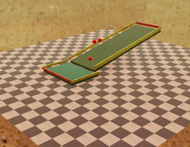

Image: inclined_plane

> **Note:** Planes were created specifically for this project.


#### Robot collision simulation

Second challenge was assembling a robot and positioning it in this simulated world. The films inclined_plane_with_robot and inclined_plane_with_robot_1 are the inclined plane with robot and collision control (not neural network) to test whether robot worked in simulation; the latter has a lower guardrail (which prevents robot from falling).

inclined_plane_with_robot: https://youtu.be/1YhcI6GHoAs

inclined_plane_with_robot_1: https://youtu.be/zjciixsm578

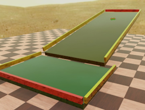

Image: inclined_plane_with_robot

> **Note:** In collision test robots, example models from Webots open library were used with adaptations.

#### Control simulation

Finally, it was necessary to get a code-based control interface to interact with simulation. The film normal_plane_with_rotation is an initial test with joints, motors, and activation via control interface. This step was decisive in the project, as it opened the door to controlling simulation aspects via programmable interface, first in C and then in Python.

normal_plane_with_rotation: https://youtu.be/ZKbbiObtkQ8

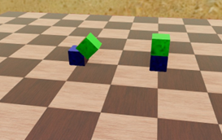

Image: normal_plane_with_rotation

> **Note:** Rotating parts with control were created from scratch because it was necessary to deeply understand how the "joint" between two parts works exactly in this simulation.

### Appendix D - Parameter location and configuration

This appendix maps parameters presented in report body to
fields, constants, and arguments that determine their values in implementation.
Marking **internal default** means field is configurable in code,
but not yet exposed by main world. Marking **controller
argument** means value can be informed by `controllerArgs`.

#### Neural network parameters

| Parameter | Field or constant | File | Integrated configuration |
|---|---|---|---|
| number of neurons | `NEURON_COUNT` | `src/neural/four_neuron_network.py` | constant fixed at 4 |
| recurrent weight | `NeuralConfig.recurrent_weight` | `src/neural/four_neuron_network.py` | internal default |
| sigmoid gain | `NeuralConfig.sigmoid_gain` | `src/neural/four_neuron_network.py` | internal default |
| initial non-diagonal weights | `initial_weight_min`; `initial_weight_max` | `src/neural/four_neuron_network.py` | internal defaults; uniform draw conditioned by seed |
| synaptic rate `epsilon` | `NeuralConfig.synaptic_learning_rate` | `src/neural/four_neuron_network.py` | internal default |
| intrinsic rate `xi` | `NeuralConfig.intrinsic_learning_rate` | `src/neural/four_neuron_network.py` | internal default |
| initial shift | `NeuralConfig.initial_shift` | `src/neural/four_neuron_network.py` | internal default |
| competition | `FourNeuronNetwork._select_winner` | `src/neural/four_neuron_network.py` | largest output; ties resolved by seed |
| plasticity scope | `NeuralConfig.plasticity_scope` | `src/neural/four_neuron_network.py` | default `PlasticityScope.WINNER_ONLY` |
| intrinsic plasticity source | `FourNeuronNetwork._update_intrinsic_shifts` | `src/neural/four_neuron_network.py` | output after competition; fixed reconstruction hypothesis |
| activation noise | not implemented | `src/neural/four_neuron_network.py` | no noise term is added |
| additional weight limits | not implemented | `src/neural/four_neuron_network.py` | equation applied without additional clipping |
| neural seed | `LearningRuntimeConfig.random_seed`; `NeuralConfig.random_seed` | `webots/controllers/four_wheels_manual/learning_runtime.py` | `--learning-seed` argument, defined in main world |

`LearningRuntime` builds `NeuralConfig` explicitly informing seed and
acceleration normalization. Other neural parameters use defaults
centralized in `src/neural/four_neuron_network.py`.

#### Learning protocol parameters

| Parameter | Field or constant | File | Integrated configuration |
|---|---|---|---|
| nominal action duration | `LearningRuntimeConfig.action_duration_seconds` | `webots/controllers/four_wheels_manual/learning_runtime.py` | `--learning-action-duration` argument, defined in main world |
| speed in `LEARNING` mode | `LearningRuntimeConfig.wheel_speed` | `webots/controllers/four_wheels_manual/learning_runtime.py` | `--learning-speed` argument, defined in main world |
| stationary movement threshold | `LearningRuntimeConfig.stationary_threshold` | `webots/controllers/four_wheels_manual/learning_runtime.py` | internal default |
| rattle intensity | `LearningRuntimeConfig.sound_intensity` | `webots/controllers/four_wheels_manual/learning_runtime.py` | accepts `--learning-sound-intensity`; world uses default |
| acceleration scale | `LearningRuntimeConfig.acceleration_scale` | `webots/controllers/four_wheels_manual/learning_runtime.py` | `--learning-acceleration-scale` argument, defined in main world |
| visual input | `visual=0.0` | `webots/controllers/four_wheels_manual/learning_runtime.py` | fixed; visual channel disabled |
| consecutive movements | `ExperimentConfig.learning_streak` | `webots/controllers/four_wheels_manual/learning_runtime.py` | fixed at `5` when creating protocol |
| descent sign | `ExperimentConfig.downhill_sign` | `webots/controllers/four_wheels_manual/learning_runtime.py` | fixed at `-1` when creating protocol |

Arguments configured by main world are located in
`webots/worlds/experiment_inclined_plane.wbt`.

#### Webots world parameters

| Parameter | Field or constant | File | Integrated configuration |
|---|---|---|---|
| world basic step | `WorldInfo.basicTimeStep` | `webots/worlds/experiment_inclined_plane.wbt` | world field; `16 ms` |
| controller step | `TIME_STEP` | `webots/controllers/four_wheels_manual/four_wheels_manual.py` | constant; `64 ms`, equivalent to four basic steps |
| world seed | `WorldInfo.randomSeed` | `webots/worlds/experiment_inclined_plane.wbt` | world field; independent from `--learning-seed` |
| ramp inclination | `angle` | `webots/worlds/experiment_inclined_plane.wbt` | repeated in `CompactInclinedPlane` and `InclinedFourWheelRobot`; values must match |
| logical goal area | `GoalArea.size`; `GoalArea.detectionHeight`; `--goal` | `webots/worlds/experiment_inclined_plane.wbt` | duplicated configuration between world and controller |
| dwell in goal | `GoalArea.dwellTime`; last value of `--goal` | `webots/worlds/experiment_inclined_plane.wbt` | general monitor uses value; `LEARNING` ends on entry |

Gravity, friction, and contact parameters are not explicit in main world
and remain inherited from Webots defaults.

#### Robot and sensor parameters

| Parameter | Field or constant | File | Integrated configuration |
|---|---|---|---|
| passive realistic mode torque | `PASSIVE_REALISTIC_TORQUE` | `webots/controllers/four_wheels_manual/four_wheels_manual.py` | hardcoded constant; `0.03 N·m` per wheel |

CMCC - Federal University of ABC (UFABC) - Santo André - SP - Brazil
