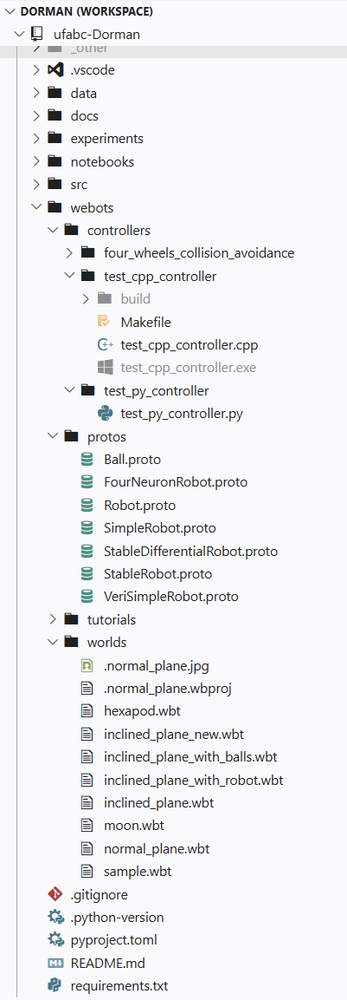
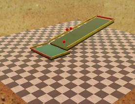
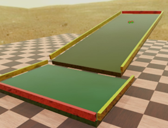
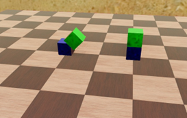

# Modelo neurocomputacional de reorganizacao motora

**Neurocomputational model for motor reorganization**


Universidade Federal do ABC - Ciência da computação

Lenin Cristi

{lenin.cristi}@aluno.ufabc.edu.br

## Resumo

Este trabalho tem como objetivo a reprodução computacional e robótica do experimento [Doman's Inclined Floor Method for Early Motor Organization Simulated with a Four Neurons Robot (2010)](https://www.semanticscholar.org/paper/Doman%27s-Inclined-Floor-Method-for-Early-Motor-with-Pel%C3%A1ez-Santana/a1d9815865dcf65b909aeaf985f2f96c99be9dd5) de Ropero Peláez e Lucas Santana, no qual um robô controlado por uma rede neural plástica de quatro neurônios aprende a organizar seu comportamento motor em um plano inclinado, inspirado no método de estimulação motora precoce de Glenn Doman.

A implementação original foi realizada em MATLAB e dependente de sensores ambientais externos (rampa listrada e estímulos visuais), este projeto visa desenvolver uma versão totalmente reprodutível do experimento utilizando linguagem multiparadigma flexível e sensoriamento embarcado. O código do projeto está disponível em https://github.com/lnncrs/DomanNeurocomputationalModel

*Na primeira fase, o foco será a reconstrução funcional do experimento: modelo neural e simulação do robô em ambiente controlado (simulador e plataforma robótica simples) e a validação experimental da emergência de comportamento direcional com métricas quantitativas de aprendizado.*

O resultado esperado é a entrega de um relatório descrevendo fases e métodos de construção da simulação, um conjunto de dados do aprendizado e um repositório público com o código utilizado tanto na simulação, quanto na aprendizagem, na plataforma de testes e código embarcado, todos documentados e reproduzíveis, para que sirvam como base para extensões futuras envolvendo generalização para diferentes sistemas sensores e locomotores em novos experimentos de neuroplasticidade.

## Objetivo do Projeto

Os objetivos centrais do experimento são:

- Simular condições de aprendizado motor infantil;
- Observar o surgimento de comportamento emergente;
- Analisar, a partir desse comportamento, possíveis paralelos com processos de neuroplasticidade.

Ou seja a simulação, o robô e o aprendizado são tratados como **meios**, não fins.

## Introdução

### O experimento original

Antes da construção do projeto, foi imprescindível fazer uma série de leituras mais detalhadas do artigo que descreve o experimento original: [Doman's Inclined Floor Method for Early Motor Organization Simulated with a Four Neurons Robot (2010)](https://www.semanticscholar.org/paper/Doman%27s-Inclined-Floor-Method-for-Early-Motor-with-Pel%C3%A1ez-Santana/a1d9815865dcf65b909aeaf985f2f96c99be9dd5), este artigo também está disponível no repositório do projeto [aqui](https://github.com/lnncrs/DomanNeurocomputationalModel/blob/main/docs/Testing%20the%20inclined%20plane%20technique%20with%20a%20four%20neurons%20robot.pdf). Essas leituras adicionais do artigo revelaram um ponto fundamental sobre o experimento:

> O objetivo do experimento não é exatamente fazer o robô aprender a andar, mas sim simular o processo pelo qual uma criança aprende a fazê-lo e assim aprender mais sobre a neuroplasticidade envolvida neste processo.

Para tanto, o experimento busca reproduzir:

- Estímulos sensoriais (visão, audição);
- Ambiente físico (plano inclinado);
- Simplicidade estrutural do sistema neural.

E a partir dos dados e modelo gerados por esse experimento, analisar o comportamento emergente. Fica claro então que o objetivo fim não é o aprendizado do robô em si, mas tentar simular ao máximo as condições de uma criança aprendendo a andar no método do plano inclinado de Doman, e a partir dessa simulação, das condições e das variáveis envolvidas gerar um modelo de aprendizado com alguma capacidade de explicabilidade com relação ao aprendizado da criança no método de Doman. Em outras palavras, uma simulação robótica que nos traga mais perto de explicar a forma como as crianças organizam neuroplasticamente o seu aprendizado no método mencionado.

### A rede neural "não convencional"

No experimento do artigo é descrita uma rede completamente conectada de apenas quatro neurônios. Numa leitura mais aprofundada do experimento, é possível derivar com clareza que a rede não era pequena por limitação de plataforma, mas para que quando do estudo da plasticidade emergente do aprendizado, seria mais fácil interpretar a plasticidade neuronal gerada.

Se fossem utilizados centenas ou milhares de neurônios nessa simulação, o comportamento emergente provavelmente apareceria, mas seria mais difícil interpretar esse comportamento e relacionar ele de volta com a plasticidade de uma criança que aprendeu a andar.

Outro ponto chave do artigo com relação a rede neuronal é que os neurônios utilizados no artigo não são neurônios artificiais "clássicos". Em redes neurais tradicionais, normalmente temos funções de ativação específicas, mecanismos de feedforward em rede também bem definidos e quando não estamos falando de reinforcement learning, temos métodos clássicos de fazer redes "aprenderem" comportamento.

Os neurônios do artigo por outro lado buscam ser mais próximos de neurônios orgânicos, com funções, limiar e ativação bem específicos, não sendo portanto, semelhantes às do neurônio artificial clássico que encontramos me campo seja nas disciplinas ou pesquisa, mesmo os pré modelados em bibliotecas "prontas para uso".

Isso é também parte crítica do artigo: Se criarmos uma rede com muitos neurônios,  com um back propagation de redes neurais artificiais clássicas, e com funções de ativação clássicas e chegássemos ao aprendizado, estaríamos mais distantes de usar o modelo resultante para aprender um pouco mais sobre como crianças andam.

Fica claro que para que o modelo tenha uma melhor capacidade de explicar o comportamento da criança andando, é necessário empregar neurônios e funções de ativação, mecanismos de aprendizado que sejam mais próximos dos naturais, oportunamente estes meios são exatamente os descritos no artigo.

Esse foi o segundo grande ponto extraído do artigo, ele usa neurônios específicos e funções específicas, e não a mesma arquitetura de uma rede que vemos em redes neurais artificiais comuns e isso tem um propósito: Para que seja mais fácil correlacionar o aprendizado dele com o aprendizado de uma criança.

#### Resumo das diferenças

Em relação a redes neurais clássicas:

- Não há backpropagation tradicional;
- Não há arquiteturas profundas;
- Funções de ativação são específicas do modelo do artigo.

Em relação aos neurônios:

- Possuem limiares e dinâmicas próprias;
- São mais próximos de neurônios biológicos do que artificiais convencionais;
- Foram limitados a 4 unidades para maximizar interpretabilidade.

> Esse conjunto de escolhas permite observar plasticidade de forma clara e correlacionar com processos de aprendizado infantil, o que é o objetivo do experimento.

#### Rede proposta

Caminho pretendido do estímulo:

```text
Conjunto de sensores → 4 neurônios → 2 motores → 2 conjuntos de rodas
```

Mapeamento pretendido:

```text
N1/N2 → lado esquerdo
N3/N4 → lado direito
```

Comportamentos emergentes esperados:

- Movimento frontal
- Ré
- Rotação
- Correção de trajetória

O sistema motor é composto por dois motores independentes em configuração *differential drive*, cada um controlando um conjunto de rodas de um lado do robô. A rede neural possui quatro neurônios, sendo que cada neurônio está associado a um movimento específico (sentido horário ou anti-horário) de um dos motores, resultando em quatro primitivas de ação: esquerda-frente, esquerda-trás, direita-frente, direita-trás. O comportamento motor emerge da combinação das ativações desses quatro neurônios."

## Metodologia

O terceiro ponto importante extraído do artigo é o de que o experimento envolve muitas peças móveis e muitas variáveis. Entre elas estão o plano inclinado em si, diversos sensores embarcados que simulam audição e visão, um conjunto de estímulos externos equivalentes aos que uma criança seria submetida (como sinais que representam a voz da mãe ou o som de um chocalho), além do robô em si que no experimento original foi implementado em Arduino usando MatLab, possivelmente diretamente, sem interfaces de controle para a rede neuronal.

Esse cenário cria uma complexidade grande. Ficou claro que partir diretamente para a implementação física em Arduino poderia resultar em um processo de tentativa e erro extenso, com várias iterações de construção e reconstrução do robô, e seria difícil testar o que falhou: O plano, o robô, a interface de controle ou a rede neuronal.

### Como construir (e testar) em camadas

Diante disso, a abordagem adotada foi a de construir e experimento em camadas, validando cada etapa do experimento separadamente. Para isso, a simulação de mundo se tornou essencial. A ideia é a de que a construção física do robô seria a etapa final, isolando essa camada e permitindo que todas as outras fossem validadas previamente a cada passo da construção.

Isso levou à uma decisão de simular todo o sistema antes: mundo físico, planos de testes (inclinado e nivelado), diferentes variantes do robô (motores e sensores), interface de controle, e diferentes versões da rede neural.

Implementar diretamente em Arduino traria:

- Alto custo de tentativa e erro
- Dificuldade de isolar falhas
- Baixa reprodutibilidade

A simulação permite:

- Validar cada componente isoladamente
- Reduzir iterações físicas
- Garantir controle sobre variáveis

### Arquitetura de cada camada

Devido à complexidade do sistema, foi adotada uma abordagem em camadas, com cinco etapas a serem construídas, testando cada uma de maneira individualizada em ambiente simulado, sendo possível assim validar o comportamento de cada camada antes de construir o robô real. A cada teste de camada se o comportamento não convergisse ou apresentasse algum problema, seria mais fácil identificar que camada do projeto estava falhando.

- **Fase 1 - Mundo**

  - Construção do ambiente
  - Validação visual e estrutural

- **Fase 2 - Física**

  - Testes com bolas e colisões
  - Validação de gravidade e atrito

- **Fase 3 - Robô**

  - Modelagem de corpo, rodas e juntas

- **Fase 4 - Interface de Controle**

  - Controle manual (teclado & Xbox)
  - Controle randômico
  - Abstração entre robô real e virtual

- **Fase 5 - Integração Neural**

  - Implementação da rede
  - Integração com o robô via controle específico
  - Observação de comportamento emergente


### Simulação de mundo

Para a simulação foi iniciada uma pesquisa onde foram considerados dois ambientes simuladores: o Webots e o PyBullet. O ambiente escolhido foi o Webots, pois ofereceria maior capacidade de representar motores, atuadores e sensores de forma próxima à realidade (ou seja eu estaria próximo ao robô real mesmo usando uma simulação) e num ambiente de mundo real com física sólida rica, oferecendo também suporte a integração em Python ou C++ e biblioteca de mundos reutilizáveis.

Resumo dos principais motivos de escolha do Webots:

- Melhor modelagem de sensores e atuadores reais;
- Suporte a integração Python/C++;
- Biblioteca de mundos reutilizáveis;
- Proximidade com implementação física.

Um ponto chave no ambiente Webots é exatamente ele permitir trabalhar inicialmente em Python para maior flexibilidade, mas manténdo a possibilidade de gerar o código final em C++ numa implementação mais próxima do hardware real. Isso torna possível usar exatamente o mesmo código de controle do ambiente virtual no ambiente real, já que a ideia é ter uma interface de controle que abstraia do robô qual controle está sendo utilizado (rede neural, manual ou randômico) e abstraia da rede neural (ou do manual) qual robô está sendo utilizado (virtual ou real).

Teríamos toda a camada de software capaz de operar o robô virtual e o real sem distinção.

A biblioteca extensa de mundos e exemplos reutilizáveis também é fator chave, o que facilita o desenvolvimento e confecção inicial.

### Desenvolvimento

O desenvolvimento do projeto foi guiado visando reprodutibilidade, somente com bibliotecas open source visando facilitar a reprodução do projeto por outros pesquisadores, utilizando o Webots para a simulação e Python para o desenvolvimento da interface de controle e da rede neural. O código é versionado e documentado no repositório do projeto na plataforma Gitub.

Não somente código, mas testes adicionais de mundo e colisão, esquetes de diferentes tentativas de robô, esquetes de exemplo utilizadas, estão versionados e o README no repositório já permite carregar o mundo simulado e reproduzir o ponto atual do projeto.

#### Fase atual

A fase atual é a que já temos controle manual sobre o robô no ambiente virtual via interface, ou seja, estamos prontos do ponto de vista do simulador para implementar e conectar a camada de rede neural para aprendizado.

**Atualmente:**

- Ambiente físico validado
- Robô funcional
- Controle comunicando com o ambiente virtual

**Próximos passos:**

- Integração da rede neural
- Execução de ciclos de aprendizado

**Testes realizados**

- Validação de física (bolas em rampa)
- Interação robô-ambiente
- Controle manual
- Testes de juntas e motores

#### Visão geral do repositório

A imagem `repositorio_visao_geral.png` dá uma ideia da organização atual do repositório.



#### Simulação de física

O filme `inclined_plane` é o plano inclinado com bolas para a simulação de física.

inclined_plane: https://youtu.be/qvbR1wQidVg



#### Simulação de colisão do robô

O filme `inclined_plane_with_robot` e `inclined_plane_with_robot_1` é o plano inclinado com o robo e controle de batida (nao rede neural) para testar se o robo funcionava na simulação, o último tem um guardrail mais baixo (o que impede a queda do robo).

inclined_plane_with_robot: https://youtu.be/1YhcI6GHoAs

inclined_plane_with_robot_1: https://youtu.be/zjciixsm578



#### Simulação de controle

O filme `normal_plane_with_rotation` é um primeiro teste com juntas, motores e ativação via interface de controle, foi um passo no projeto, pois abriu portas para que fosse possível controlar aspectos da simulação via interface programável.

normal_plane_with_rotation: https://youtu.be/ZKbbiObtkQ8



Os planos foram criados especificamente para o projeto.

Nos robôs de teste de batida foram usados modelos de exemplo da biblioteca aberta do Webots adaptados.

As peças rotacionando com controle foi necessário criar do zero porque era necessário entender a fundo como funcionava exatamente a "junção" entre duas peças nesta simulação.

### Próximos passos

#### Modelagem da rede neural

A próxima etapa é a modelagem da rede neural, que está nas camadas 4 e 5 do experimento. A implementação da rede neural será feita em Python, utilizando as funções de ativação e dinâmica descritas no artigo original. A rede será integrada com a interface de controle para permitir que o comportamento emergente seja observado e analisado.

#### Diversidade de sensores

Foi reduzida a diversidade de sensores embarcados no o primeiro aprendizado para somente aproximação da chegada (é possível ver a "chegada" nos vídeos do plano inclinado) no entanto, o Webots suporta todos os itens de estímulo do artigo, como estímulos visuais e auditivos, e eles serão integrados na fase 5 do experimento após a validação do comportamento emergente com o sensor de aproximação.

#### Modelo físico

Foi escolha de projeto simular em ambiente virtual para a montagem e testagem da camada de software de maneira isolada. Portanto a montagem física do robô é a última etapa do projeto, e somente será iniciada após a validação do comportamento emergente na simulação. É importante relembrar no entanto, que todo código utilizado é reutilizável na camada de hardware, ou seja, o código de controle do robô virtual é o mesmo código de controle do robô real, e a interface de controle é a mesma para ambos os robôs, portanto, a camada de software é completamente reutilizável na camada de hardware.

## Conclusão

Apesar de desafios iniciais, principalmente no aprendizado e adaptação ao ambiente Webots, o projeto evoluiu para um estado funcional sólido de simulação com controle mas ainda sem a rede neural integrada. A construção em camadas permitiu validar cada componente isoladamente, garantindo que o sistema como um todo esteja pronto para a integração da rede neural e a observação do comportamento emergente.

A abordagem em camadas permitiu:

- Reduzir complexidade
- Aumentar controle experimental
- Garantir reprodutibilidade

O projeto encontra-se próximo da etapa de aprendizado efetivo.

## Anexos

### Como clonar o repositório do projeto

Clone o repositório do projeto para acessar o código, os mundos e os protos:

Clonar usando HTTPS:

```bash
git clone https://github.com/lnncrs/DomanNeurocomputationalModel.git
cd DomanNeurocomputationalModel
```

Clonar usando SSH (recomendado):

```bash
git clone git@github.com:lnncrs/DomanNeurocomputationalModel.git
cd DomanNeurocomputationalModel
```

### Organização detalhada do repositório

O repositório do projeto está organizado da seguinte forma:

```
├── 📄 README.md                          # Documentação principal
├── 📄 requirements.txt                   # Dependências Python
├── 📄 pyproject.toml                     # Configuração do projeto
│
├── 🖼️ assets/                            # Imagens e diagramas
│
├── 💾 data/                              # Dados de experimentos
│
├── 📚 docs/                              # Documentação técnica
│
├── 🧪 experiments/                       # Scripts de testes e experimentos
│
├── 📓 notebooks/                         # Jupyter notebooks
│
├── 🧠 src/                               # Código-fonte principal
│   │
│   ├── control/                          # Controladores do robô
│   │
│   ├── interfaces/                       # Interfaces de comunicação
│   │
│   └── neural/                           # Implementação da rede neural
│
└── 🤖 webots/                            # Ambiente de simulação Webots
    │
    ├── controllers/                      # Controladores Webots
    │
    ├── protos/                           # Definições de objetos Webots
    │   ├── FourWheelRobot.proto          # Robô principal de quatro rodas
    │   ├── SimpleRobot.proto             # Robô simplificado legado
    │   ├── physics/                      # Objetos para validação de física
    │   │   ├── Ball.proto
    │   │   └── MotorizedCube.proto
    │   └── differential/                 # Evolução dos robôs diferenciais
    │       ├── DifferentialDriveRobot.proto
    │       ├── StableDifferentialRobot.proto
    │       ├── StableRobot.proto
    │       └── VeriSimpleRobot.proto
    │
    ├── tutorials/                        # Mundos do tutorial Webots
    │   ├── 4_wheels_robot.wbt
    │   ├── appearance.wbt
    │   ├── collision_avoidance.wbt
    │   ├── compound_solid.wbt
    │   ├── my_first_simulation.wbt
    │   └── obstacles.wbt
    │
    └── worlds/                           # Mundos de simulação
        ├── normal_plane.wbt              # Plano nivelado
        ├── inclined_plane.wbt            # Plano inclinado canônico do experimento
        ├── inclined_plane_with_balls.wbt # Teste de física
        ├── inclined_plane_with_robot.wbt # Experimento com robô
        ├── hexapod.wbt                   # Teste com hexápode
        ├── moon.wbt                      # Teste de gravidade
        └── sample.wbt                    # Mundo de exemplo
```

### Montagem do ambiente de desenvolvimento e simulação

É necessário ter o ambiente configurado para reproduzir os experimentos. A seguir estão as instruções para configurar o ambiente de desenvolvimento e simulação.

#### Lista de software requerido

- Toolchain C++ de sua preferência (GCC, Clang, MSVC)
- Git
- Webots
- Python +3.13 (Seja via conda ou instalação direta)
- vscode ou editor de código de sua preferência

> A reprodução dos experimentos é garantida utilizando plataforma Windows ou Linux com a lista de software apresentada, no entanto outras plataformas podem ser utilizadas, desde que compatíveis com o Webots e Python +3.13.

### Webots

O Webots é o ambiente de simulação utilizado para a construção e teste do experimento. Ele oferece uma plataforma robusta para modelagem de robôs, ambientes físicos e controle de comportamento. Para instalar o Webots, siga as instruções na página oficial: https://cyberbotics.com/doc/guide/installing-webots

> Importante: Certifique-se de instalar a versão mais recente do Webots para garantir compatibilidade com os mundos e protos utilizados no projeto.

#### Nota sobre uso do Webots no Windows

O Webots no Windows pode não herdar o caminho correto do Python no disparo, isso faz com que simulações com controle Python (ex: `webots\worlds\normal_plane.wbt`) falhem de maneira silenciosa, fechando a simulação logo após o carregamento. Para que isso não ocorra, abra o Webots a partir do terminal, com o ambiente Webots já ativo.

Ativar o ambiente webots:

```bash
conda activate webots
```

Abrir o Webots:

```bash
& "C:\Program Files\Webots\msys64\mingw64\bin\webots.exe" --stdout --stderr
```

A linha de comando do Webots depende da instalação, o caminho apresentado é o caminho padrão, mas pode variar dependendo do local onde o Webots foi instalado. Certifique-se de ajustar o caminho conforme necessário para a sua instalação.

### Ambiente virtual e instalação de dependências

Vamos mostrar a seguir um exemplo de como criar o ambiente necessário usando duas abordagens: **pip** e **conda**.

#### Usando pip

Certifique-se de ter instalado o motor Python +3.13 e instale as dependências do projeto com:

```bash
pip install -r requirements.txt
```

Dentro do repositório do projeto.

> Use **preferencialmente** um ambiente virtual para isolar as dependências do projeto.

#### Usando conda

##### Instalando o conda

Utilize a referência oficial **Conda-Forge** para instalar o conda no seu ambiente https://conda-forge.org/download/

Ou utilize a referência oficial **Anaconda** para instalar o miniconda no seu ambiente https://docs.anaconda.com/miniconda/install/

##### Criando o ambiente virtual

Para criar um ambiente virtual chamado `webots` com Python 3.13 utilizando o conda, use o comando:

```bash
conda create -n webots python=3.13
```

##### Ativando o ambiente

Após a criação do ambiente virtual, ative ele com

```bash
conda activate webots
```

##### Instalando dependências

Com o ambiente virtual ativado, instale as dependências do projeto com:

```bash
pip install -r requirements.txt
```

##### Criando o ambiente a partir de arquivo (Alternativo)

Para criar o ambiente com os pacotes base a partir de arquivo requirements.txt, utilize o comando:

```bash
pip install -r requirements.txt
```

Ou para criar o ambiente com os pacotes base a partir de arquivo yml, utilize o comando:

```bash
conda env create -f environment.yml
```

Dentro do repositório do projeto.

> Use **preferencialmente** um ambiente virtual para isolar as dependências do projeto.

# ! TODO

pacman -Syu

pacman -S mingw-w64-ucrt-x86_64-gcc

pacman -S mingw-w64-ucrt-x86_64-toolchain

pacman -S \
  mingw-w64-ucrt-x86_64-toolchain \
  mingw-w64-ucrt-x86_64-make \
  mingw-w64-ucrt-x86_64-cmake \
  mingw-w64-ucrt-x86_64-ninja \
  mingw-w64-ucrt-x86_64-pkg-config \
  mingw-w64-ucrt-x86_64-boost \
  mingw-w64-ucrt-x86_64-doxygen

adicionar ao path
msys64\ucrt64\bin
msys64\usr\bin

Compilar usando make em
\webots\controllers\four_wheels_collision_avoidance

## Referências

Francisco Javier Ropero Peláez, Lucas Galdiano Ribeiro Santana<br />
**Doman's Inclined Floor Method for Early Motor Organization Simulated with a Four Neurons Robot (2011)**<br />
https://www.semanticscholar.org/paper/Doman%27s-Inclined-Floor-Method-for-Early-Motor-with-Pel%C3%A1ez-Santana/a1d9815865dcf65b909aeaf985f2f96c99be9dd5

J. R. Peláez, Marcelo Simoes<br />
**A computational model of synaptic metaplasticity (1999)**<br />
https://www.semanticscholar.org/paper/A-computational-model-of-synaptic-metaplasticity-Pel%C3%A1ez-Simoes/ba93f797064a0035c6fe37836b055f84d85c61f1

J. R. Peláez, J. Piqueira<br />
**Biological Clues for Up-to-Date Artificial Neurons (2007)**<br />
https://www.semanticscholar.org/paper/Biological-Clues-for-Up-to-Date-Artificial-Neurons-Pel%C3%A1ez-Piqueira/6dc2349c03495f5465df0d6d1ed93c31adde8189

N S Desai, L C Rutherford, G G Turrigiano<br />
**Plasticity in the intrinsic excitability of cortical pyramidal neurons  (1999)**<br />
https://pubmed.ncbi.nlm.nih.gov/10448215/

Niraj S Desai<br />
**Homeostatic plasticity in the CNS: synaptic and intrinsic forms   (2003)**<br />
https://pubmed.ncbi.nlm.nih.gov/15242651/

___

CMCC - Universidade Federal do ABC (UFABC) - Santo André - SP - Brasil
