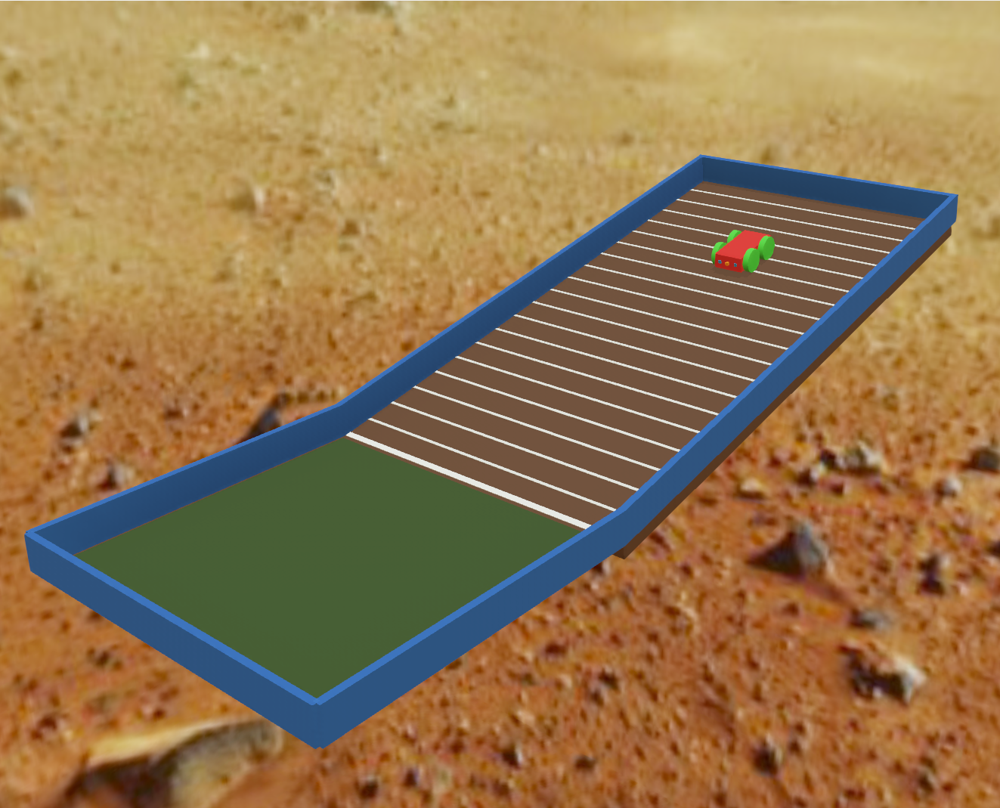
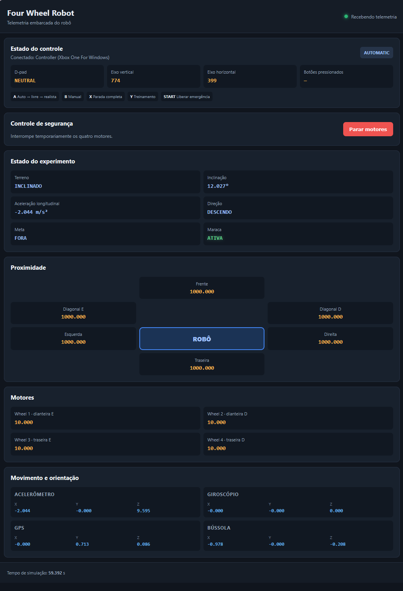
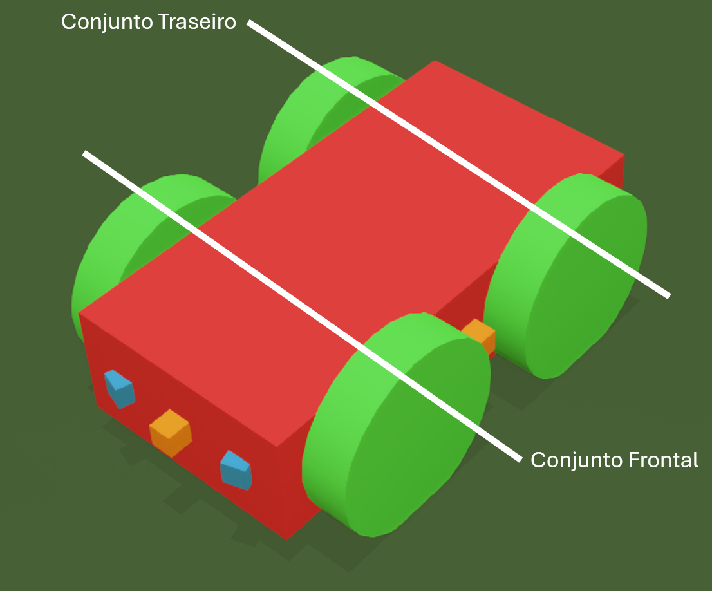
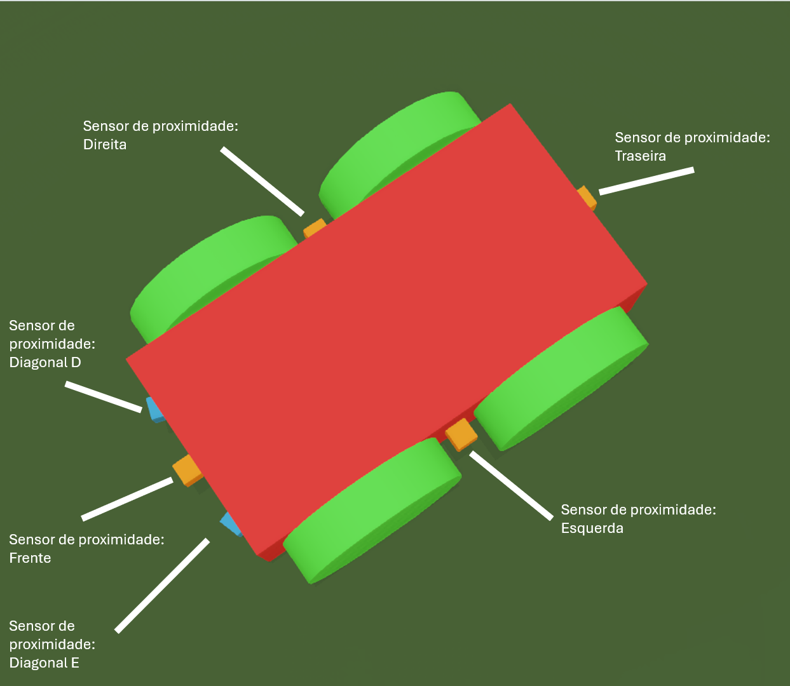
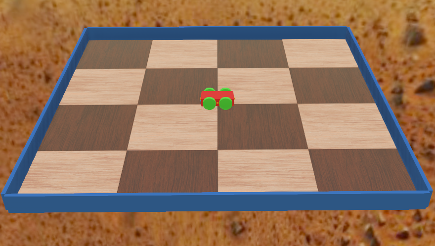

<!--
Documento de trabalho da Fase 2.
Base histórica: docs/fase01-relatorio.md.
O conteúdo está sendo revisado incrementalmente e permanece sujeito às tags editoriais.
-->

<!--
> **Documento de trabalho da Fase 2:** Este arquivo foi criado como cópia integral de `docs/fase01-relatorio.md` para permitir uma revisão incremental e rastreável. As seções marcadas como `[preservar]` já foram revistas, as demais ainda podem conter descrições, próximos passos e conclusões obsoletas.
-->

## [atualizar] Atualização de entrega da Fase 2

O relatório a seguir consolida a evolução do projeto na segunda entrega.

A Fase 2 compreende a correção e parametrização do mundo inclinado, a definição lógica da área da meta (onde o experimento termina), a aquisição do estímulo da aceleração e a aquisição do estimulo da maraca, a implementação **inicial** da rede plástica de quatro neurônios com uma **primeira versão** das equações envolvidas e sua integração ao modo `LEARNING` da simulação, a telemetria experimental e a geração de artefatos a cada execução também fazem parte dessa entrega.

O objetivo de conectar a rede a simulação validou

No estado atual, a implementação de engenharia e o fluxo experimental de ponta a ponta estão concluídos mas as execuções realizadas neste ponto têm caráter exploratório: demonstram o funcionamento do sistema mas não constituem um experimento controlado nem evidência suficiente para atribuir o comportamento observado à plasticidade neural.

No entanto, a simulação implementada com um protocolo de experimento definido e posterior análise dos artefatos gerados podem sim ser a base para uma análise desse tipo.

Está nos planos a implementção na Fase 3 de um modo de disparo não supervisionado de um conjunto de simulações que permita variar determinados parâmetros e comparar o resultado do conjunto de experimentos, isso será um facilitador para estudar impacto de diferentes plasticidades neurais.

### [preservar] Legenda editorial

- `[preservar]`: conteúdo tecnicamente válido, sujeito apenas a revisão textual leve;
- `[corrigir]`: conteúdo com erro factual, inconsistência ou afirmação que precisa ser qualificada;
- `[atualizar]`: conteúdo válido na Fase 1, mas que precisa refletir o estado da Fase 2;
- `[adicionar]`: seção nova reservada para conteúdo ainda não redigido.
- `[esclarecer]`: sessão que necessita de mais clareza ou pesquisa, deve ser omitida ou comentada


# [preservar] Modelo neurocomputacional de reorganização motora

Lenin Cristi

CMCC - Universidade Federal do ABC (UFABC)
Santo André - SP - Brasil

lenin.cristi@aluno.ufabc.edu.br

Resumo. Este trabalho tem como objetivo a reprodução computacional e robótica do experimento Doman's Inclined Floor Method for Early Motor Organization Simulated with a Four Neurons Robot (2011) de Ropero Peláez e Lucas Santana, no qual um robô controlado por uma rede neural plástica de quatro neurônios aprende a organizar seu comportamento motor em um plano inclinado, inspirado no método de estimulação motora precoce de Glenn Doman.

## [preservar] Sumário

- `[preservar]` Resumo
- `[preservar]` Objetivo do Projeto
- `[preservar]` Introdução
  - `[preservar]` O experimento original
  - `[preservar]` A rede neural "não convencional"
  - `[preservar]` Resumo das diferenças
  - `[preservar]` Arquitetura e mapeamento motor
- `[preservar]` Metodologia
  - `[preservar]` Estratégia incremental de construção e validação
  - `[preservar]` Simulação de mundo
  - `[preservar]` Desenvolvimento
  - `[preservar]` Estado ao final da Fase 2
- `[atualizar]` Arquitetura detalhada da rede
  - `[atualizar]` Topologia e conectividade
  - `[atualizar]` Mapeamento neural-motor
  - `[atualizar]` Ordem temporal e fluxo causal
- `[atualizar]` Funções e equações
  - `[atualizar]` Normalização e soma sensorial
  - `[atualizar]` Ativação, saída sigmoidal e competição
  - `[atualizar]` Plasticidade sináptica
  - `[atualizar]` Plasticidade intrínseca
  - `[atualizar]` Distância, deslocamento e classificação do movimento
  - `[atualizar]` Aceleração, maraca e critérios de aprendizagem
- `[atualizar]` Parâmetros experimentais
  - `[atualizar]` Parâmetros da rede neural
  - `[atualizar]` Parâmetros do protocolo de aprendizagem
  - `[atualizar]` Parâmetros do mundo Webots
  - `[atualizar]` Parâmetros do robô e dos sensores
- `[atualizar]` Implementação e reprodutibilidade
  - `[atualizar]` Validação automatizada
  - `[atualizar]` Ensaios exploratórios
  - `[atualizar]` Telas da interface e da telemetria
  - `[atualizar]` Vídeos das execuções
- `[atualizar]` Limitações e hipóteses operacionais
- `[atualizar]` Protocolo dos ensaios formais
- `[atualizar]` Conclusão
- `[preservar]` Apêndices
  - `[preservar]` Apêndice A - Guia de reprodução
  - `[preservar]` Apêndice B - Estrutura do repositório
  - `[preservar]` Apêndice C - Evolução histórica da simulação
  - `[adicionar]` Apêndice D - Localização e configuração dos parâmetros
- `[corrigir]` Referências

## [preservar] Resumo

Este trabalho tem como objetivo a reprodução computacional e robótica do experimento *Doman's Inclined Floor Method for Early Motor Organization Simulated with a Four Neurons Robot (2011)* de Ropero Peláez e Lucas Santana, no qual um robô controlado por uma rede neural plástica de quatro neurônios aprende a organizar seu comportamento motor em um plano inclinado, inspirado no método de estimulação motora precoce de Glenn Doman.

A implementação original foi realizada utilizando *LEGO Mindstorms NXT* em *MATLAB* e dependia de sensores e estímulos relacionados à aceleração, à visão e ao som, representados respectivamente pela detecção de aceleração, por uma câmera apontada para a rampa listrada e por um microfone captando o som de uma maraca na meta. Este projeto desenvolve uma versão reproduzível do experimento utilizando uma linguagem multiparadigma flexível e uma arquitetura modular de sensoriamento e controle. O código integral do projeto está disponível em https://github.com/lnncrs/DomanNeurocomputationalModel

A reconstrução foi conduzida deliberadamente de forma incremental, separando a modelagem do mundo, a validação da física neste mundo, a construção do robô e sua equipagem com sensores, a interface de controle webots e por fim sua integração com a rede neural.

Essa organização permitiu testar isoladamente cada componente em cada camada antes de integrá-lo ao experimento completo, reduzindo a dificuldade de identificar falhas e aumentando a reprodutibilidade do sistema.

<mark>
Foram criados ambientes de simulaçãodo Webots versionados em `webots\worlds`, sendo o principal deles o `webots\worlds\experiment_inclined_plane.wbt` já integrado a uma primeira tentativa de rede neural recorrente e plástica de quatro neurônios.
</mark>
<br/><br/>



Imagem: Simulador pronto para o experimento

<mark>
Esta simulação conta também com controle motor, aquisição de telemetria detalhada para diversos sensores, retorno do estímulo de uma maraca sintética que premia deslocamento para a meta inspirada no artigo, registro detalhado das execuções e controle manual do robo.
</mark>
<br/><br/>



Imagem: Tela de acompanhamento da telemetria do robo

<!-- ! TODO
Os planos inclinados e normais devem ser revisados para garantir que estao sendo usados os artefatos mais recentes e mesma perspectiva, plano com boxes precisa ser renomeado para melhor entendimento
-->

<!--
Os ensaios exploratórios já demonstram o funcionamento do fluxo completo, enquanto a avaliação do aprendizado e do comportamento emergente será realizada posteriormente por meio de uma série de experimentos controlados.
-->

## [preservar] Objetivo do Projeto

Os objetivos centrais do experimento original são:

- Simular condições de aprendizado motor infantil;

- Observar o surgimento de comportamento emergente;

- Analisar, a partir desse comportamento, possíveis paralelos com processos de neuroplasticidade.

> **Nota:** Neste ponto entendemos que a simulação, o robô e mesmo o aprendizado são tratados como meios e não como objetivos fim.

## [preservar] Introdução

### [preservar] O experimento original

Antes da construção do projeto, foi imprescindível realizar uma leitura detalhada do artigo que descreve o experimento original *Doman's Inclined Floor Method for Early Motor Organization Simulated with a Four Neurons Robot (2011)*, também disponível no repositório em `docs\Testing the inclined plane technique with a four neurons robot.pdf`.

Essa leitura revelou um ponto fundamental sobre o experimento: O objetivo do experimento não era simplesmente fazer o robô aprender a se locomover, mas sim utilizar uma arquitetura robótica e neural simples para investigar como estímulos sensoriais e determinados mecanismos de plasticidade poderiam contribuir para a organização inicial do comportamento motor.

O experimento procura reproduzir, de maneira simplificada, alguns elementos presentes no método do plano inclinado de Doman:

- aceleração produzida durante o movimento sobre o plano inclinado, como analogia ao estímulo vestibular;

- transições visuais geradas pelas faixas pretas e brancas da rampa;

- estímulo sonoro produzido por uma maraca após movimentos descendentes em direção a meta;

- ambiente físico formado pelo plano inclinado;

- sistema neural simples, composto por quatro neurônios plásticos interconectados.

Inicialmente, o robô não possui uma direção preferencial. Quando uma sequência de comandos motores produz um movimento descendente, a ação da gravidade resulta em maior aceleração e em transições mais rápidas entre as faixas visuais da rampa. Além disso, o movimento descendente é seguido pelo estímulo sonoro da maraca. Esses estímulos influenciam os mecanismos de plasticidade sináptica e intrínseca, favorecendo a formação de sequências neurais associadas ao deslocamento sobre a rampa. No artigo, considera-se que o robô aprendeu quando executa movimentos na mesma direção durante cinco iterações consecutivas.

O modelo não pretende reproduzir integralmente o sistema nervoso infantil ou demonstrar diretamente como uma criança aprende a se locomover. Ele constitui uma analogia computacional controlada, utilizada para observar a relação entre estímulos sensoriais, plasticidade e organização motora e, a partir dela, formular hipóteses sobre processos envolvidos na aquisição inicial do movimento.

Assim, o aprendizado do robô não constitui o objetivo final do experimento, mas um meio para investigar, em um sistema simplificado e controlável, como estímulos sensoriais e mecanismos de plasticidade podem participar da organização do comportamento motor.

### [preservar] A rede neural utilizada

> **Nota:** A implementação apresentada aqui é uma primeira tentativa de reproduzir a apresentada no artigo, assim como leituras subsequentes do artigo levaram a correção do mecanismo de locomoção de diferencial para por eixos, a rede pode ser revista.

<mark>
O artigo descreve uma rede totalmente interconectada composta por quatro unidades neuronais excitatórias do tipo rate-code. Cada neurônio recebe a soma dos estímulos sensoriais e sinais provenientes da atividade anterior dos demais neurônios e de sua própria conexão recorrente. Um mecanismo de competição mantém ativo apenas o neurônio com maior saída em cada iteração.
</mark>
<br/><br/>

A arquitetura possui quatro conexões recorrentes, cada uma ligando um neurônio a si próprio, cujos pesos são mantidos fixos em *0,7*. As doze conexões entre neurônios diferentes possuem pesos modificáveis ou *plásticos*.

| **Recebe de / Saída de** | **N1** | **N2** | **N3** | **N4** |
| ------------------------ | -----: | -----: | -----: | -----: |
| **N1**                   |    0,7 |    w₁₂ |    w₁₃ |    w₁₄ |
| **N2**                   |    w₂₁ |    0,7 |    w₂₃ |    w₂₄ |
| **N3**                   |    w₃₁ |    w₃₂ |    0,7 |    w₃₄ |
| **N4**                   |    w₄₁ |    w₄₂ |    w₄₃ |    0,7 |

Tabela 1: Conexões neuronais na rede

Sendo:
- $w_{12}$: conexão de **N2 para N1**
- $w_{21}$: conexão de **N1 para N2**
- Os valores `0,7` na diagonal representam as conexões autorrecorrentes fixas.

<mark>
O aprendizado ocorre de forma incremental a cada iteração por meio de dois mecanismos complementares: plasticidade sináptica, que altera os pesos entre os neurônios, e plasticidade intrínseca, que desloca a função de ativação de cada unidade de acordo com seu histórico de atividade.
</mark>
<br/><br/>

Esses neurônios continuam sendo modelos artificiais, mas diferem daqueles empregados em muitas redes neurais convencionais: Não há camadas profundas, função de perda, dados rotulados ou retropropagação de erro.

A adaptação ocorre a partir do retorno sensorial produzido pelas consequências das ações do robô, que modula a atividade neuronal e, indiretamente, as alterações sinápticas.

A pequena quantidade de neurônios torna possível acompanhar diretamente os pesos, as ativações, os neurônios vencedores e as sequências motoras produzidas. Essa interpretabilidade é uma propriedade útil da arquitetura, embora o artigo não afirme explicitamente que a escolha de quatro neurônios tenha sido determinada exclusivamente por esse objetivo.

O modelo não pretende reproduzir toda a complexidade de um sistema neural biológico. Ele representa uma estrutura computacional simplificada, utilizada para investigar como plasticidade, competição e feedback sensorial podem contribuir para a organização progressiva do comportamento motor.

> **Nota:** Numa primeira visita a aula *Modelagem de redes bioinspiradas. Prof. Javier Ropero Peláez (UFABC)* disponível em: https://www.youtube.com/watch?v=j9ElSxpLWzw acredito que este modelo pode ser considerado fenomenológico (porque não modelamos detalhadamente canais ionicos, potenciais, membranas etc) e frequencial pela característica de *taxa de disparo* usada

<!-- ! TODO
duvida se esta exata a sessao seguinte inclinado a omitir na fase 2 do relatorio e retornar com ela na fase 3
-->

<!--
### [esclarecer] Resumo das diferenças

Em comparação com redes neurais convencionalmente treinadas, o modelo apresenta:

- quatro neurônios excitadores totalmente interconectados;

- conexões recorrentes fixas e conexões não diagonais plásticas;

- função de ativação sigmoidal com deslocamento adaptável;

- plasticidade sináptica e intrínseca;

- competição entre os neurônios;

- adaptação contínua durante a interação com o ambiente;

- ausência de retropropagação de erro e de dados rotulados.

Esse conjunto de características permite observar diretamente como o estado da rede se modifica durante o experimento e como sequências de atividade neural se relacionam com as ações motoras executadas.
-->

### [preservar] Mapeamento motor

O fluxo geral do sistema é:

```text
ação anterior
→ resposta do ambiente
→ aceleração + visão + som
→ normalização e soma sensorial
→ ativação recorrente
→ saída sigmoidal
→ competição
→ neurônio vencedor
→ atualização sináptica e intrínseca
→ nova ação motora
→ resposta do ambiente
→ próxima iteração
```

No robô virtual, cada roda possui um motor independente. Para preservar a organização funcional do experimento original, o adaptador do modo `LEARNING` agrupa esses motores em conjuntos frontal e traseiro. Cada neurônio corresponde assim a uma primitiva motora e a competição mantém apenas um neurônio ativo por iteração, o modelo neural conhece apenas as ações abstratas e a conversão para os quatro motores do robô é feita por um adaptador.

<!--
| Neurônio | Ação abstrata | Comando no robô virtual |
|---|---|---|
| N1 | conjunto frontal, horário | rodas 1 e 2 com velocidade positiva |
| N2 | conjunto frontal, anti-horário | rodas 1 e 2 com velocidade negativa |
| N3 | conjunto traseiro, horário | rodas 3 e 4 com velocidade positiva |
| N4 | conjunto traseiro, anti-horário | rodas 3 e 4 com velocidade negativa |
-->

| Neurônio | Primitiva motora |
|---|---|
| N1 | conjunto frontal, sentido horário |
| N2 | conjunto frontal, sentido anti-horário |
| N3 | conjunto traseiro, sentido horário |
| N4 | conjunto traseiro, sentido anti-horário |

Tabela 4: Tradução das açoes abstratas em primitivas motoras



Imagem: *Closeup* no robo onde se vêem os dois eixos frontal / traseiro em perspectiva

> **Nota sobre a implementação atual:** O retorno de **aceleração** é calculado a partir da variação da aceleração longitudinal medida durante cada janela motora. O retorno do estímulo sonoro da **maraca** é produzido sinteticamente quando existe redução da distância até a área retangular da meta e ela é suficiente para que o movimento seja classificado como descendente. Portanto, a implementação atual não utiliza um par físico de microfone e alto-falante e o canal visual de detecção de listras permanece não implementado nesta etapa. Esses mecanismos serão detalhados nas seções de funções, equações e protocolo experimental.

> **Nota histórica:** Nas primeiras versões da simulação, o mapeamento `neuronios → movimento` foi interpretado como uma configuração diferencial entre os lados esquerdo e direito. A releitura do artigo levou à correção do modo `LEARNING` para a organização `neuronios → movimento` para os eixos frontal/traseiro em sentido horário e anti-horário. Os modos manual de controle `MANUAL` e automático anti colisão `AUTOMATIC` continuam utilizando controle diferencial e não foram afetados por essa mudança.

### [preservar] Sensoriamento

O Robo usado como base é o do tutorial do Webots preservado em `webots\tutorials\4_wheels_robot.wbt`, ele foi adaptado e ganhou 4 sensores de proximidade externos adicionais em cada direção, teve mantido os sensores de proximidade frontais diagonais originais e recebeu os seguintes sensores adicionais não visíveis:

- Acelerômetro
- Giroscópio
- GPS
- Bússola



Imagem: *Closeup* no robo onde se vêem os sensores de proximidade originais e adicionais (somente estes são visíveis)

<!--
## [atualizar] Arquitetura detalhada da rede
-->

<!-- ! todo
paragrafo seguinte nao conecta com o texto, talvez uma introducao simples
-->

<!--
A implementação mantém separadas a arquitetura descrita no artigo e as hipóteses necessárias para torná-la executável. A rede não depende do Webots: ela recebe três valores sensoriais e devolve uma das quatro ações motoras abstratas.
-->

<!-- ! todo
incluir referencia ao arquivo principal e classe da implementacao neuronal
-->

<!-- ! todo
esse trecho seguinte em parte esta redundante com a explicacao em tabela anterior, talvez remontar os paragrafos seguintes
-->

<!--
### [atualizar] Topologia e conectividade

A rede possui quatro neurônios excitatórios do tipo *rate-code*, totalmente
interconectados. A matriz `W[i][j]` representa a conexão do neurônio `j` para o
neurônio `i`. As quatro conexões diagonais são recorrentes e permanecem fixas
em `0,7`; as doze conexões não diagonais são plásticas.

A mesma soma sensorial chega aos quatro neurônios. A diferença entre suas
ativações surge do estado recorrente, dos pesos e dos deslocamentos individuais
das funções sigmoidais. Após o cálculo das saídas, uma competição mantém ativo
somente o neurônio vencedor.
-->

<!--
### [atualizar] Mapeamento neural-motor

Cada neurônio corresponde a uma primitiva motora,o modelo neural conhece apenas as ações abstratas e a conversão para os quatro motores do robô é feita
por um adaptador.

| Neurônio | Ação abstrata | Comando no robô virtual |
|---|---|---|
| N1 | conjunto frontal, horário | rodas 1 e 2 com velocidade positiva |
| N2 | conjunto frontal, anti-horário | rodas 1 e 2 com velocidade negativa |
| N3 | conjunto traseiro, horário | rodas 3 e 4 com velocidade positiva |
| N4 | conjunto traseiro, anti-horário | rodas 3 e 4 com velocidade negativa |

Tabela 4: Tradução das açoes abstratas em primitivas motoras
-->

<!-- ! todo
incluir referencia do codigo onde é feita a tradução acao -> primitiva
-->

<!-- ! todo
escolhe como? criterio? e esse trecho nao duplica a explicacao inicial sobre a ordem de etapas?
-->

<!--
### [atualizar] Ordem temporal e fluxo causal

Uma iteração representa a consequência de uma ação já selecionada. No início, a rede recebe entradas nulas e escolhe a primeira ação. Em seguida, cada ciclo obedece à ordem:


```text
ação anterior
-> movimento mantido durante uma janela temporal
-> deslocamento e aceleração observados
-> classificação do movimento
-> produção dos estímulos sensoriais
-> ativação e competição neural
-> plasticidade sináptica e intrínseca
-> seleção da próxima ação
```

Essa ordem impede que a maraca influencie a ação que a produziu: o som gerado por uma descida alimenta somente a decisão neural seguinte.
-->

<!-- ! todo
incluir como esse "impede" é implementado no codigo
-->

## [preservar] Metodologia

A reconstrução do experimento envolve componentes interdependentes:

- o ambiente inclinado;
- a dinâmica física;
- a estrutura do robô;
- os sensores embarcados;
- os estímulos externos;
- o controle motor;
- a rede neural.

Alterações em qualquer um desses elementos podem modificar o comportamento observado e, consequentemente, dificultar a identificação da origem de eventuais falhas.

No experimento original, a estrutura robótica foi construída com *LEGO Mindstorms NXT*, enquanto a rede neural e os comandos sensório-motores foram implementados em *MATLAB* por meio da *RWTH Mindstorms NXT Toolbox*.

A reprodução direta dessa estrutura em uma nova plataforma física exigiria que problemas mecânicos, eletrônicos, sensoriais e computacionais fossem tratados simultaneamente.

### [preservar] Estratégia incremental de construção e validação

Para reduzir essa complexidade, foi adotada uma estratégia incremental em camadas. Cada componente é inicialmente construído e validado de forma isolada e, posteriormente, integrado aos demais. Essa abordagem permite distinguir problemas relacionados ao ambiente, à física, ao robô, ao controle e ao modelo neural.

A simulação foi utilizada como ambiente inicial de desenvolvimento porque permite:

- controlar as condições experimentais;

- repetir ensaios sob configurações equivalentes;

- observar diretamente posições, velocidades, acelerações e comandos motores;

- testar componentes isoladamente;

- reduzir o custo de alterações mecânicas;

- registrar de forma sistemática as variáveis de cada execução.

A construção de um robô físico foi mantida como uma etapa posterior à validação do comportamento no ambiente simulado. O núcleo neural e o protocolo experimental foram separados da interface do simulador para favorecer sua reutilização futura.

> **Nota:** Por mais que a estrutura em camadas favoreça o reuso de código, uma implementação física ainda exigirá um adaptador específico para os sensores, motores, unidades de medida e restrições temporais da plataforma escolhida.

Para evitar confusão com as fases de entrega e documentação do projeto, os cinco blocos de desenvolvimento são tratados neste relatório como **etapas técnicas de implementação**.

| Etapa | Escopo | Estado ao final da Fase 2 |
|---|---|---|
| 1 - Ambiente | Construção dos planos inclinado e horizontal e validação de sua geometria | concluída |
| 2 - Física | Testes de gravidade, colisão, contato com a rampa e comportamento de sólidos | concluída |
| 3 - Robô | Modelagem do corpo, das rodas, dos motores, das juntas e dos sensores | concluída |
| 4 - Controle e instrumentação | Implementação dos modos de controle `MANUAL` e `AUTO`, telemetria e aquisição das variáveis experimentais | concluída |
| 5 - Integração neural | Implementação da rede de quatro neurônios, protocolo temporal e integração ao modo `LEARNING` | integração concluída; validação científica pendente |

Tabela 3: Completude técnica do projeto

> **Nota:** Na etapa técnica 4, foi necessário implementar dois modos adicionais de controle não previstos: `PASSIVE_FREE` e `PASSIVE_REALISTIC`. No primeiro, o torque disponível dos motores é desativado, deixando as rodas livres. No segundo, o torque disponível é limitado a 0,03 N·m por roda, representando uma pequena resistência dos motores. Esses modos foram utilizados para testar o deslizamento e a influência da gravidade sobre o robô nos planos inclinados.

A conclusão de uma etapa técnica indica que seus componentes essenciais estão implementados e funcionalmente integrados. Isso não significa, por si só, que todas as hipóteses científicas associadas tenham sido validadas. Em particular, a integração neural permite executar o experimento completo, mas a atribuição do comportamento observado à plasticidade exige ensaios controlados e comparações com condições de referência.

### [preservar] Simulação de mundo

<!-- ! TODO
Nomes de produtos como Webots, PyBullet e Jupyter, etc em paragrafos ou titulos que nao sejam em paths ou semalhante devem estar em italico
-->

Para a simulação, foi realizada uma pesquisa na qual foram considerados dois ambientes principais: *Webots* e *PyBullet*. O Webots foi escolhido por oferecer maior capacidade de representar motores, atuadores e sensores de maneira próxima a uma implementação física, dentro de um ambiente integrado de simulação. A plataforma também oferece suporte a controladores em Python, C e C++, além de uma biblioteca de mundos e componentes reutilizáveis.

Os principais motivos para a escolha do Webots foram:

- modelagem integrada de sensores, motores e atuadores;

- suporte a controladores em Python, C e C++;

- simulação da interação entre corpos, juntas e superfícies;

- biblioteca de mundos e componentes reutilizáveis;

- proximidade conceitual com uma futura implementação física.

Um ponto importante do Webots é permitir o desenvolvimento inicial dos controladores em Python, oferecendo maior flexibilidade para a implementação e validação do modelo neural. A plataforma também suporta controladores em C e C++, o que amplia as possibilidades de integração com outras plataformas e de futuras adaptações para hardware físico.

**A implementação foi organizada de forma que o modelo neural e o protocolo experimental não dependam diretamente dos detalhes internos do robô simulado.** Essa separação favorece a reutilização do núcleo do sistema, embora uma implementação física ainda exija um adaptador específico para os sensores, motores, unidades de medida e restrições temporais do hardware escolhido.



Imagem: Plano *half-size* não inclinado utilizado em testes

A biblioteca de mundos, objetos e exemplos disponibilizada pelo Webots parcialmente preservada em `webots\tutorials` também foi um fator relevante para a escolha, pois forneceu referências para a construção inicial dos ambientes, das juntas, dos sensores e dos controladores utilizados no projeto.

### [preservar] Desenvolvimento

**O projeto foi desenvolvido com ferramentas abertas e organizado para favorecer a reprodução dos experimentos.**

O Webots é utilizado para a simulação física, enquanto Python implementa a rede neural, o protocolo experimental, a integração com o controlador e a geração dos artefatos de cada execução.

As dependências de sistema como o *gcc* e o *make* tão bem como dependências Python estão integralmente mapeadas no apêndice.

Uma listagem preliminar do *software* utilizado é a que segue:

- Plataformas *Windows* e *Linux* suportadas com instruções disponíveis para ambas pois a reprodução dos experimentos é agnóstica a sistema operacional.

- Ferramentas *Git* para clonar e operar o repositório de projeto;

- O *Webots R2025a* para rodar as simulações;

- Compilador *gcc* com *make* e *sh* disponíveis pois é utilizado pelo *Webots R2025a* quando da criação das bibliotecas de *controllers* e *plugins*;

- Ambiente *uv* recomendado, mas pode-se usar *pip* ou *conda*;

- Python 3.13 fornecido pelo ambiente de escolha acima;

- Uma validação da rede com dados sinteticos usa um notebook *Jupyter*, adicionalmente *numpy*, *pandas* e *matplotlib* são recomendados;

- Os testes automatizados usam *pytest*;

### [preservar] Estado do projeto ao final da Fase 2

**Ao final da Fase 2, o ambiente físico, o robô, a instrumentação e a rede neural encontram-se integrados no modo `LEARNING`.** Cada ação neural é mantida durante uma janela temporal, após a qual o deslocamento e a aceleração são agregados. O movimento é então classificado, a maraca é produzida quando ocorre descida e os estímulos resultantes alimentam o passo neural seguinte.

O fluxo experimental completo já produz telemetria, registros por iteração, metadados, resumos e relatórios HTML. Os testes automatizados validam os componentes de software, e as execuções exploratórias demonstram que o robô consegue completar o percurso. Esses resultados confirmam a integração do sistema, mas ainda não permitem atribuir o comportamento observado à plasticidade neural.

Uma lista com *features* chave do projeto funcionais nesta fase é a que segue:

- Mapas webots criados em separado dos artefatos de robo para permitir reutilizacao com exemplares planos e inclinados

- Area de meta criada em verde para facil identificacao e parametrizada para reuso

- Instrumentacao embarcada do robo criada acoplada ao robo e independente do mapa

- Controle do robo independente e parametrizavel

- Todas as variaveis de simulacao e experimento identificadas e parametrizaveis centralmente para facilitar alteracao

- Tela interativa de acompanhamento da simulacao com telemetria e dados de treinamento em tempo real;

- Controle manual baseado em joystic para exploracao livre do mapa;

- Geração de metadados e logs do experimento em JSONL acompanhados de um relatório HTML com detalhes da rede gerada;

<!-- ! todo
aqui entram duas imagens de um close no carrinho e da tela de treinamento lado a lado
-->

## [preservar] Funções e equações

As funções utilizadas na reconstrução possuem origens diferentes. Algumas são
apresentadas explicitamente no artigo original; outras foram necessárias para
transformar sua descrição em um protocolo executável no ambiente simulado. Para
distinguir esses casos, cada subseção apresenta a notação matemática, define
seus símbolos, registra a origem da expressão e indica resumidamente sua
implementação.

| Função ou equação | Finalidade | Origem | Classificação |
|---|---|---|---|
| normalização e soma sensorial | transformar e combinar aceleração, visão e som | soma sensorial descrita no artigo; normalização explicitada na reconstrução | adaptação operacional |
| ativação, saída sigmoidal e competição | calcular a atividade e selecionar o neurônio vencedor | sigmoide correspondente à equação 3 do artigo; ativação e competição completadas pela reconstrução | publicada e adaptada |
| plasticidade sináptica | atualizar os pesos entre neurônios diferentes | equação 2 do artigo | publicada, com hipótese sobre o escopo da atualização |
| plasticidade intrínseca | atualizar o deslocamento da função sigmoidal | equação 4 do artigo | publicada, com hipótese sobre a saída utilizada |
| distância, deslocamento e classificação | medir a aproximação à meta e classificar o movimento | não apresentada como equação no artigo | decisão geométrica e operacional |
| aceleração, maraca e critérios | agregar o estímulo vestibular, produzir o estímulo sonoro e registrar aprendizagem | critério principal descrito no artigo; agregação e critério adicional definidos na reconstrução | publicada e adaptada |

### [preservar] Normalização e soma sensorial

Os três canais sensoriais são representados por aceleração, visão e som. Antes de serem apresentados à rede, seus valores passam por uma transformação de normalização independente, composta pela correção de um valor de referência e pela aplicação de um fator de escala:

$$
\widetilde{x}_k(t) =
\left(x_k(t)-o_k\right)s_k,
\qquad k \in \{a,v,s\}
$$

Onde:

- $t$: iteração do protocolo experimental;
- $k$: canal sensorial considerado;
- $a$, $v$ e $s$: aceleração, visão e som, respectivamente;
- $x_k(t)$: valor do canal $k$ recebido pelo normalizador na iteração $t$;
- $o_k$: deslocamento ou *offset* aplicado ao canal $k$;
- $s_k$: fator de escala do canal $k$;
- $\widetilde{x}_k(t)$: valor do canal após a normalização.

Cada entrada sensorial pode ter seu ponto de referência corrigido e sua intensidade ajustada antes de ser apresentada à rede, ou seja:

> **Esta equação quer dizer:** Pegue o valor recebido de um sensor, subtraia um valor de referência e multiplique o resultado por um fator de escala.

Os valores normalizados são somados e formam uma entrada sensorial comum aos
quatro neurônios:

$$
S(t)
=
\sum_{k \in \{a,v,s\}}\widetilde{x}_k(t)
=
\widetilde{x}_a(t)
+
\widetilde{x}_v(t)
+
\widetilde{x}_s(t)
$$

Onde:

- $S(t)$: entrada sensorial total apresentada a cada neurônio na iteração $t$;
- $\widetilde{x}_a(t)$: aceleração longitudinal agregada e normalizada;
- $\widetilde{x}_v(t)$: entrada visual normalizada;
- $\widetilde{x}_s(t)$: intensidade normalizada do estímulo da maraca.

> **Esta equação quer dizer:** entrada total = aceleração transformada + visão transformada + som transformado

Na configuração atual:
- Todos os *offsets* são zero e todas as escalas são `1,0`.
- O canal visual permanece desativado e recebe `0,0`.
- O canal sonoro recebe `0,1` quando a iteração anterior é classificada como descendente e `0,0` nos demais casos.

<!--
**Origem e adaptação:** O artigo descreve aceleração, visão e som como entradas
sensoriais comuns à rede, mas não especifica integralmente uma transformação de
normalização para a reconstrução. A transformação linear torna explícitos o
deslocamento e a escala de cada canal. A soma preserva a organização comum das
entradas sensoriais descrita no modelo original.

> **Hipótese operacional:** Com escalas unitárias, os canais são somados sem
> uma calibração adicional de suas magnitudes. A adequação relativa dessas
> escalas deverá ser avaliada nos ensaios formais.

**Implementação:** `src/neural/four_neuron_network.py`, método
`SensoryNormalization.normalize`. O valor total é armazenado em
`NormalizedSensoryInput.total` e utilizado por `FourNeuronNetwork.step`. A
escala da aceleração é encaminhada pelo runtime em
`webots/controllers/four_wheels_manual/learning_runtime.py`.
-->

### [preservar] Ativação, saída sigmoidal e competição

Após a normalização e a soma dos estímulos sensoriais, a rede calcula a ativação de cada neurônio. Essa ativação combina a entrada sensorial da iteração atual com a atividade produzida pela rede na iteração anterior:

$$
a_i(t)
=
S(t)
+
\sum_{j=1}^{4} W_{ij}(t)O_j^c(t-1)
+
\eta_i(t)
$$

Onde:

- $t$: iteração atual do protocolo;
- $i$: neurônio cuja ativação está sendo calculada;
- $j$: neurônio que envia sua saída para o neurônio $i$;
- $a_i(t)$: ativação do neurônio $i$ na iteração $t$;
- $S(t)$: soma das entradas sensoriais normalizadas;
- $W_{ij}(t)$: peso da conexão do neurônio $j$ para o neurônio $i$;
- $O_j^c(t-1)$: saída do neurônio $j$ após a competição na iteração anterior;
- $\eta_i(t)$: ruído opcional acrescentado à ativação.

> **Esta equação quer dizer:** Para calcular a ativação de um neurônio, some a entrada sensorial atual, as saídas da iteração anterior multiplicadas pelos pesos de suas conexões e um ruído opcional.

Como a competição mantém somente um neurônio ativo, normalmente apenas a saída do vencedor anterior contribui para o termo recorrente. Na primeira iteração, as saídas anteriores são zero e a escolha inicial depende da competição entre as saídas produzidas com esse estado inicial.

Em seguida, a ativação é transformada em uma saída limitada ao intervalo entre zero e um por meio de uma função sigmoidal, correspondente à equação 3 do artigo:

$$
O_i(t)
=
\frac{1}
{1+\exp\left[-g\left(a_i(t)-\theta_i(t)\right)\right]}
$$

Onde:

- $O_i(t)$: saída do neurônio $i$ antes da competição;
- $a_i(t)$: ativação calculada para o neurônio $i$;
- $\theta_i(t)$: deslocamento individual da sigmoide do neurônio $i$, chamado
  `shift` na implementação;
- $g$: ganho da sigmoide;
- $\exp$: função exponencial.

> **Esta equação quer dizer:** Compare a ativação do neurônio com o deslocamento de sua sigmoide e transforme essa diferença em uma saída entre zero e um. Quanto maior a ativação em relação ao deslocamento, mais próxima de um será a saída.

Quando $a_i(t)=\theta_i(t)$, a saída da sigmoide é `0,5`. Na configuração atual, o ganho $g$ é `25`, valor adotado do artigo. Esse ganho torna a transição ao redor do deslocamento relativamente acentuada.

Depois do cálculo das quatro saídas, a competição seleciona o neurônio com a maior saída:

$$
w(t)=\underset{i \in \{1,2,3,4\}}{\operatorname{arg\,max}}\;O_i(t)
$$

A saída após a competição é:

$$
O_i^c(t)
=
\begin{cases}
O_i(t), & \text{se } i=w(t),\\
0, & \text{caso contrário.}
\end{cases}
$$

Onde:

- $w(t)$: índice do neurônio vencedor na iteração $t$;
- $\operatorname{arg\,max}$: operação que retorna o índice do maior valor;
- $O_i^c(t)$: saída do neurônio $i$ depois da competição.

> **Estas equações querem dizer:** Compare as saídas dos quatro neurônios, escolha aquele que possui a maior saída, preserve o valor do vencedor e atribua zero aos demais.

Na configuração atual:

- a competição utiliza o modo determinístico, no qual vence a maior saída;
- empates exatos são resolvidos pelo gerador pseudoaleatório associado à seed neural;
- o desvio do ruído de ativação é `0,0` e, portanto, $\eta_i(t)=0$;
- a saída competitiva do vencedor é preservada com seu valor sigmoidal, e não substituída por `1,0`.

### [preservar] Plasticidade sináptica

A plasticidade sináptica modifica os pesos das conexões entre neurônios
diferentes. A variação de cada peso segue a regra pré-sináptica de Grossberg,
apresentada como equação 2 do artigo:

$$
\Delta W_{ij}(t)
=
\varepsilon\,
O_j^c(t-1)
\left[a_i(t)-W_{ij}(t)\right]
$$

O novo peso é obtido acrescentando essa variação ao valor anterior:

$$
W_{ij}(t+1)
=
W_{ij}(t)
+
\Delta W_{ij}(t)
$$

Onde:

- $t$: iteração atual do protocolo;
- $i$: neurônio que recebe a conexão, chamado neurônio pós-sináptico;
- $j$: neurônio que envia a conexão, chamado neurônio pré-sináptico;
- $W_{ij}(t)$: peso da conexão do neurônio $j$ para o neurônio $i$;
- $\Delta W_{ij}(t)$: alteração calculada para esse peso;
- $\varepsilon$: taxa de plasticidade sináptica;
- $O_j^c(t-1)$: saída do neurônio $j$ após a competição na iteração anterior;
- $a_i(t)$: ativação atual do neurônio $i$.

> **Estas equações querem dizer:** Se o neurônio $j$ esteve ativo na iteração anterior, compare a ativação atual do neurônio $i$ com o peso da conexão de $j$ para $i$. Uma pequena fração dessa diferença é acrescentada ao peso.

Quando $a_i(t)$ é maior que $W_{ij}(t)$, a variação é positiva e o peso tende a
aumentar. Quando $a_i(t)$ é menor, a variação é negativa e o peso tende a
diminuir. Se $O_j^c(t-1)=0$, o neurônio pré-sináptico não contribuiu na
iteração anterior e o peso correspondente não se altera.

Na configuração atual:

- a taxa sináptica $\varepsilon$ é `0,01`;
- somente os pesos que chegam ao neurônio vencedor atual são considerados para
  atualização, comportamento denominado `winner_only`;
- como somente o vencedor anterior possui saída competitiva diferente de
  zero, no máximo uma conexão não diagonal recebe uma alteração diferente de
  zero em cada iteração;
- quando o mesmo neurônio vence duas iterações consecutivas, essa possível
  conexão seria diagonal e, portanto, permanece fixa;
- as quatro conexões diagonais não participam da regra de plasticidade e são
  reafirmadas em `0,7` após cada passo;
- não são aplicados limites adicionais aos pesos.

O uso da saída competitiva anterior como atividade pré-sináptica e a
restrição `winner_only` constituem hipóteses operacionais da reconstrução. A
implementação também oferece a alternativa `all_postsynaptic`, na qual todos
os neurônios pós-sinápticos são considerados para atualização, preservando
ainda as conexões diagonais fixas.

### [preservar] Plasticidade intrínseca

A plasticidade intrínseca não modifica os pesos das conexões. Ela altera o
deslocamento individual da função sigmoidal de cada neurônio e, com isso,
modifica a quantidade de ativação necessária para que esse neurônio produza
uma saída elevada em iterações futuras.

Na configuração atual, a atualização utiliza a saída após a competição e segue
a forma operacional da equação 4 do artigo:

$$
\theta_i(t+1)
=
\frac{
\xi O_i^c(t)+\theta_i(t)
}{
1+\xi
}
$$

Onde:

- $t$: iteração atual do protocolo;
- $i$: neurônio cujo deslocamento está sendo atualizado;
- $\theta_i(t)$: deslocamento da sigmoide do neurônio $i$ antes da atualização,
  chamado `shift` na implementação;
- $\theta_i(t+1)$: deslocamento que será utilizado na próxima iteração;
- $O_i^c(t)$: saída do neurônio $i$ após a competição;
- $\xi$: taxa de plasticidade intrínseca.

> **Esta equação quer dizer:** Calcule o novo deslocamento como uma média ponderada entre o deslocamento anterior e a saída atual do neurônio. A taxa $\xi$ determina a velocidade com que o deslocamento se aproxima dessa saída.

Se a saída for maior que o deslocamento atual, o deslocamento aumenta. Se for
menor, o deslocamento diminui. Um deslocamento maior move a sigmoide para a
direita, fazendo o neurônio precisar de uma ativação maior para produzir a
mesma saída. Um deslocamento menor move a sigmoide para a esquerda, tornando o
neurônio mais responsivo a ativações menores.

Na configuração atual:

- o deslocamento inicial de todos os neurônios é `0,5`;
- a taxa intrínseca $\xi$ é `0,01`;
- a fonte utilizada é `post_competition`, isto é, a saída após a competição;
- somente o vencedor possui saída competitiva diferente de zero;
- os neurônios não vencedores também são atualizados: como suas saídas
  competitivas são zero, seus deslocamentos são divididos por $1+\xi$ e
  diminuem gradualmente em direção a zero.

Para o neurônio vencedor, o deslocamento se move em direção ao valor de sua
saída sigmoidal preservada pela competição. Para os demais, a redução do
deslocamento aumenta progressivamente sua capacidade de competir em iterações
posteriores. Esse mecanismo funciona como uma adaptação da excitabilidade
individual dos neurônios.

O uso da saída após a competição é uma hipótese operacional da reconstrução.
A implementação também oferece a alternativa `pre_competition`, na qual a
saída sigmoidal dos quatro neurônios é utilizada antes que os não vencedores
sejam zerados.

### [preservar] Distância, deslocamento e classificação do movimento

A direção do movimento é determinada pela variação da distância entre o robô
e a meta durante uma janela motora. Como a meta ocupa uma área retangular, a
distância é calculada até a borda mais próxima desse retângulo, e não apenas
até seu centro.

Para cada eixo horizontal, calcula-se primeiro a distância até os limites da
meta:

$$
d_x
=
\max\left(
\left|x-x_g\right|-\frac{w}{2},
0
\right)
$$

$$
d_y
=
\max\left(
\left|y-y_g\right|-\frac{l}{2},
0
\right)
$$

A distância horizontal total é então:

$$
d
=
\sqrt{d_x^2+d_y^2}
$$

Onde:

- $x$ e $y$: coordenadas horizontais do robô fornecidas pelo GPS;
- $x_g$ e $y_g$: coordenadas do centro da meta;
- $w$: largura da área da meta;
- $l$: comprimento da área da meta;
- $d_x$: distância até a meta ao longo do eixo $x$;
- $d_y$: distância até a meta ao longo do eixo $y$;
- $d$: menor distância horizontal entre o robô e o retângulo da meta;
- $\max$: operação que escolhe o maior entre os valores apresentados;
- $\left|\,\right|$: valor absoluto, que desconsidera o sinal da diferença.

> **Estas equações querem dizer:** Verifique quanto o robô está fora dos limites da meta em cada direção. Se ele já estiver dentro dos limites de um eixo, a distância naquele eixo será zero. Depois, combine as duas distâncias para encontrar a menor distância horizontal até a área.

No início e no final de cada janela motora, essa distância é registrada. Sua
variação é:

$$
\Delta d
=
d_{\mathrm{final}}
-
d_{\mathrm{inicial}}
$$

Como a aproximação da meta reduz a distância, define-se o progresso em direção
à meta como:

$$
q
=
-\Delta d
=
d_{\mathrm{inicial}}
-
d_{\mathrm{final}}
$$

Onde:

- $d_{\mathrm{inicial}}$: distância até a meta no início da janela motora;
- $d_{\mathrm{final}}$: distância até a meta no final da janela;
- $\Delta d$: variação da distância durante a janela;
- $q$: progresso orientado em direção à meta.

> **Estas equações querem dizer:** Se a distância final for menor que a inicial, o robô se aproximou da meta e $q$ será positivo. Se a distância final for maior, ele se afastou e $q$ será negativo.

Para evitar que pequenas oscilações ou imprecisões numéricas sejam
classificadas como movimento, utiliza-se um limiar $\tau$:

$$
\operatorname{direção}(q)
=
\begin{cases}
\mathrm{DOWN}, & q>\tau,\\
\mathrm{UP}, & q<-\tau,\\
\mathrm{STATIONARY}, & -\tau\leq q\leq\tau.
\end{cases}
$$

Onde:

- $\tau$: deslocamento mínimo necessário para reconhecer movimento;
- `DOWN`: aproximação da meta;
- `UP`: afastamento da meta;
- `STATIONARY`: variação insuficiente para caracterizar subida ou descida.

> **Esta equação quer dizer:** Uma aproximação maior que o limiar é classificada como descida; um afastamento maior que o limiar é classificado como subida; variações menores são consideradas estacionárias.

Na configuração atual:

- a posição é obtida pelo GPS;
- a meta lógica mede `0,96 × 0,96 m` horizontalmente;
- o limiar $\tau$ é `0,005 m`;
- o sinal de descida é `-1`, porque o protocolo recebe originalmente
  $\Delta d=d_{\mathrm{final}}-d_{\mathrm{inicial}}$;
- `DOWN` representa aproximação da meta, que está localizada na parte inferior
  da rampa, e não uma medição direta da inclinação ou da altitude;
- a distância usada para classificar o movimento é horizontal; a coordenada
  vertical é verificada separadamente para determinar a entrada efetiva na
  região tridimensional da meta.

Neste contexto, "deslocamento" representa a variação da distância até a meta,
e não o comprimento total da trajetória percorrida pelo robô durante a janela.
Esse cálculo é uma decisão geométrica e operacional da reconstrução, pois o
artigo não publica uma equação equivalente para a classificação do movimento.

### [preservar] Aceleração, maraca e critérios de aprendizagem

Ao entrar no modo `LEARNING`, o controlador registra a componente longitudinal
do acelerômetro como valor de referência. Durante cada janela motora, novas
leituras são comparadas com essa referência. A entrada de aceleração associada
à janela é a média das diferenças absolutas:

$$
A(t)
=
\frac{1}{n_t}
\sum_{r=1}^{n_t}
\left|
a_x(t,r)-a_{x,0}
\right|
$$

Onde:

- $t$: janela motora ou iteração experimental;
- $r$: índice de uma leitura realizada dentro da janela;
- $n_t$: quantidade de leituras de aceleração coletadas na janela $t$;
- $a_x(t,r)$: componente longitudinal do acelerômetro na leitura $r$;
- $a_{x,0}$: valor de referência registrado ao entrar no modo `LEARNING`;
- $A(t)$: aceleração agregada apresentada ao protocolo ao final da janela;
- $\left|\,\right|$: valor absoluto, que considera a magnitude da diferença
  sem preservar seu sinal.

> **Esta equação quer dizer:** Compare cada leitura longitudinal com uma
> referência, desconsidere o sinal dessas diferenças e calcule sua média
> durante a janela motora.

Na configuração atual:

- a componente longitudinal corresponde ao primeiro valor, ou eixo $x$, do
  acelerômetro;
- as leituras são obtidas a cada passo de `64 ms` do controlador;
- a escala de normalização da aceleração é `1,0`;
- uma janela nominal dura `0,5 s`;
- uma janela parcial também é finalizada e registrada quando o robô entra na
  meta.

> **Ponto a revisar:** O valor $a_{x,0}$ é capturado ao entrar no modo
> `LEARNING` e não é reiniciado no começo de cada nova janela motora. Portanto,
> a implementação atual mede a diferença em relação ao início da execução ou
> retomada do aprendizado, e não em relação ao início de cada ação. Caso a
> intenção experimental seja medir a variação dentro de cada ação, o runtime
> deverá atualizar essa referência ao abrir cada janela.

Depois da conclusão da janela, o movimento é classificado. Quando a direção é
`DOWN`, o protocolo produz o estímulo lógico da maraca:

$$
M(t)
=
\begin{cases}
m, & \text{se } D(t)=\mathrm{DOWN},\\
0, & \text{caso contrário.}
\end{cases}
$$

Onde:

- $D(t)$: direção atribuída ao movimento executado na janela $t$;
- $m$: intensidade configurada para a maraca;
- $M(t)$: entrada sonora produzida como consequência dessa janela.

> **Esta equação quer dizer:** Se a ação aproximou o robô da meta o suficiente
> para ser classificada como descida, produza a maraca; em qualquer outro caso,
> mantenha a entrada sonora em zero.

Na configuração atual, $m=0{,}1$. O estímulo não é produzido por microfone e
alto-falante: ele é gerado logicamente pelo protocolo. A maraca é calculada
depois da observação da ação executada e participa do passo neural que
seleciona a ação seguinte. Dessa forma, ela não influencia retroativamente a
ação que a produziu.

O protocolo registra dois critérios baseados em sequências de movimentos:

$$
C_{\mathrm{artigo}}(t)
=
\left[D(t)\neq\mathrm{STATIONARY}\right]
\land
\left[n_{\mathrm{mesma}}(t)\geq 5\right]
$$

$$
C_{\mathrm{descida}}(t)
=
\left[n_{\mathrm{descida}}(t)\geq 5\right]
$$

Onde:

- $C_{\mathrm{artigo}}(t)$: critério de cinco movimentos consecutivos na mesma
  direção;
- $C_{\mathrm{descida}}(t)$: critério adicional de cinco movimentos
  consecutivos para baixo;
- $n_{\mathrm{mesma}}(t)$: quantidade de classificações consecutivas iguais à
  direção atual;
- $n_{\mathrm{descida}}(t)$: quantidade de classificações `DOWN`
  consecutivas;
- $\land$: operador lógico “e”; as duas condições precisam ser verdadeiras.

> **Estas equações querem dizer:** O primeiro critério é alcançado após cinco
> movimentos não estacionários consecutivos na mesma direção, seja subida ou
> descida. O segundo é alcançado somente após cinco descidas consecutivas.

O primeiro critério reproduz a condição descrita no artigo. O segundo foi
adicionado para distinguir uma sequência especificamente orientada para a
meta. Ambos são registrados na telemetria e nos artefatos da execução, mas não
encerram o experimento. Na implementação atual, a execução termina quando o
robô entra na meta. A repetição de um mesmo neurônio vencedor, isoladamente,
não é considerada evidência de aprendizagem.

## [preservar] Parâmetros experimentais

As tabelas seguintes registram os valores efetivamente utilizados na configuração atual.

Parâmetros classificados como hipótese deverão ser avaliados nos ensaios formais.

> **Nota:** A localização dos campos, constantes e argumentos correspondentes
> está documentada no **Apêndice D - Localização e configuração dos
> parâmetros**.

### [preservar] Parâmetros da rede neural

| Parâmetro | Valor | Origem |
|---|---:|---|
| número de neurônios | 4 | artigo |
| peso recorrente | 0,7 | artigo |
| ganho sigmoidal | 25 | artigo |
| pesos não diagonais iniciais | uniforme entre 0,1 e 0,9 | hipótese |
| taxa sináptica `epsilon` | 0,01 | hipótese |
| taxa intrínseca `xi` | 0,01 | faixa publicada |
| deslocamento inicial | 0,5 | hipótese |
| competição | determinística | hipótese operacional |
| escopo da plasticidade | `winner_only` | hipótese operacional |
| fonte da plasticidade intrínseca | saída após competição | hipótese operacional |
| desvio do ruído de ativação | 0,0 | desativado |
| limites adicionais dos pesos | nenhum | não publicado |
| seed da configuração integrada | 42 | reprodutibilidade |

Na execução integrada, somente a seed neural é exposta como argumento do
controlador. Os demais valores utilizam a configuração padrão da rede.

### [preservar] Parâmetros do protocolo de aprendizagem

| Parâmetro | Valor atual |
|---|---:|
| duração nominal da ação | 0,5 s |
| velocidade das rodas no modo `LEARNING` | 3,0 rad/s |
| limiar de movimento estacionário | 0,005 m |
| intensidade sonora da maraca | 0,1 |
| escala da aceleração | 1,0 |
| entrada visual | 0,0 |
| movimentos consecutivos para o critério | 5 |
| sinal usado para representar descida | -1 |

> **Nota:** O canal visual permanece desativado. O sinal negativo usado para descida decorre do cálculo `distância final - distância inicial`, pois a aproximação da meta (não necessariamente ao centro dela) reduz a distância.

### [preservar] Parâmetros do mundo Webots

| Parâmetro | Valor atual |
|---|---:|
| versão dos arquivos Webots | R2025a |
| passo básico do mundo | 16 ms |
| passo do controlador | 64 ms |
| seed do mundo | 42 |
| inclinação da rampa | 12 graus (`0,20943951023932` rad) |
| plataforma de chegada | 1 x 1 m |
| rampa | 2 x 1 m |
| altura dos guardrails | 0,1 m |
| espaçamento das faixas | 0,1 m |
| largura das faixas | 0,01 m |
| largura da linha de chegada | 0,02 m |
| área lógica da meta | 0,96 x 0,96 x 0,30 m |
| permanência configurada na meta | 0,5 s; o modo `LEARNING` atual conclui na entrada |

> **Nota:** A seed do mundo é independente da seed neural. O ângulo deve permanecer igual no plano e no robô. A área da meta está representada tanto no mundo quanto nos argumentos do controlador e os valores devem permanecer sincronizados. Embora a permanência esteja configurada em `0,5 s`, o runtime do modo `LEARNING` atualmente encerra a execução na entrada da área.

Gravidade, atrito e alguns parâmetros de contato permanecem herdados dos defaults do Webots.

### [preservar] Parâmetros do robô e dos sensores

| Parâmetro | Valor atual |
|---|---:|
| dimensões do corpo | 0,20 x 0,10 x 0,05 m |
| rodas e motores | 4 |
| raio da roda | 0,04 m |
| espessura da roda | 0,02 m |
| densidade configurada do corpo | 1000 kg/m3 |
| distância inicial ao longo da rampa | 1,45 m |
| torque do modo passivo realista | 0,03 N.m por roda |
| instrumentação | acelerômetro, giroscópio, GPS e bússola |
| sensores de proximidade disponíveis | frontal diagonal esquerdo, frontal diagonal direito, frontal, traseiro, esquerdo e direito |
| posição usada no protocolo | GPS |
| aceleração usada na rede | componente longitudinal do acelerômetro |
| som usado na rede | estímulo lógico, sem microfone ou alto-falante |

<!-- ! todo
esta sessao abaixo esta potencialmente repetida
-->

<!--
## [atualizar] Implementação e reprodutibilidade

O código separa quatro responsabilidades principais:

- `src/neural`: estado, competição e plasticidade da rede;

- `src/experiments`: ordem causal, critérios, registro e relatório;

- `src/control`: tradução das ações abstratas para comandos de rodas;

- `webots\controllers\four_wheels_manual`: controlador Webots com aquisição dos sensores, controle motor, execução da janela de acompanhamento.

Cada execução produz `metadata.json`, `iterations.jsonl`, `summary.json` e um relatório HTML `report.html`derivado na pasta `\experiments\runs\learning_{ISO UTC Timestamp}_{seed}\`.

Os metadados registram as configurações neural,
experimental, do runtime e da meta. A seed torna a inicialização reproduzível;
-->

<!-- ! todo
a sessao abaixo sobre testes e como rodar potencialmente vai para os anexos
-->

<!--
### [remover?] Testes automatizados

A implementação possui testes automatizados distribuídos entre quatro conjuntos:

- equações, inicialização, competição e plasticidade da rede;

- causalidade, classificação do movimento, critérios e arquivos de execução;

- mapeamento das quatro ações para os motores;

- integração temporal, meta, telemetria e geração do relatório HTML.

Esses testes verificam a consistência do software fora do Webots, mas não
substituem a validação visual dos sentidos motores nem os ensaios científicos.

O ambiente Python 3.13 é descrito pelo `pyproject.toml` e pelo `uv.lock`. O
comando recomendado para instalar dependências e executar os testes é:

```bash
uv sync --all-groups --all-extras
uv run pytest
```
-->

<!--
### [remover?] Ensaios exploratórios

Há seis execuções exploratórias registradas, todas encerradas por chegada à
meta. O número de iterações variou entre 43 e 129, e três execuções geraram o
relatório HTML completo. Cinco registros já utilizam o esquema atual dos dois
critérios de aprendizagem.

Essas execuções foram realizadas enquanto a implementação ainda evoluía e não
devem ser agregadas como repetições de um mesmo experimento. Elas demonstram o
funcionamento do fluxo completo, mas não permitem atribuir a chegada à meta à
plasticidade da rede.
-->

<!-- ! todo
isso aqui vira uma explicacao de operacao do experimento
incluir imagem do mapa
incluir imagem da tela explicando cada grupo de controles
incluir mapoeamento do joystic com cada botao e funcao
incluir nota que a versao fase 3 tera mapeamento no teclado tambem
-->

<!--
### [atualizar] Telas da interface e da telemetria

Esta subseção deverá destacar a execução do modo `LEARNING`, incluindo o
neurônio vencedor, a ação selecionada, a direção observada, o estado da maraca,
os contadores dos critérios e a chegada à meta. Também deverá apresentar uma
tela do relatório HTML produzido ao final da execução.
-->

<!-- ! todo
incluir imagem de uma execucao
incluir video no youtube (url) de uma execucao
-->

<!--
### [remover?] Execuções de exemplo

Serão selecionados vídeos curtos que mostrem as quatro primitivas motoras, uma execução completa no plano inclinado e a correspondência entre movimento, telemetria e estímulo sonoro. Os vídeos deverão informar a versão do código e a
configuração utilizada.
-->

<!-- ! todo
isso aqui vira uma sessao de limitacoes e proximos passos
-->

<!--
## [remover?] Limitações e hipóteses operacionais

Na configuração atual, a rede utiliza a aceleração longitudinal e o estímulo
sonoro produzido logicamente após movimentos descendentes. O canal visual
permanece desativado e recebe valor zero. A normalização da aceleração e os
parâmetros temporais ainda deverão ser calibrados antes dos ensaios formais.

A meta possui permanência nominal de `0,5 s` em sua configuração, mas o runtime
de aprendizagem encerra a execução assim que o robô entra na região. Esse
comportamento deverá ser mantido como decisão explícita ou alinhado ao tempo de
permanência antes da campanha experimental.

A implementação foi validada no ambiente simulado. Uma futura plataforma
física exigirá um adaptador próprio para sensores, motores, unidades de medida
e restrições temporais.
-->

<!-- ! todo
ressaltar que a fase 3 permitira executar um batch de experimentos com variacoes de parametros para permitir comparar alteracoes de variaveis a plasticidade gerada
-->

<!--
## [remover?] Protocolo dos ensaios formais

Antes da campanha experimental, deverão ser congelados os parâmetros, a versão
do código e as condições de execução. Os ensaios deverão incluir repetições com
seeds registradas e condições de referência capazes de separar o efeito da
plasticidade do deslocamento produzido pela física da rampa.
-->

## [atualizar] Conclusão

Apesar de desafios iniciais, principalmente no aprendizado e adaptação ao ambiente Webots, o projeto evoluiu para um estado funcional sólido de simulação com controle, mas ainda sem a rede neural integrada. A construção em camadas permitiu validar cada componente isoladamente, garantindo que o sistema como um todo esteja pronto para a integração da rede neural e a observação do comportamento emergente.

A abordagem em camadas permitiu:

- Reduzir complexidade

- Aumentar controle experimental

- Garantir reprodutibilidade

O projeto encontra-se próximo da etapa de aprendizado efetivo.

## [preservar] Referências

Francisco Javier Ropero Peláez, Lucas Galdiano Ribeiro Santana
Doman's Inclined Floor Method for Early Motor Organization Simulated with a Four Neurons Robot (2011)
https://www.semanticscholar.org/paper/Doman's-Inclined-Floor-Method-for-Early-Motor-with-Peláez-Santana/a1d9815865dcf65b909aeaf985f2f96c99be9dd5

J. R. Peláez, Marcelo Simoes
A computational model of synaptic metaplasticity (1999)
https://www.semanticscholar.org/paper/A-computational-model-of-synaptic-metaplasticity-Peláez-Simoes/ba93f797064a0035c6fe37836b055f84d85c61f1

J. R. Peláez, J. Piqueira
Biological Clues for Up-to-Date Artificial Neurons (2007)
https://www.semanticscholar.org/paper/Biological-Clues-for-Up-to-Date-Artificial-Neurons-Peláez-Piqueira/6dc2349c03495f5465df0d6d1ed93c31adde8189

N S Desai, L C Rutherford, G G Turrigiano
Plasticity in the intrinsic excitability of cortical pyramidal neurons (1999)
https://pubmed.ncbi.nlm.nih.gov/10448215/

Niraj S Desai
Homeostatic plasticity in the CNS: synaptic and intrinsic forms (2003)
https://pubmed.ncbi.nlm.nih.gov/15242651/

## [preservar] Apendices

### [preservar] Apêndice A - Guia de reprodução

Este apêndice descreve a preparação do ambiente necessário para inspecionar o código, executar os testes automatizados e reproduzir a simulação integrada da Fase 2. Os comandos devem ser executados a partir da raiz do repositório, salvo quando indicado de outra forma.

O procedimento principal utiliza *uv*, pois `pyproject.toml` e `uv.lock` constituem as fontes de configuração e travamento das dependências Python. Os procedimentos com *pip* e *conda* são mantidos como alternativas.

#### [preservar] Requisitos de software

A tabela esta em ordem sugerida de instalação

| Software | Versão ou condição | Finalidade |
|---|---|---|
| GCC, G++ e *make* | toolchain compatível com o sistema | compilação de controladores ou *plugins* nativos |
| *Git* | versão recente | obtenção e atualização do repositório |
| *Webots* | `R2025a` | execução dos mundos e do controlador do robô |
| Python | `3.13.x` | rede neural, protocolo, testes e relatórios |
| *uv* | versão recente | instalação reproduzível |
| *conda* (não instale o Python antes se usar esta opção) | versão recente | instalação reproduzível |
| *Visual Studio Code* ou outro editor | opcional | inspeção e desenvolvimento do código |

O experimento integrado utiliza um controlador Python e, por isso, GCC não é necessário para interpretar a rede neural. A toolchain permanece documentada porque o repositório contém controladores e exemplos nativos e porque ela será necessária caso esses componentes sejam recompilados ou modificados.

#### [preservar] Requisitos de hardware

| Hardware | Versão ou condição | Finalidade |
|---|---|---|
| controle compatível com *joystick* (modelo Xbox One S mapeado) | opcional para testes gerais; necessário na interface atual para selecionar os modos interativos | acionamento de `MANUAL`, `LEARNING` e demais modos |

#### [preservar] Instalação de GCC, G++ e make

No Ubuntu Linux:

O pacote `build-essential` reúne GCC, G++, *make* e os componentes básicos de compilação:

```bash
sudo apt update
sudo apt install build-essential
gcc --version
g++ --version
make --version
```

No Windows:

O *Webots R2025a* distribui uma cópia própria do MinGW para seus controladores C e C++. Para desenvolvimento também fora do ambiente interno do simulador, pode-se instalar a toolchain UCRT64 do [MSYS2](https://www.msys2.org/).

Após instalar o MSYS2, deve-se abrir o terminal **MSYS2 UCRT64** e atualizar os pacotes:

```bash
pacman -Syu
```

Caso o terminal solicite encerramento após a atualização dos componentes centrais, deve-se abri-lo novamente e repetir `pacman -Syu`. Em seguida, instala-se a toolchain:

```bash
pacman -S --needed \
  mingw-w64-ucrt-x86_64-toolchain \
  mingw-w64-ucrt-x86_64-make \
  make
```

Quando as ferramentas precisarem ser utilizadas também pelo PowerShell ou pelo *Visual Studio Code*, os seguintes diretórios da instalação padrão podem ser adicionados ao `PATH` do usuário:

```text
C:\msys64\ucrt64\bin
C:\msys64\usr\bin
```

A instalação deve ser validada em um novo terminal:

```powershell
gcc --version
g++ --version
make --version
```

No pacote UCRT64, o executável específico do *make* também pode aparecer como `mingw32-make`; o pacote `make` fornece o comando genérico usado pelos procedimentos do projeto.

#### [preservar] Instalação do Git

No Ubuntu Linux:

```bash
sudo apt update
sudo apt install git
git --version
```

No Windows:

O *Git for Windows* pode ser obtido em <https://git-scm.com/>. Em sistemas com *winget*, a instalação também pode ser realizada em PowerShell:

```powershell
winget install --id Git.Git -e --source winget
git --version
```

Depois da instalação, deve-se abrir um novo terminal para que eventuais alterações no `PATH` sejam reconhecidas.

#### [preservar] Clonagem do repositório

Usando HTTPS:

```bash
git clone https://github.com/lnncrs/DomanNeurocomputationalModel.git
cd DomanNeurocomputationalModel
```

Usando SSH, quando uma chave já estiver configurada no GitHub:

```bash
git clone git@github.com:lnncrs/DomanNeurocomputationalModel.git
cd DomanNeurocomputationalModel
```

Após a clonagem, os arquivos `pyproject.toml`, `uv.lock`, `requirements.txt` e `environment.yml` devem estar disponíveis na raiz do projeto.

#### [preservar] Instalação do Webots

Os mundos do repositório declaram `R2025a` no cabeçalho e utilizam recursos dessa versão. Para reproduzir a configuração documentada, deve-se instalar **Webots R2025a**, em vez de substituir automaticamente pela versão mais recente. Os instaladores e as instruções oficiais estão disponíveis em <https://cyberbotics.com/doc/guide/installing-webots> e nas versões publicadas em <https://github.com/cyberbotics/webots/releases>.

No Ubuntu Linux:

Deve-se baixar o pacote `.deb` correspondente ao Webots R2025a e instalá-lo a partir do diretório em que foi salvo:

```bash
sudo apt install ./webots_2025a_amd64.deb
webots --version
```

O nome exato do arquivo pode variar conforme o pacote publicado. Se o executável não for encontrado no `PATH`, o Webots também pode ser iniciado pelo menu de aplicações ou por seu diretório de instalação.

No Windows:

Deve-se baixar e executar o instalador `webots-R2025a_setup.exe`. Na instalação padrão, o executável fica sob `C:\Program Files\Webots`.

Em algumas configurações, o Webots aberto diretamente pelo menu não herda o ambiente Python utilizado pelo projeto. Nesse caso, deve-se primeiro preparar ou ativar o ambiente e abrir o simulador pelo mesmo terminal. Em PowerShell, considerando a instalação padrão:

```powershell
& "C:\Program Files\Webots\msys64\mingw64\bin\webots.exe" --stdout --stderr --clear-cache
```

O caminho deve ser ajustado caso o Webots tenha sido instalado em outro diretório. As opções `--stdout` e `--stderr` mantêm visíveis as mensagens do controlador; `--clear-cache` é útil quando alterações em mundos ou arquivos PROTO não aparecem após uma atualização.

#### [preservar] Ambiente Python recomendado com uv

O *uv* pode ser instalado pelos procedimentos oficiais disponíveis em <https://docs.astral.sh/uv/getting-started/installation/>.

No Ubuntu Linux:

```bash
curl -LsSf https://astral.sh/uv/install.sh | sh
```

No Windows PowerShell:

```powershell
powershell -ExecutionPolicy ByPass -c "irm https://astral.sh/uv/install.ps1 | iex"
```

Depois de abrir um novo terminal, a instalação pode ser verificada e o ambiente completo do projeto sincronizado:

```bash
uv --version
uv sync --all-groups --all-extras
```

O comando cria ou atualiza `.venv`, instala a versão compatível do Python quando necessário, instala o projeto e inclui os grupos de análise e desenvolvimento empregados nos *notebooks* e testes.

#### [preservar] Alternativa com pip

Esta alternativa exige que Python `3.13.x` já esteja instalado. Recomenda-se criar um ambiente virtual isolado.

No Ubuntu Linux:

```bash
python3.13 -m venv .venv
source .venv/bin/activate
python -m pip install --upgrade pip
python -m pip install -r requirements.txt
```

No Windows PowerShell:

```powershell
py -3.13 -m venv .venv
.\.venv\Scripts\Activate.ps1
python -m pip install --upgrade pip
python -m pip install -r requirements.txt
```

O arquivo `requirements.txt` instala o projeto com o conjunto de dependências de análise e inclui o *pytest*. A definição principal das dependências permanece em `pyproject.toml`.

#### [preservar] Alternativa com conda

Pode-se utilizar Miniforge ou Miniconda seguindo a documentação em <https://docs.conda.io/projects/conda/en/stable/user-guide/install/>. Depois de instalar o gerenciador e abrir um terminal com `conda` disponível, o arquivo `environment.yml` cria o ambiente `webots` com Python 3.13 e as dependências do projeto:

```bash
conda env create -f environment.yml
conda activate webots
```

Quando o ambiente já existir e o arquivo tiver sido alterado, ele pode ser atualizado por:

```bash
conda env update -f environment.yml --prune
conda activate webots
```

#### [preservar] Editor e extensões opcionais

O projeto não depende de um editor específico. Para desenvolvimento com *Visual Studio Code*, são úteis as extensões oficiais **Python** e **Pylance**, além de suporte a Jupyter para os *notebooks*. O editor deve ser iniciado somente depois da criação ou ativação do ambiente, ou configurado para usar o interpretador localizado em `.venv` ou no ambiente `webots` do *conda*.

#### [preservar] Validação do ambiente

Com *uv*, todos os testes podem ser executados por:

```bash
uv run pytest
```

Com o ambiente *pip* ou *conda* ativado:

```bash
python -m pytest
```

Os testes cobrem as equações e a plasticidade da rede, a causalidade do protocolo, o mapeamento motor, a telemetria e a geração dos artefatos. Sua aprovação verifica a instalação do núcleo Python, mas não substitui a validação da física e dos sentidos de rotação dentro do Webots.

#### [preservar] Lista mínima de verificação

- `git --version` responde corretamente;
- o Webots instalado corresponde à versão `R2025a`;
- `uv sync --all-groups --all-extras` ou uma alternativa equivalente termina sem erros;
- `webots/worlds/experiment_inclined_plane.wbt` abre sem erros de PROTO ou de controlador;
- as mensagens do controlador aparecem no terminal;
- o modo `LEARNING` pode ser selecionado;
- uma execução produz os arquivos esperados em `experiments/runs`.

#### [preservar] Execução da simulação integrada

Após validar o ambiente:

1. Inicie o Webots a partir do terminal associado ao ambiente Python.
2. Abra o mundo `webots/worlds/experiment_inclined_plane.wbt`.
3. Conecte o controle compatível com *joystick*, quando for utilizar a interface interativa atual.
4. Inicie ou reinicie a simulação.
5. Pressione o botão **Y** do mapeamento documentado para selecionar o modo `LEARNING`.
6. Acompanhe no console e na interface a ação selecionada, o neurônio vencedor, a direção observada, a maraca e os critérios de aprendizagem.

O mundo integrado inicia em `PASSIVE_REALISTIC`, conforme seus `controllerArgs`; portanto, apenas iniciar a simulação não ativa automaticamente o aprendizado. Na implementação atual, a seleção de `LEARNING` é feita pelo controle.

Cada simulação de aprendizagem gera um diretório dentro de `experiments/runs`:

```text
experiments/runs/learning_{timestamp_UTC}_{seed}/
```

Esse diretório contém:

- `metadata.json`, com a configuração neural, experimental e de runtime;

- `iterations.jsonl`, com um registro estruturado para cada iteração;

- `summary.json`, com o resultado consolidado da execução;

- `report.html`, com a visualização derivada dos registros.

Os arquivos de uma rodada devem permanecer juntos, pois o relatório HTML e o resumo são derivados dos mesmos metadados e registros por iteração.

### [preservar] Apêndice B - Estrutura do repositório

O repositório separa o modelo neural, o protocolo experimental e a adaptação dos comandos motores dos artefatos específicos do Webots. A árvore a seguir apresenta alguns dos componentes do repositório que serão detalhados a seguir.

```text
DomanNeurocomputationalModel/
|-- README.md
|-- pyproject.toml
|-- uv.lock
|-- requirements.txt
|-- environment.yml
|-- .python-version
|
|-- src/
|   |-- neural/
|   |   `-- four_neuron_network.py
|   |-- control/
|   |   `-- robot_adapter.py
|   `-- experiments/
|       |-- experiment_runner.py
|       |-- experiment_logger.py
|       `-- experiment_report.py
|
|-- tests/
|   |-- test_four_neuron_network.py
|   |-- test_robot_adapter.py
|   |-- test_experiment_runner.py
|   `-- test_learning_runtime.py
|
|-- webots/
|   |-- worlds/
|   |   |-- experiment_inclined_plane.wbt
|   |   |-- inclined_plane_fs.wbt
|   |   |-- inclined_plane_fs_balls.wbt
|   |   |-- inclined_plane_fs_robot.wbt
|   |   |-- inclined_plane_hs.wbt
|   |   |-- inclined_plane_hs_robot.wbt
|   |   |-- normal_plane_fs.wbt
|   |   |-- normal_plane_fs_boxes.wbt
|   |   |-- normal_plane_fs_robot.wbt
|   |   |-- normal_plane_hs.wbt
|   |   `-- normal_plane_hs_robot.wbt
|   |-- protos/
|   |   |-- CompactInclinedPlane.proto
|   |   |-- CompactInclinedPlaneExperiment.proto
|   |   |-- FourWheelRobot.proto
|   |   |-- InclinedFourWheelRobot.proto
|   |   |-- GoalArea.proto
|   |   |-- SimpleRobot.proto
|   |   |-- differential/
|   |   `-- physics/
|   |-- controllers/
|   |   |-- four_wheels_manual/
|   |   |   |-- four_wheels_manual.py
|   |   |   `-- learning_runtime.py
|   |   |-- four_wheels_collision_avoidance/
|   |   |-- four_wheels_collision_avoidance_py/
|   |   `-- outros controladores de referência e validação/
|   |-- plugins/
|   |   `-- robot_windows/
|   |       |-- four_wheel_robot_window/
|   |       `-- custom_robot_window/
|   `-- tutorials/
|
|-- experiments/ [gerado durante o experimento]
|   `-- runs/
|       `-- learning_{timestamp}_{seed}/
|           |-- metadata.json
|           |-- iterations.jsonl
|           |-- summary.json
|           `-- report.html
|
|-- notebooks/
|   `-- four_neuron_network_validation.ipynb
|-- examples/
|   `-- four_neuron_minimal.py
|-- docs/
|   |-- fase01-relatorio.md
|   |-- fase02-relatorio.md
`-- assets/
```

> **Nota:** Arquivos de cache, ambientes virtuais, resultados temporários e configurações internas de ferramentas foram omitidos.

#### [preservar] Arquivos de configuração na raiz

| Arquivo | Função |
|---|---|
| `README.md` | apresentação geral e instruções principais do projeto |
| `pyproject.toml` | metadados, versão do Python e dependências do projeto |
| `uv.lock` | versões resolvidas para reprodução com uv |
| `requirements.txt` | alternativa de instalação com pip |
| `environment.yml` | alternativa de instalação com conda |
| `.python-version` | versão de Python selecionada para o diretório de trabalho |
| `.gitignore` | exclusão de ambientes, caches e resultados gerados |

#### [preservar] Código-fonte do modelo

O diretório `src` contém o núcleo independente do Webots e está dividido em três responsabilidades:

- `src/neural` implementa o estado da rede de quatro neurônios, a ativação, a competição e as regras de plasticidade;

- `src/control` traduz as quatro ações neurais abstratas em comandos para os motores, sem incorporar a lógica do simulador;

- `src/experiments` organiza a execução do protocolo, registra os dados de cada iteração e produz o resumo e o relatório final.

O arquivo `src/neural/four_neuron_network.py` concentra o modelo neural.

O arquivo `src/control/robot_adapter.py` contém a fronteira entre as ações neurais e as primitivas motoras.

Em `src/experiments`, `experiment_runner.py`, `experiment_logger.py` e `experiment_report.py` separam, respectivamente, execução, persistência e apresentação dos resultados.

#### [preservar] Estrutura da simulação Webots

O diretório `webots` reúne todos os componentes dependentes do simulador:

- `webots/worlds` contém os ambientes executáveis. `experiment_inclined_plane.wbt` é o mundo principal da Fase 2; os demais mundos preservam configurações intermediárias usadas para validar física, planos, bolas, robôs e diferentes escalas;

- `webots/protos` contém as definições reutilizáveis do plano, da meta, do robô e dos objetos de teste. Os subdiretórios `differential` e `physics` preservam, respectivamente, modelos diferenciais e objetos utilizados na validação física;

- `webots/controllers` contém o controle executado durante a simulação. O controlador atualmente relevante para o experimento integrado é `four_wheels_manual` e apesar do nome histórico, ele reúne os modos `AUTOMATIC`, `MANUAL`, `PASSIVE_FREE`, `PASSIVE_REALISTIC` e `LEARNING`;

- `webots/plugins/robot_windows` contém as interfaces HTML, CSS, JavaScript e C exibidas como janela de telemetria e acompanahmento do robô.  `four_wheel_robot_window` corresponde à interface principal de acompanhamento;

- `webots/tutorials` preserva mundos usados no aprendizado inicial da plataforma e como referência de implementação. Esses mundos não constituem a configuração experimental da Fase 2.

No controlador principal, `four_wheels_manual.py` realiza a leitura dos sensores, a seleção do modo de controle e o envio dos comandos às rodas. `learning_runtime.py` conecta esse ciclo do Webots ao núcleo localizado em `src` e mantém a janela temporal de cada ação neural.

#### [preservar] Documentação, exemplos e validação

- `docs` contém os relatórios, os documentos de planejamento e o artigo usado como referência.

- `assets` armazena as imagens utilizadas na documentação;

- `notebooks/four_neuron_network_validation.ipynb` permite examinar o modelo neural com dados sintéticos fora do Webots;

- `examples/four_neuron_minimal.py` apresenta uma execução mínima da rede de quatro neurônios;

#### [preservar] Testes automatizados

O diretório `tests` reproduz a mesma divisão funcional do código:

| Arquivo | Responsabilidade principal |
|---|---|
| `test_four_neuron_network.py` | equações, inicialização, competição e plasticidade neural |
| `test_robot_adapter.py` | tradução das ações abstratas para comandos motores |
| `test_experiment_runner.py` | causalidade, classificação do movimento, critérios e artefatos experimentais |
| `test_learning_runtime.py` | integração temporal, telemetria, meta e funcionamento do runtime usado pelo Webots |

> **Nota:** Esses testes validam o comportamento computacional somente.

<!--
#### [avaliar] Relação entre os componentes

O caminho principal de uma execução integrada pode ser resumido da seguinte forma:

```text
webots/worlds/experiment_inclined_plane.wbt
        |
        v
webots/protos/InclinedFourWheelRobot.proto
        |
        v
webots/controllers/four_wheels_manual/four_wheels_manual.py
        |
        v
webots/controllers/four_wheels_manual/learning_runtime.py
        |
        +-> src/neural/four_neuron_network.py
        +-> src/control/robot_adapter.py
        `-> src/experiments/
                    |
                    v
        experiments/runs/learning_{timestamp}_{seed}/
```
-->

### [preservar] Apêndice C - Evolução histórica da simulação

Foram necessárias diversas simulações para construir o experimento da Fase 2, os principais saltos qualitativos do projeto estão listados abaixo.

#### [preservar] Simulação de física

O primeiro desafio foi reproduzir física com parâmetros de mundo terrestre com exatidão aproximada(gravidade, atrito, elasticidade, etc), o filme inclined_plane é o plano inclinado com bolas para a simulação de física.

inclined_plane: https://youtu.be/qvbR1wQidVg


Imagem: inclined_plane

> **Nota:** Os planos foram criados especificamente para o projeto.


#### [preservar] Simulação de colisão do robô

O segundo desafio foi montar um robo e posicioná-lo neste mundo simulado, o filme inclined_plane_with_robot e inclined_plane_with_robot_1 é o plano inclinado com o robo e controle de batida (nao rede neural) para testar se o robo funcionava na simulação, o último tem um guardrail mais baixo (o que impede a queda do robo).

inclined_plane_with_robot: https://youtu.be/1YhcI6GHoAs

inclined_plane_with_robot_1: https://youtu.be/zjciixsm578


Imagem: inclined_plane_with_robot

> **Nota:** Nos robôs de teste de batida foram usados modelos de exemplo da biblioteca aberta do Webots adaptados.

#### [preservar] Simulação de controle

Por fim era necessário conseguir que uma interface de controle baseada em código conseguisse interagir com a simulação, o filme normal_plane_with_rotation é um primeiro teste com juntas, motores e ativação via interface de controle, esse passo foi decisivo no projeto, pois abriu portas para que fosse possível controlar aspectos da simulação via interface programável primeiro em C e depois em Python.

normal_plane_with_rotation: https://youtu.be/ZKbbiObtkQ8


Imagem: normal_plane_with_rotation

> **Nota:** As peças rotacionando com controle foram criadas do zero porque era necessário entender a fundo como funcionava exatamente a "junção" entre duas peças nesta simulação.

### [preservar] Apêndice D - Localização e configuração dos parâmetros

Este apêndice relaciona os parâmetros apresentados no corpo do relatório aos
campos, constantes e argumentos que determinam seus valores na implementação.
A indicação **default interno** significa que o campo é configurável em código,
mas ainda não é exposto pelo mundo principal. A indicação **argumento do
controlador** significa que o valor pode ser informado por `controllerArgs`.

#### [preservar] Parâmetros da rede neural

| Parâmetro | Campo ou constante | Arquivo | Configuração integrada |
|---|---|---|---|
| número de neurônios | `NEURON_COUNT`; `NeuralConfig.neuron_count` | `src/neural/four_neuron_network.py` | fixado e validado em 4 |
| peso recorrente | `NeuralConfig.recurrent_weight` | `src/neural/four_neuron_network.py` | default interno |
| ganho sigmoidal | `NeuralConfig.sigmoid_gain` | `src/neural/four_neuron_network.py` | default interno |
| pesos não diagonais iniciais | `initial_weight_min`; `initial_weight_max` | `src/neural/four_neuron_network.py` | defaults internos; sorteio uniforme condicionado pela seed |
| taxa sináptica `epsilon` | `NeuralConfig.synaptic_learning_rate` | `src/neural/four_neuron_network.py` | default interno |
| taxa intrínseca `xi` | `NeuralConfig.intrinsic_learning_rate` | `src/neural/four_neuron_network.py` | default interno |
| deslocamento inicial | `NeuralConfig.initial_shift` | `src/neural/four_neuron_network.py` | default interno |
| competição | `NeuralConfig.competition_mode` | `src/neural/four_neuron_network.py` | default `CompetitionMode.DETERMINISTIC` |
| escopo da plasticidade | `NeuralConfig.plasticity_scope` | `src/neural/four_neuron_network.py` | default `PlasticityScope.WINNER_ONLY` |
| fonte da plasticidade intrínseca | `NeuralConfig.intrinsic_output_source` | `src/neural/four_neuron_network.py` | default `IntrinsicOutputSource.POST_COMPETITION` |
| desvio do ruído de ativação | `NeuralConfig.activation_noise_std` | `src/neural/four_neuron_network.py` | default `0.0`; desativado |
| limites adicionais dos pesos | `NeuralConfig.optional_weight_bounds` | `src/neural/four_neuron_network.py` | default `None`; sem limites adicionais |
| seed neural | `LearningRuntimeConfig.random_seed`; `NeuralConfig.random_seed` | `webots/controllers/four_wheels_manual/learning_runtime.py` | argumento `--learning-seed`, definido no mundo principal |

O `LearningRuntime` constrói `NeuralConfig` informando explicitamente a seed e
a normalização da aceleração. Os demais parâmetros neurais utilizam os defaults
centralizados em `src/neural/four_neuron_network.py`.

#### [preservar] Parâmetros do protocolo de aprendizagem

| Parâmetro | Campo ou constante | Arquivo | Configuração integrada |
|---|---|---|---|
| duração nominal da ação | `LearningRuntimeConfig.action_duration_seconds` | `webots/controllers/four_wheels_manual/learning_runtime.py` | argumento `--learning-action-duration`, definido no mundo principal |
| velocidade no modo `LEARNING` | `LearningRuntimeConfig.wheel_speed` | `webots/controllers/four_wheels_manual/learning_runtime.py` | argumento `--learning-speed`, definido no mundo principal |
| limiar de movimento estacionário | `LearningRuntimeConfig.stationary_threshold` | `webots/controllers/four_wheels_manual/learning_runtime.py` | default interno |
| intensidade da maraca | `LearningRuntimeConfig.sound_intensity` | `webots/controllers/four_wheels_manual/learning_runtime.py` | aceita `--learning-sound-intensity`; o mundo usa o default |
| escala da aceleração | `LearningRuntimeConfig.acceleration_scale` | `webots/controllers/four_wheels_manual/learning_runtime.py` | argumento `--learning-acceleration-scale`, definido no mundo principal |
| entrada visual | `visual=0.0` | `webots/controllers/four_wheels_manual/learning_runtime.py` | fixada; canal visual desativado |
| movimentos consecutivos | `ExperimentConfig.learning_streak` | `webots/controllers/four_wheels_manual/learning_runtime.py` | fixado em `5` na criação do protocolo |
| sinal de descida | `ExperimentConfig.downhill_sign` | `webots/controllers/four_wheels_manual/learning_runtime.py` | fixado em `-1` na criação do protocolo |

Os argumentos configurados pelo mundo principal encontram-se em
`webots/worlds/experiment_inclined_plane.wbt`.

#### [preservar] Parâmetros do mundo Webots

| Parâmetro | Campo ou constante | Arquivo | Configuração integrada |
|---|---|---|---|
| passo básico do mundo | `WorldInfo.basicTimeStep` | `webots/worlds/experiment_inclined_plane.wbt` | campo do mundo; `16 ms` |
| passo do controlador | `TIME_STEP` | `webots/controllers/four_wheels_manual/four_wheels_manual.py` | constante; `64 ms`, equivalente a quatro passos básicos |
| seed do mundo | `WorldInfo.randomSeed` | `webots/worlds/experiment_inclined_plane.wbt` | campo do mundo; independente de `--learning-seed` |
| inclinação da rampa | `angle` | `webots/worlds/experiment_inclined_plane.wbt` | repetida em `CompactInclinedPlane` e `InclinedFourWheelRobot`; valores devem coincidir |
| área lógica da meta | `GoalArea.size`; `GoalArea.detectionHeight`; `--goal` | `webots/worlds/experiment_inclined_plane.wbt` | configuração duplicada entre mundo e controlador |
| permanência na meta | `GoalArea.dwellTime`; último valor de `--goal` | `webots/worlds/experiment_inclined_plane.wbt` | monitor geral utiliza o valor; `LEARNING` termina na entrada |

Gravidade, atrito e parâmetros de contato não estão explicitados no mundo
principal e permanecem herdados dos defaults do Webots.

#### [preservar] Parâmetros do robô e dos sensores

| Parâmetro | Campo ou constante | Arquivo | Configuração integrada |
|---|---|---|---|
| torque do modo passivo realista | `PASSIVE_REALISTIC_TORQUE` | `webots/controllers/four_wheels_manual/four_wheels_manual.py` | constante hardcoded; `0,03 N·m` por roda |

CMCC - Universidade Federal do ABC (UFABC) - Santo André - SP - Brasil
