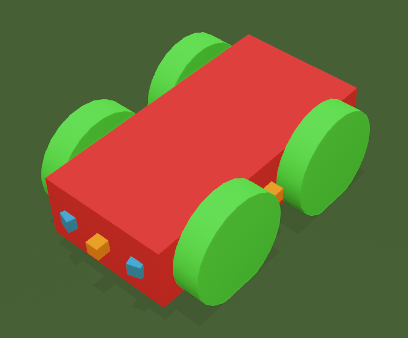

<!--
Documento de trabalho da Fase 2.
Base histórica: docs/fase01-relatorio.md.
O conteúdo está sendo revisado incrementalmente e permanece sujeito às tags editoriais.
-->

<!--
> **Documento de trabalho da Fase 2:** Este arquivo foi criado como cópia integral de `docs/fase01-relatorio.md` para permitir uma revisão incremental e rastreável. As seções marcadas como `[preservar]` já foram revistas, as demais ainda podem conter descrições, próximos passos e conclusões obsoletas.
-->

## [atualizar] Escopo e estado da Fase 2

Este relatório consolida a evolução do projeto na segunda entrega. A Fase 2 compreende a correção e parametrização do mundo inclinado, a definição lógica da meta, a aquisição de aceleração e do estimulo da maraca, a implementação da rede plástica de quatro neurônios e sua integração ao modo `LEARNING` da simulação, a telemetria experimental e a geração de artefatos a cada execução também fazem parte dessa entrega.

No estado atual, a implementação de engenharia e o fluxo experimental de ponta a ponta estão concluídos mas as execuções realizadas neste ponto têm caráter exploratório: demonstram o funcionamento do sistema mas não constituem um experimento controlado nem evidência suficiente para atribuir o comportamento observado à plasticidade neural.

No entanto, a simulação implementada com um protocolo de experimento definido e posterior análise dos artefatos gerados podem sim ser a base para uma análise desse tipo.

Está nos planos a implementção na Fase 3 de um modo de disparo não supervisionado de um conjunto de simulações que permita variar determinados parâmetros e comparar o resultado do conjunto de experimentos, isso será um facilitador para estudar impacto de diferentes plasticidades neurais.

### Legenda editorial

- `[preservar]`: conteúdo tecnicamente válido, sujeito apenas a revisão textual leve;
- `[corrigir]`: conteúdo com erro factual, inconsistência ou afirmação que precisa ser qualificada;
- `[atualizar]`: conteúdo válido na Fase 1, mas que precisa refletir o estado da Fase 2;
- `[adicionar]`: seção nova reservada para conteúdo ainda não redigido.
- `[esclarecer]`: sessão que necessita de mais clareza ou pesquisa, deve ser omitida ou comentada


# [preservar] Modelo neurocomputacional de reorganização motora

Lenin Cristi

CMCC - Universidade Federal do ABC (UFABC)
Santo André - SP - Brasil

lenin.cristi@aluno.ufabc.edu.br

Resumo. Este trabalho tem como objetivo a reprodução computacional e robótica do experimento Doman's Inclined Floor Method for Early Motor Organization Simulated with a Four Neurons Robot (2011) de Ropero Peláez e Lucas Santana, no qual um robô controlado por uma rede neural plástica de quatro neurônios aprende a organizar seu comportamento motor em um plano inclinado, inspirado no método de estimulação motora precoce de Glenn Doman.

## [preservar] Sumário

- `[preservar]` Resumo
- `[preservar]` Objetivo do Projeto
- `[preservar]` Introdução
  - `[preservar]` O experimento original
  - `[preservar]` A rede neural "não convencional"
  - `[preservar]` Resumo das diferenças
  - `[preservar]` Arquitetura e mapeamento motor
- `[preservar]` Metodologia
  - `[preservar]` Estratégia incremental de construção e validação
  - `[preservar]` Simulação de mundo
  - `[preservar]` Desenvolvimento
  - `[preservar]` Estado ao final da Fase 2
- `[atualizar]` Arquitetura detalhada da rede
  - `[atualizar]` Topologia e conectividade
  - `[atualizar]` Mapeamento neural-motor
  - `[atualizar]` Ordem temporal e fluxo causal
- `[atualizar]` Funções e equações
  - `[atualizar]` Normalização e soma sensorial
  - `[atualizar]` Ativação, saída sigmoidal e competição
  - `[atualizar]` Plasticidade sináptica
  - `[atualizar]` Plasticidade intrínseca
  - `[atualizar]` Distância, deslocamento e classificação do movimento
  - `[atualizar]` Aceleração, maraca e critérios de aprendizagem
- `[atualizar]` Parâmetros experimentais
  - `[atualizar]` Parâmetros da rede neural
  - `[atualizar]` Parâmetros do protocolo de aprendizagem
  - `[atualizar]` Parâmetros do mundo Webots
  - `[atualizar]` Parâmetros do robô e dos sensores
- `[atualizar]` Implementação e reprodutibilidade
  - `[atualizar]` Validação automatizada
  - `[atualizar]` Ensaios exploratórios
  - `[atualizar]` Telas da interface e da telemetria
  - `[atualizar]` Vídeos das execuções
- `[atualizar]` Limitações e hipóteses operacionais
- `[atualizar]` Protocolo dos ensaios formais
- `[atualizar]` Conclusão
- `[atualizar]` Anexos
  - `[atualizar]` Visão geral do repositório
  - `[atualizar]` Simulação de física
  - `[atualizar]` Simulação de colisão do robô
  - `[atualizar]` Simulação de controle
  - `[preservar]` Como clonar o repositório do projeto
  - `[atualizar]` Organização detalhada do repositório
  - `[atualizar]` Montagem do ambiente de desenvolvimento e simulação
   - `[atualizar]` Lista de software requerido
  - `[atualizar]` Webots
    - `[atualizar]` Nota sobre uso do Webots no Windows
  - `[atualizar]` Ambiente virtual e instalação de dependências
    - `[atualizar]` Usando pip
    - `[atualizar]` Usando conda
- `[corrigir]` Referências

## [preservar] Resumo

Este trabalho tem como objetivo a reprodução computacional e robótica do experimento *Doman's Inclined Floor Method for Early Motor Organization Simulated with a Four Neurons Robot (2011)* de Ropero Peláez e Lucas Santana, no qual um robô controlado por uma rede neural plástica de quatro neurônios aprende a organizar seu comportamento motor em um plano inclinado, inspirado no método de estimulação motora precoce de Glenn Doman.

A implementação original foi realizada utilizando *LEGO Mindstorms NXT* em *MATLAB* e dependia de sensores e estímulos relacionados à aceleração, à visão e ao som, representados respectivamente pela detecção de aceleração, por uma câmera apontada para a rampa listrada e por um microfone captando o som de uma maraca na meta. Este projeto desenvolve uma versão reproduzível do experimento utilizando uma linguagem multiparadigma flexível e uma arquitetura modular de sensoriamento e controle. O código integral do projeto está disponível em https://github.com/lnncrs/DomanNeurocomputationalModel

A reconstrução foi conduzida deliberadamente de forma incremental, separando a modelagem do mundo, a validação da física neste mundo, a construção do robô e sua equipagem com sensores, a interface de controle webots e por fim sua integração com a rede neural. Essa organização permitiu testar isoladamente cada componente em cada camada antes de integrá-lo ao experimento completo, reduzindo a dificuldade de identificar falhas e aumentando a reprodutibilidade do sistema.


Imagem: Simulador pronto para o experimento

Como resultado, foram obtidos varios ambientes experimentais reproduzíveis no Webots versionados em `webots\worlds`, sendo o principal deles `webots\worlds\experiment_inclined_plane.wbt` já integrado a uma rede neural recorrente e plástica de quatro neurônios, com controle motor, aquisição de telemetria detalhada para diversos sensores incluindo aceleração, retorno do estímulo de uma maraca sintética que premia deslocamento para a meta e registro detalhado das execuções.


Imagem: Tela de acompanhamento da telemetria do robo

<!-- ! TODO
Os planos inclinados e normais devem ser revisados para garantir que estao sendo usados os artefatos mais recentes e mesma perspectiva, plano com boxes precisa ser renomeado para melhor entendimento
-->

Os ensaios exploratórios já demonstram o funcionamento do fluxo completo, enquanto a avaliação do aprendizado e do comportamento emergente será realizada posteriormente por meio de uma série de experimentos controlados.

## [preservar] Objetivo do Projeto

Os objetivos centrais do experimento original são:

- Simular condições de aprendizado motor infantil;

- Observar o surgimento de comportamento emergente;

- Analisar, a partir desse comportamento, possíveis paralelos com processos de neuroplasticidade.

> **Nota:** Neste ponto entendemos que a simulação, o robô e mesmo o aprendizado são tratados como meios e não como objetivos fim.

## [preservar] Introdução

### [preservar] O experimento original

Antes da construção do projeto, foi imprescindível realizar uma leitura detalhada do artigo que descreve o experimento original *Doman's Inclined Floor Method for Early Motor Organization Simulated with a Four Neurons Robot (2011)*, também disponível no repositório em `docs\Testing the inclined plane technique with a four neurons robot.pdf`.

Essa leitura revelou um ponto fundamental sobre o experimento: O objetivo do experimento não era simplesmente fazer o robô aprender a se locomover, mas sim utilizar uma arquitetura robótica e neural simples para investigar como estímulos sensoriais e determinados mecanismos de plasticidade poderiam contribuir para a organização inicial do comportamento motor.

O experimento procura reproduzir, de maneira simplificada, alguns elementos presentes no método do plano inclinado de Doman:

- aceleração produzida durante o movimento sobre o plano inclinado, como analogia ao estímulo vestibular;

- transições visuais geradas pelas faixas pretas e brancas da rampa;

- estímulo sonoro produzido por uma maraca após movimentos descendentes em direção a meta;

- ambiente físico formado pelo plano inclinado;

- sistema neural simples, composto por quatro neurônios plásticos interconectados.

Inicialmente, o robô não possui uma direção preferencial. Quando uma sequência de comandos motores produz um movimento descendente, a ação da gravidade resulta em maior aceleração e em transições mais rápidas entre as faixas visuais da rampa. Além disso, o movimento descendente é seguido pelo estímulo sonoro da maraca. Esses estímulos influenciam os mecanismos de plasticidade sináptica e intrínseca, favorecendo a formação de sequências neurais associadas ao deslocamento sobre a rampa. No artigo, considera-se que o robô aprendeu quando executa movimentos na mesma direção durante cinco iterações consecutivas.

O modelo não pretende reproduzir integralmente o sistema nervoso infantil ou demonstrar diretamente como uma criança aprende a se locomover. Ele constitui uma analogia computacional controlada, utilizada para observar a relação entre estímulos sensoriais, plasticidade e organização motora e, a partir dela, formular hipóteses sobre processos envolvidos na aquisição inicial do movimento.

Assim, o aprendizado do robô não constitui o objetivo final do experimento, mas um meio para investigar, em um sistema simplificado e controlável, como estímulos sensoriais e mecanismos de plasticidade podem participar da organização do comportamento motor.

### [preservar] A rede neural utilizada

O artigo descreve uma rede totalmente interconectada composta por quatro unidades neuronais excitatórias do tipo *rate-code*. Cada neurônio recebe a soma dos estímulos sensoriais e sinais provenientes da atividade anterior dos demais neurônios e de sua própria conexão recorrente. Um mecanismo de competição mantém ativo apenas o neurônio com maior saída em cada iteração.

A arquitetura possui quatro conexões recorrentes, cada uma ligando um neurônio a si próprio, cujos pesos são mantidos fixos em *0,7*. As doze conexões entre neurônios diferentes possuem pesos modificáveis.

| **Recebe de / Saída de** | **N1** | **N2** | **N3** | **N4** |
| ------------------------ | -----: | -----: | -----: | -----: |
| **N1**                   |    0,7 |    w₁₂ |    w₁₃ |    w₁₄ |
| **N2**                   |    w₂₁ |    0,7 |    w₂₃ |    w₂₄ |
| **N3**                   |    w₃₁ |    w₃₂ |    0,7 |    w₃₄ |
| **N4**                   |    w₄₁ |    w₄₂ |    w₄₃ |    0,7 |

Tabela 1: Conexões neuronais na rede

Sendo:
- $w_{12}$: conexão de **N2 para N1**
- $w_{21}$: conexão de **N1 para N2**
- Os valores `0,7` na diagonal representam as conexões autorrecorrentes fixas.

O aprendizado ocorre de forma incremental a cada iteração por meio de dois mecanismos complementares: plasticidade sináptica, que altera os pesos entre os neurônios, e plasticidade intrínseca, que desloca a função de ativação de cada unidade de acordo com seu histórico de atividade.

Esses neurônios continuam sendo modelos artificiais, mas diferem daqueles empregados em muitas redes neurais convencionais. Não há camadas profundas, função de perda, dados rotulados ou retropropagação de erro.

A adaptação ocorre a partir do retorno sensorial produzido pelas consequências das ações do robô, que modula a atividade neuronal e, indiretamente, as alterações sinápticas.

A pequena quantidade de neurônios torna possível acompanhar diretamente os pesos, as ativações, os neurônios vencedores e as sequências motoras produzidas. Essa interpretabilidade é uma propriedade útil da arquitetura, embora o artigo não afirme explicitamente que a escolha de quatro neurônios tenha sido determinada exclusivamente por esse objetivo.

O modelo não pretende reproduzir toda a complexidade de um sistema neural biológico. Ele representa uma estrutura computacional simplificada, utilizada para investigar como plasticidade, competição e feedback sensorial podem contribuir para a organização progressiva do comportamento motor.

<!-- ! TODO
duvida se esta exata a sessao seguinte inclinado a omitir na fase 2 do relatorio e retornar com ela na fase 3
-->

<!--
### [esclarecer] Resumo das diferenças

Em comparação com redes neurais convencionalmente treinadas, o modelo apresenta:

- quatro neurônios excitadores totalmente interconectados;

- conexões recorrentes fixas e conexões não diagonais plásticas;

- função de ativação sigmoidal com deslocamento adaptável;

- plasticidade sináptica e intrínseca;

- competição entre os neurônios;

- adaptação contínua durante a interação com o ambiente;

- ausência de retropropagação de erro e de dados rotulados.

Esse conjunto de características permite observar diretamente como o estado da rede se modifica durante o experimento e como sequências de atividade neural se relacionam com as ações motoras executadas.
-->

### [preservar] Arquitetura e mapeamento motor

O fluxo geral do sistema é:

```text
ação anterior
→ resposta do ambiente
→ aceleração + visão + som
→ normalização e soma sensorial
→ ativação recorrente
→ saída sigmoidal
→ competição
→ neurônio vencedor
→ atualização sináptica e intrínseca
→ nova ação motora
→ resposta do ambiente
→ próxima iteração
```

O mapeamento adotado na reconstrução é:

| Neurônio | Primitiva motora |
|---|---|
| N1 | conjunto frontal, sentido horário |
| N2 | conjunto frontal, sentido anti-horário |
| N3 | conjunto traseiro, sentido horário |
| N4 | conjunto traseiro, sentido anti-horário |

Tabela 2: Mapeamentos neurônio → movimento

<!-- ! TODO
o paragrafo seguinte nao conecta com o texto
-->

<!--
O artigo apresenta explicitamente o primeiro exemplo; a numeração das demais ações foi reconstruída a partir da combinação entre dois conjuntos de rodas e dois sentidos de rotação.
-->

No robô virtual, cada roda possui um motor independente. Para preservar a organização funcional do experimento original, o adaptador do modo `LEARNING` agrupa esses motores em conjuntos frontal e traseiro. Como a competição mantém apenas um neurônio ativo por iteração, o comportamento motor emerge da sequência temporal das ações selecionadas.



Imagem: *Closeup* no robo onde se vêem os dois eixos frontal / traseiro em perspectiva

> **Nota sobre a implementação atual:** O retorno de **aceleração** é calculado a partir da variação da aceleração longitudinal medida durante cada janela motora. O retorno do estímulo sonoro da **maraca** é produzido sinteticamente quando existe redução da distância até a área retangular da meta e ela é suficiente para que o movimento seja classificado como descendente. Portanto, a implementação atual não utiliza um par físico de microfone e alto-falante e o canal visual de detecção de listras permanece não implementado nesta etapa. Esses mecanismos serão detalhados nas seções de funções, equações e protocolo experimental.

> **Nota histórica:** Nas primeiras versões da simulação, o mapeamento `neuronios → movimento` foi interpretado como uma configuração diferencial entre os lados esquerdo e direito. A releitura do artigo levou à correção do modo `LEARNING` para a organização `neuronios → movimento` para os eixos frontal/traseiro em sentido horário e anti-horário. Os modos manual de controle `MANUAL` e automático anti colisão `AUTOMATIC` continuam utilizando controle diferencial e não foram afetados por essa mudança.

## [preservar] Metodologia

A reconstrução do experimento envolve componentes interdependentes:

- o ambiente inclinado;
- a dinâmica física;
- a estrutura do robô;
- os sensores embarcados;
- os estímulos externos;
- o controle motor;
- a rede neural.

Alterações em qualquer um desses elementos podem modificar o comportamento observado e, consequentemente, dificultar a identificação da origem de eventuais falhas.

No experimento original, a estrutura robótica foi construída com *LEGO Mindstorms NXT*, enquanto a rede neural e os comandos sensório-motores foram implementados em *MATLAB* por meio da *RWTH Mindstorms NXT Toolbox*.

A reprodução direta dessa estrutura em uma nova plataforma física exigiria que problemas mecânicos, eletrônicos, sensoriais e computacionais fossem tratados simultaneamente.

### [preservar] Estratégia incremental de construção e validação

Para reduzir essa complexidade, foi adotada uma estratégia incremental em camadas. Cada componente é inicialmente construído e validado de forma isolada e, posteriormente, integrado aos demais. Essa abordagem permite distinguir problemas relacionados ao ambiente, à física, ao robô, ao controle e ao modelo neural.

A simulação foi utilizada como ambiente inicial de desenvolvimento porque permite:

- controlar as condições experimentais;

- repetir ensaios sob configurações equivalentes;

- observar diretamente posições, velocidades, acelerações e comandos motores;

- testar componentes isoladamente;

- reduzir o custo de alterações mecânicas;

- registrar de forma sistemática as variáveis de cada execução.

A construção de um robô físico foi mantida como uma etapa posterior à validação do comportamento no ambiente simulado. O núcleo neural e o protocolo experimental foram separados da interface do simulador para favorecer sua reutilização futura.

> **Nota:** Por mais que a estrutura em camadas favoreça o reuso de código, uma implementação física ainda exigirá um adaptador específico para os sensores, motores, unidades de medida e restrições temporais da plataforma escolhida.

Para evitar confusão com as fases de entrega e documentação do projeto, os cinco blocos de desenvolvimento são tratados neste relatório como **etapas técnicas de implementação**.

| Etapa | Escopo | Estado ao final da Fase 2 |
|---|---|---|
| 1 - Ambiente | Construção dos planos inclinado e horizontal e validação de sua geometria | concluída |
| 2 - Física | Testes de gravidade, colisão, contato com a rampa e comportamento de sólidos | concluída |
| 3 - Robô | Modelagem do corpo, das rodas, dos motores, das juntas e dos sensores | concluída |
| 4 - Controle e instrumentação | Implementação dos modos de controle `MANUAL` e `AUTO`, telemetria e aquisição das variáveis experimentais | concluída |
| 5 - Integração neural | Implementação da rede de quatro neurônios, protocolo temporal e integração ao modo `LEARNING` | integração concluída; validação científica pendente |

Tabela 3: Completude técnica do projeto

> **Nota:** Na etapa técnica 4, foi necessário implementar dois modos adicionais de controle não previstos: `PASSIVE_FREE` e `PASSIVE_REALISTIC`. No primeiro, o torque disponível dos motores é desativado, deixando as rodas livres. No segundo, o torque disponível é limitado a 0,03 N·m por roda, representando uma pequena resistência dos motores. Esses modos foram utilizados para testar o deslizamento e a influência da gravidade sobre o robô nos planos inclinados.

A conclusão de uma etapa técnica indica que seus componentes essenciais estão implementados e funcionalmente integrados. Isso não significa, por si só, que todas as hipóteses científicas associadas tenham sido validadas. Em particular, a integração neural permite executar o experimento completo, mas a atribuição do comportamento observado à plasticidade exige ensaios controlados e comparações com condições de referência.

### [preservar] Simulação de mundo

<!-- ! TODO
Nomes de produtos como Webots, PyBullet e Jupyter, etc em paragrafos ou titulos que nao sejam em paths ou semalhante devem estar em italico
-->

Para a simulação, foi realizada uma pesquisa na qual foram considerados dois ambientes principais: *Webots* e *PyBullet*. O Webots foi escolhido por oferecer maior capacidade de representar motores, atuadores e sensores de maneira próxima a uma implementação física, dentro de um ambiente integrado de simulação. A plataforma também oferece suporte a controladores em Python, C e C++, além de uma biblioteca de mundos e componentes reutilizáveis.

Os principais motivos para a escolha do Webots foram:

- modelagem integrada de sensores, motores e atuadores;

- suporte a controladores em Python, C e C++;

- simulação da interação entre corpos, juntas e superfícies;

- biblioteca de mundos e componentes reutilizáveis;

- proximidade conceitual com uma futura implementação física.

Um ponto importante do Webots é permitir o desenvolvimento inicial dos controladores em Python, oferecendo maior flexibilidade para a implementação e validação do modelo neural. A plataforma também suporta controladores em C e C++, o que amplia as possibilidades de integração com outras plataformas e de futuras adaptações para hardware físico.

**A implementação foi organizada de forma que o modelo neural e o protocolo experimental não dependam diretamente dos detalhes internos do robô simulado.** Essa separação favorece a reutilização do núcleo do sistema, embora uma implementação física ainda exija um adaptador específico para os sensores, motores, unidades de medida e restrições temporais do hardware escolhido.


Imagem: Plano *half-size* não inclinado utilizado em testes

A biblioteca de mundos, objetos e exemplos disponibilizada pelo Webots parcialmente preservada em `webots\tutorials` também foi um fator relevante para a escolha, pois forneceu referências para a construção inicial dos ambientes, das juntas, dos sensores e dos controladores utilizados no projeto.

### [preservar] Desenvolvimento

**O projeto foi desenvolvido com ferramentas abertas e organizado para favorecer a reprodução dos experimentos.**

O Webots é utilizado para a simulação física, enquanto Python implementa a rede neural, o protocolo experimental, a integração com o controlador e a geração dos artefatos de cada execução.

As dependências de sistema como o *gcc* e o *make* tão bem como dependências Python estão integralmente mapeadas no apêndice.

Uma listagem preliminar do *software* utilizado é a que segue:

- Plataformas *Windows* e *Linux* suportadas com instruções disponíveis para ambas pois a reprodução dos experimentos é agnóstica a sistema operacional.

- Ferramentas *Git* para clonar e operar o repositório de projeto;

- O *Webots R2025a* para rodar as simulações;

- Compilador *gcc* com *make* e *sh* disponíveis pois é utilizado pelo *Webots R2025a* quando da criação das bibliotecas de *controllers* e *plugins*;

- Ambiente *uv* recomendado, mas pode-se usar *pip* ou *conda*;

- Python 3.13 fornecido pelo ambiente de escolha acima;

- Uma validação da rede com dados sinteticos usa um notebook *Jupyter*, adicionalmente *numpy*, *pandas* e *matplotlib* são recomendados;

- Os testes automatizados usam *pytest*;

### [preservar] Estado do projeto ao final da Fase 2

**Ao final da Fase 2, o ambiente físico, o robô, a instrumentação e a rede neural encontram-se integrados no modo `LEARNING`.** Cada ação neural é mantida durante uma janela temporal, após a qual o deslocamento e a aceleração são agregados. O movimento é então classificado, a maraca é produzida quando ocorre descida e os estímulos resultantes alimentam o passo neural seguinte.

O fluxo experimental completo já produz telemetria, registros por iteração, metadados, resumos e relatórios HTML. Os testes automatizados validam os componentes de software, e as execuções exploratórias demonstram que o robô consegue completar o percurso. Esses resultados confirmam a integração do sistema, mas ainda não permitem atribuir o comportamento observado à plasticidade neural.

Uma lista com *features* chave do projeto funcionais nesta fase é a que segue:

- Mapas webots criados em separado dos artefatos de robo para permitir reutilizacao com exemplares planos e inclinados

- Area de meta criada em verde para facil identificacao e parametrizada para reuso

- Instrumentacao embarcada do robo criada acoplada ao robo e independente do mapa

- Controle do robo independente e parametrizavel

- Todas as variaveis de simulacao e experimento identificadas e parametrizaveis centralmente para facilitar alteracao

- Tela interativa de acompanhamento da simulacao com telemetria e dados de treinamento em tempo real;

- Controle manual baseado em joystic para exploracao livre do mapa;

- Geração de metadados e logs do experimento em JSONL acompanhados de um relatório HTML com detalhes da rede gerada;

<!-- ! todo
aqui entram duas imagens de um close no carrinho e da tela de treinamento lado a lado
-->


## [atualizar] Arquitetura detalhada da rede

<!-- ! todo
paragrafo seguinte nao conecta com o texto, talvez uma introducao simples
-->

<!--
A implementação mantém separadas a arquitetura descrita no artigo e as hipóteses necessárias para torná-la executável. A rede não depende do Webots: ela recebe três valores sensoriais e devolve uma das quatro ações motoras abstratas.
-->

<!-- ! todo
incluir referencia ao arquivo principal e classe da implementacao neuronal
-->

### [atualizar] Topologia e conectividade

<!-- ! todo
esse trecho seguinte em parte esta redundante com a explicacao em tabela anterior, talvez remontar os paragrafos seguintes
-->

A rede possui quatro neurônios excitatórios do tipo *rate-code*, totalmente
interconectados. A matriz `W[i][j]` representa a conexão do neurônio `j` para o
neurônio `i`. As quatro conexões diagonais são recorrentes e permanecem fixas
em `0,7`; as doze conexões não diagonais são plásticas.

A mesma soma sensorial chega aos quatro neurônios. A diferença entre suas
ativações surge do estado recorrente, dos pesos e dos deslocamentos individuais
das funções sigmoidais. Após o cálculo das saídas, uma competição mantém ativo
somente o neurônio vencedor.

### [atualizar] Mapeamento neural-motor

Cada neurônio corresponde a uma primitiva motora,o modelo neural conhece apenas as ações abstratas e a conversão para os quatro motores do robô é feita
por um adaptador.

| Neurônio | Ação abstrata | Comando no robô virtual |
|---|---|---|
| N1 | conjunto frontal, horário | rodas 1 e 2 com velocidade positiva |
| N2 | conjunto frontal, anti-horário | rodas 1 e 2 com velocidade negativa |
| N3 | conjunto traseiro, horário | rodas 3 e 4 com velocidade positiva |
| N4 | conjunto traseiro, anti-horário | rodas 3 e 4 com velocidade negativa |

Tabela 4: Tradução das açoes abstratas em primitivas motoras

<!-- ! todo
esse trecho seguinte esta desconexo
-->

Os sinais físicos de rotação são parâmetros do adaptador e precisam ser confirmados visualmente sempre que a orientação dos motores ou dos eixos for
alterada.

<!-- ! todo
incluir referencia do codigo onde é feita a tradução acao -> primitiva
-->


### [atualizar] Ordem temporal e fluxo causal

Uma iteração representa a consequência de uma ação já selecionada. No início, a rede recebe entradas nulas e escolhe a primeira ação. Em seguida, cada ciclo obedece à ordem:

<!-- ! todo
escolhe como? criterio? e esse trecho nao duplica a explicacao inicial sobre a ordem de etapas?
-->

```text
ação anterior
-> movimento mantido durante uma janela temporal
-> deslocamento e aceleração observados
-> classificação do movimento
-> produção dos estímulos sensoriais
-> ativação e competição neural
-> plasticidade sináptica e intrínseca
-> seleção da próxima ação
```

Essa ordem impede que a maraca influencie a ação que a produziu: o som gerado por uma descida alimenta somente a decisão neural seguinte.

<!-- ! todo
incluir como esse "impede" é implementado no codigo
-->

## [atualizar] Funções e equações

As equações publicadas foram implementadas diretamente quando possível. As expressões de ativação, normalização, competição e integração com o ambiente completam pontos que não são especificados integralmente no artigo.

<!-- ! todo
incluir uma tabela que indique a equacao, descritivo curto, se foi trazida do artigo e sem sim qual, se não porque foi escolhida
-->

<!-- ! todo
para as equacoes abaixo, incluir a notacao matematica e sempre incluir abaixo uma sessao "Onde:" descrevendo cada item da equacao e na sequencia, a referencia da implementacao em codigo
-->

### [atualizar] Normalização e soma sensorial

Cada canal sensorial `k` é normalizado por uma transformação linear:

```text
x'_k(t) = (x_k(t) - offset_k) * scale_k
```

A entrada comum aos quatro neurônios é:

```text
S(t) = acceleration'(t) + visual'(t) + sound'(t)
```

Na configuração atual, todos os offsets são zero, todas as escalas são `1,0` e o canal visual recebe zero.

### [atualizar] Ativação, saída sigmoidal e competição

A ativação operacional combina a entrada sensorial atual com a saída
competitiva do passo anterior:

```text
a_i(t) = S(t) + sum_j(W_ij(t) * O^c_j(t-1)) + noise_i(t)
```

A saída sigmoidal corresponde à equação 3 do artigo:

```text
O_i(t) = 1 / (1 + exp(-gain * (a_i(t) - shift_i(t))))
```

<!-- ! todo
25 veio da onde? e esta nao fluido
-->

O ganho é `25`. No modo padrão, vence o neurônio de maior saída; os demais recebem saída competitiva zero. Empates são resolvidos pelo gerador pseudoaleatório associado à seed do ensaio. O ruído de ativação é opcional e
permanece desligado.

### [atualizar] Plasticidade sináptica

A variação dos pesos segue a regra pré-sináptica de Grossberg, equação 2 do
artigo:

```text
delta_W_ij(t) = epsilon * I_j(t) * (a_i(t) - W_ij(t))
W_ij(t+1) = W_ij(t) + delta_W_ij(t)
```

<!-- ! todo
confuso abaixo
-->

Na implementação, `I_j(t)` é a saída competitiva do passo anterior. Por padrão, somente os pesos que chegam ao vencedor atual são candidatos à atualização. Esse escopo, denominado `winner_only`, é uma hipótese operacional; uma variante permite atualizar todos os neurônios pós-sinápticos. As conexões diagonais são
reafirmadas em `0,7` após cada passo.

### [atualizar] Plasticidade intrínseca

O deslocamento da sigmoide segue a equação 4:

```text
shift_i(t+1) = (xi * O_i(t) + shift_i(t)) / (1 + xi)
```

<!-- ! todo
confuso abaixo
-->

No modo padrão, `O_i(t)` é a saída após a competição. Consequentemente, apenas
o vencedor apresenta saída diferente de zero, enquanto os deslocamentos dos
demais neurônios também evoluem pela divisão por `1 + xi`. A saída anterior à
competição permanece disponível como variante experimental.

### [atualizar] Distância, deslocamento e classificação do movimento

A posição do robô é comparada com o retângulo da meta, e não apenas com seu
centro. Para uma meta de centro `(x_g, y_g)`, largura `w` e comprimento `l`:

```text
d_x = max(abs(x - x_g) - w/2, 0)
d_y = max(abs(y - y_g) - l/2, 0)
d   = sqrt(d_x^2 + d_y^2)
```

O deslocamento da janela é `delta_d = d_final - d_inicial`. Como aproximar-se
da meta reduz a distância, define-se `q = -delta_d`. Com limiar `tau`:

```text
q > tau    -> DOWN
q < -tau   -> UP
caso contrário -> STATIONARY
```

### [atualizar] Aceleração, maraca e critérios de aprendizagem

A aceleração de uma janela é a média da variação absoluta da componente longitudinal em relação ao início da ação:

```text
acceleration = mean_k(abs(a_x(k) - a_x(initial)))
```

Quando o movimento é classificado como `DOWN`, a entrada sonora da iteração seguinte recebe a intensidade da maraca; nos demais casos, recebe zero. São registrados dois critérios: cinco movimentos consecutivos na mesma direção,
como no artigo, e cinco movimentos consecutivos para baixo, como medida adicional desta reconstrução. A repetição de um neurônio vencedor, por si só, não é considerada aprendizagem.

## [atualizar] Parâmetros experimentais

As tabelas seguintes registram os valores efetivamente utilizados na configuração atual.

Parâmetros classificados como hipótese deverão ser
mantidos nos metadados e avaliados nos ensaios formais.

### [atualizar] Parâmetros da rede neural

| Parâmetro | Valor | Origem |
|---|---:|---|
| número de neurônios | 4 | artigo |
| peso recorrente | 0,7 | artigo |
| ganho sigmoidal | 25 | artigo |
| pesos não diagonais iniciais | uniforme entre 0,1 e 0,9 | hipótese |
| taxa sináptica `epsilon` | 0,01 | hipótese |
| taxa intrínseca `xi` | 0,01 | faixa publicada |
| deslocamento inicial | 0,5 | hipótese |
| competição | determinística | hipótese operacional |
| escopo da plasticidade | `winner_only` | hipótese operacional |
| fonte da plasticidade intrínseca | saída após competição | hipótese operacional |
| desvio do ruído de ativação | 0,0 | desativado |
| limites adicionais dos pesos | nenhum | não publicado |
| seed da configuração integrada | 42 | reprodutibilidade |

<!-- ! todo
estes parametros estao centralizados? onde sao configurados?
-->

### [atualizar] Parâmetros do protocolo de aprendizagem

| Parâmetro | Valor atual |
|---|---:|
| duração nominal da ação | 0,5 s |
| velocidade das rodas no modo `LEARNING` | 3,0 rad/s |
| limiar de movimento estacionário | 0,005 m |
| intensidade sonora da maraca | 0,1 |
| escala da aceleração | 1,0 |
| entrada visual | 0,0 |
| movimentos consecutivos para o critério | 5 |
| sinal usado para representar descida | -1 |

<!-- ! todo
estes parametros estao centralizados? onde sao configurados?
-->

### [atualizar] Parâmetros do mundo Webots

| Parâmetro | Valor atual |
|---|---:|
| versão dos arquivos Webots | R2025a |
| passo básico do mundo | 16 ms |
| passo do controlador | 64 ms |
| seed do mundo | 42 |
| inclinação da rampa | 12 graus (`0,20943951023932` rad) |
| plataforma de chegada | 1 x 1 m |
| rampa | 2 x 1 m |
| altura dos guardrails | 0,1 m |
| espaçamento das faixas | 0,1 m |
| largura das faixas | 0,01 m |
| largura da linha de chegada | 0,02 m |
| área lógica da meta | 0,96 x 0,96 x 0,30 m |
| permanência configurada na meta | 0,5 s; o modo `LEARNING` atual conclui na entrada |

<!-- ! todo
estes parametros estao centralizados? onde sao configurados?
-->

Gravidade, atrito e alguns parâmetros de contato permanecem herdados dos defaults do Webots e deverão ser explicitados antes da campanha formal.

<!-- ! todo
onde estao definidos estes ou qual o padrão deles? podemos criar uma tabela para eles?
-->

### [atualizar] Parâmetros do robô e dos sensores

| Parâmetro | Valor atual |
|---|---:|
| dimensões do corpo | 0,20 x 0,10 x 0,05 m |
| rodas e motores | 4 |
| raio da roda | 0,04 m |
| espessura da roda | 0,02 m |
| densidade configurada do corpo | 1000 kg/m3 |
| distância inicial ao longo da rampa | 1,45 m |
| torque do modo passivo realista | 0,03 N.m por roda |
| instrumentação | acelerômetro, giroscópio, GPS e bússola |
| sensores de proximidade disponíveis | frontal diagonal esquerdo, frontal diagonal direito, frontal, traseiro, esquerdo e direito |
| posição usada no protocolo | GPS |
| aceleração usada na rede | componente longitudinal do acelerômetro |
| som usado na rede | estímulo lógico, sem microfone ou alto-falante |

<!-- ! todo
estes parametros sao mais fixos certo?
-->

## [atualizar] Implementação e reprodutibilidade

O código separa quatro responsabilidades principais:

- `src/neural`: estado, competição e plasticidade da rede;

- `src/experiments`: ordem causal, critérios, registro e relatório;

- `src/control`: tradução das ações abstratas para comandos de rodas;

<!-- ! todo
esse item abaixo esta certo?
-->

- `webots\controllers\four_wheels_manual`: controlador Webots com aquisição dos sensores, controle motor, execução da janela de acompanhamento.

Cada execução produz `metadata.json`, `iterations.jsonl`, `summary.json` e um relatório HTML `report.html`derivado na pasta `\experiments\runs\learning_{ISO UTC Timestamp}_{seed}\`.

Os metadados registram as configurações neural,
experimental, do runtime e da meta. A seed torna a inicialização reproduzível;

<!-- ! todo
a sessao abaixo sobre testes e como rodar potencialmente vai para os anexos
-->

### [atualizar] Testes automatizados

A implementação possui testes automatizados distribuídos entre quatro conjuntos:

<!-- ! todo
apontar o caminho relativo em cada teste
-->

- equações, inicialização, competição e plasticidade da rede;

- causalidade, classificação do movimento, critérios e arquivos de execução;

- mapeamento das quatro ações para os motores;

- integração temporal, meta, telemetria e geração do relatório HTML.

Esses testes verificam a consistência do software fora do Webots, mas não
substituem a validação visual dos sentidos motores nem os ensaios científicos.

O ambiente Python 3.13 é descrito pelo `pyproject.toml` e pelo `uv.lock`. O
comando recomendado para instalar dependências e executar os testes é:

```bash
uv sync --all-groups --all-extras
uv run pytest
```

### [atualizar] Ensaios exploratórios

<!-- ! todo
essa sessao deve virar uma explicacao dos dados e arquivos gerados na rodada de um experimento
-->

Há seis execuções exploratórias registradas, todas encerradas por chegada à
meta. O número de iterações variou entre 43 e 129, e três execuções geraram o
relatório HTML completo. Cinco registros já utilizam o esquema atual dos dois
critérios de aprendizagem.

Essas execuções foram realizadas enquanto a implementação ainda evoluía e não
devem ser agregadas como repetições de um mesmo experimento. Elas demonstram o
funcionamento do fluxo completo, mas não permitem atribuir a chegada à meta à
plasticidade da rede.

### [atualizar] Telas da interface e da telemetria

<!-- ! todo
isso aqui vira uma explicacao de operacao do experimento
-->

Esta subseção deverá destacar a execução do modo `LEARNING`, incluindo o
neurônio vencedor, a ação selecionada, a direção observada, o estado da maraca,
os contadores dos critérios e a chegada à meta. Também deverá apresentar uma
tela do relatório HTML produzido ao final da execução.

<!-- ! todo
incluir imagem do mapa
incluir imagem da tela explicando cada grupo de controles
incluir mapoeamento do joystic com cada botao e funcao
incluir nota que a versao fase 3 tera mapeamento no teclado tambem
-->

### [atualizar] Execuções de exemplo

<!-- ! todo
isso aqui vira uma sessao de limitacoes e proximos passos
-->

Serão selecionados vídeos curtos que mostrem as quatro primitivas motoras, uma execução completa no plano inclinado e a correspondência entre movimento, telemetria e estímulo sonoro. Os vídeos deverão informar a versão do código e a
configuração utilizada.

<!-- ! todo
incluir imagem de uma execucao
incluir video no youtube (url) de uma execucao
-->

## [atualizar] Limitações e hipóteses operacionais

<!-- ! todo
isso aqui vira uma sessao de limitacoes e proximos passos
-->

Na configuração atual, a rede utiliza a aceleração longitudinal e o estímulo
sonoro produzido logicamente após movimentos descendentes. O canal visual
permanece desativado e recebe valor zero. A normalização da aceleração e os
parâmetros temporais ainda deverão ser calibrados antes dos ensaios formais.

A meta possui permanência nominal de `0,5 s` em sua configuração, mas o runtime
de aprendizagem encerra a execução assim que o robô entra na região. Esse
comportamento deverá ser mantido como decisão explícita ou alinhado ao tempo de
permanência antes da campanha experimental.

A implementação foi validada no ambiente simulado. Uma futura plataforma
física exigirá um adaptador próprio para sensores, motores, unidades de medida
e restrições temporais.

## [atualizar] Protocolo dos ensaios formais

<!-- ! todo
ressaltar que a fase 3 permitira executar um batch de experimentos com variacoes de parametros para permitir comparar alteracoes de variaveis a plasticidade gerada
-->

Antes da campanha experimental, deverão ser congelados os parâmetros, a versão
do código e as condições de execução. Os ensaios deverão incluir repetições com
seeds registradas e condições de referência capazes de separar o efeito da
plasticidade do deslocamento produzido pela física da rampa.

## [atualizar] Conclusão

<!-- ! todo
atualizar por ultimo
-->

Apesar de desafios iniciais, principalmente no aprendizado e adaptação ao ambiente Webots, o projeto evoluiu para um estado funcional sólido de simulação com controle, mas ainda sem a rede neural integrada. A construção em camadas permitiu validar cada componente isoladamente, garantindo que o sistema como um todo esteja pronto para a integração da rede neural e a observação do comportamento emergente.

A abordagem em camadas permitiu:

- Reduzir complexidade

- Aumentar controle experimental

- Garantir reprodutibilidade

O projeto encontra-se próximo da etapa de aprendizado efetivo.

## [corrigir] Referências

Francisco Javier Ropero Peláez, Lucas Galdiano Ribeiro Santana
Doman's Inclined Floor Method for Early Motor Organization Simulated with a Four Neurons Robot (2011)
https://www.semanticscholar.org/paper/Doman's-Inclined-Floor-Method-for-Early-Motor-with-Peláez-Santana/a1d9815865dcf65b909aeaf985f2f96c99be9dd5

J. R. Peláez, Marcelo Simoes
A computational model of synaptic metaplasticity (1999)
https://www.semanticscholar.org/paper/A-computational-model-of-synaptic-metaplasticity-Peláez-Simoes/ba93f797064a0035c6fe37836b055f84d85c61f1

J. R. Peláez, J. Piqueira
Biological Clues for Up-to-Date Artificial Neurons (2007)
https://www.semanticscholar.org/paper/Biological-Clues-for-Up-to-Date-Artificial-Neurons-Peláez-Piqueira/6dc2349c03495f5465df0d6d1ed93c31adde8189

N S Desai, L C Rutherford, G G Turrigiano
Plasticity in the intrinsic excitability of cortical pyramidal neurons (1999)
https://pubmed.ncbi.nlm.nih.gov/10448215/

Niraj S Desai
Homeostatic plasticity in the CNS: synaptic and intrinsic forms (2003)
https://pubmed.ncbi.nlm.nih.gov/15242651/

## [atualizar] Apendices

### Apêndice A - Guia de reprodução

Este apêndice descreve a preparação do ambiente necessário para inspecionar o código, executar os testes automatizados e reproduzir a simulação integrada da Fase 2. Os comandos devem ser executados a partir da raiz do repositório, salvo quando indicado de outra forma.

O procedimento principal utiliza *uv*, pois `pyproject.toml` e `uv.lock` constituem as fontes de configuração e travamento das dependências Python. Os procedimentos com *pip* e *conda* são mantidos como alternativas.

#### [adicionar] Requisitos de software

A tabela esta em ordem sugerida de instalação

| Software | Versão ou condição | Finalidade |
|---|---|---|
| GCC, G++ e *make* | toolchain compatível com o sistema | compilação de controladores ou *plugins* nativos |
| *Git* | versão recente | obtenção e atualização do repositório |
| *Webots* | `R2025a` | execução dos mundos e do controlador do robô |
| Python | `3.13.x` | rede neural, protocolo, testes e relatórios |
| *uv* | versão recente | instalação reproduzível |
| *conda* (não instale o Python antes se usar esta opção) | versão recente | instalação reproduzível |
| *Visual Studio Code* ou outro editor | opcional | inspeção e desenvolvimento do código |

O experimento integrado utiliza um controlador Python e, por isso, GCC não é necessário para interpretar a rede neural. A toolchain permanece documentada porque o repositório contém controladores e exemplos nativos e porque ela será necessária caso esses componentes sejam recompilados ou modificados.

#### [adicionar] Requisitos de hardware

| Hardware | Versão ou condição | Finalidade |
|---|---|---|
| controle compatível com *joystick* (modelo Xbox One S mapeado) | opcional para testes gerais; necessário na interface atual para selecionar os modos interativos | acionamento de `MANUAL`, `LEARNING` e demais modos |

#### [adicionar] Instalação de GCC, G++ e make

##### [adicionar] Ubuntu Linux

O pacote `build-essential` reúne GCC, G++, *make* e os componentes básicos de compilação:

```bash
sudo apt update
sudo apt install build-essential
gcc --version
g++ --version
make --version
```

##### [adicionar] Windows

O *Webots R2025a* distribui uma cópia própria do MinGW para seus controladores C e C++. Para desenvolvimento também fora do ambiente interno do simulador, pode-se instalar a toolchain UCRT64 do [MSYS2](https://www.msys2.org/).

Após instalar o MSYS2, deve-se abrir o terminal **MSYS2 UCRT64** e atualizar os pacotes:

```bash
pacman -Syu
```

Caso o terminal solicite encerramento após a atualização dos componentes centrais, deve-se abri-lo novamente e repetir `pacman -Syu`. Em seguida, instala-se a toolchain:

```bash
pacman -S --needed \
  mingw-w64-ucrt-x86_64-toolchain \
  mingw-w64-ucrt-x86_64-make \
  make
```

Quando as ferramentas precisarem ser utilizadas também pelo PowerShell ou pelo *Visual Studio Code*, os seguintes diretórios da instalação padrão podem ser adicionados ao `PATH` do usuário:

```text
C:\msys64\ucrt64\bin
C:\msys64\usr\bin
```

A instalação deve ser validada em um novo terminal:

```powershell
gcc --version
g++ --version
make --version
```

No pacote UCRT64, o executável específico do *make* também pode aparecer como `mingw32-make`; o pacote `make` fornece o comando genérico usado pelos procedimentos do projeto.

#### [adicionar] Instalação do Git

##### [adicionar] Ubuntu Linux

```bash
sudo apt update
sudo apt install git
git --version
```

##### [adicionar] Windows

O *Git for Windows* pode ser obtido em <https://git-scm.com/>. Em sistemas com *winget*, a instalação também pode ser realizada em PowerShell:

```powershell
winget install --id Git.Git -e --source winget
git --version
```

Depois da instalação, deve-se abrir um novo terminal para que eventuais alterações no `PATH` sejam reconhecidas.

#### [adicionar] Clonagem do repositório

Usando HTTPS:

```bash
git clone https://github.com/lnncrs/DomanNeurocomputationalModel.git
cd DomanNeurocomputationalModel
```

Usando SSH, quando uma chave já estiver configurada no GitHub:

```bash
git clone git@github.com:lnncrs/DomanNeurocomputationalModel.git
cd DomanNeurocomputationalModel
```

Após a clonagem, os arquivos `pyproject.toml`, `uv.lock`, `requirements.txt` e `environment.yml` devem estar disponíveis na raiz do projeto.

#### [adicionar] Instalação do Webots

Os mundos do repositório declaram `R2025a` no cabeçalho e utilizam recursos dessa versão. Para reproduzir a configuração documentada, deve-se instalar **Webots R2025a**, em vez de substituir automaticamente pela versão mais recente. Os instaladores e as instruções oficiais estão disponíveis em <https://cyberbotics.com/doc/guide/installing-webots> e nas versões publicadas em <https://github.com/cyberbotics/webots/releases>.

##### [adicionar] Ubuntu Linux

Deve-se baixar o pacote `.deb` correspondente ao Webots R2025a e instalá-lo a partir do diretório em que foi salvo:

```bash
sudo apt install ./webots_2025a_amd64.deb
webots --version
```

O nome exato do arquivo pode variar conforme o pacote publicado. Se o executável não for encontrado no `PATH`, o Webots também pode ser iniciado pelo menu de aplicações ou por seu diretório de instalação.

##### [adicionar] Windows

Deve-se baixar e executar o instalador `webots-R2025a_setup.exe`. Na instalação padrão, o executável fica sob `C:\Program Files\Webots`.

Em algumas configurações, o Webots aberto diretamente pelo menu não herda o ambiente Python utilizado pelo projeto. Nesse caso, deve-se primeiro preparar ou ativar o ambiente e abrir o simulador pelo mesmo terminal. Em PowerShell, considerando a instalação padrão:

```powershell
& "C:\Program Files\Webots\msys64\mingw64\bin\webots.exe" --stdout --stderr --clear-cache
```

O caminho deve ser ajustado caso o Webots tenha sido instalado em outro diretório. As opções `--stdout` e `--stderr` mantêm visíveis as mensagens do controlador; `--clear-cache` é útil quando alterações em mundos ou arquivos PROTO não aparecem após uma atualização.

#### [adicionar] Ambiente Python recomendado com uv

O *uv* pode ser instalado pelos procedimentos oficiais disponíveis em <https://docs.astral.sh/uv/getting-started/installation/>.

No Ubuntu Linux:

```bash
curl -LsSf https://astral.sh/uv/install.sh | sh
```

No Windows PowerShell:

```powershell
powershell -ExecutionPolicy ByPass -c "irm https://astral.sh/uv/install.ps1 | iex"
```

Depois de abrir um novo terminal, a instalação pode ser verificada e o ambiente completo do projeto sincronizado:

```bash
uv --version
uv sync --all-groups --all-extras
```

O comando cria ou atualiza `.venv`, instala a versão compatível do Python quando necessário, instala o projeto e inclui os grupos de análise e desenvolvimento empregados nos *notebooks* e testes.

#### [adicionar] Alternativa com pip

Esta alternativa exige que Python `3.13.x` já esteja instalado. Recomenda-se criar um ambiente virtual isolado.

No Ubuntu Linux:

```bash
python3.13 -m venv .venv
source .venv/bin/activate
python -m pip install --upgrade pip
python -m pip install -r requirements.txt
```

No Windows PowerShell:

```powershell
py -3.13 -m venv .venv
.\.venv\Scripts\Activate.ps1
python -m pip install --upgrade pip
python -m pip install -r requirements.txt
```

O arquivo `requirements.txt` instala o projeto com o conjunto de dependências de análise e inclui o *pytest*. A definição principal das dependências permanece em `pyproject.toml`.

#### [adicionar] Alternativa com conda

Pode-se utilizar Miniforge ou Miniconda seguindo a documentação em <https://docs.conda.io/projects/conda/en/stable/user-guide/install/>. Depois de instalar o gerenciador e abrir um terminal com `conda` disponível, o arquivo `environment.yml` cria o ambiente `webots` com Python 3.13 e as dependências do projeto:

```bash
conda env create -f environment.yml
conda activate webots
```

Quando o ambiente já existir e o arquivo tiver sido alterado, ele pode ser atualizado por:

```bash
conda env update -f environment.yml --prune
conda activate webots
```

#### [adicionar] Editor e extensões opcionais

O projeto não depende de um editor específico. Para desenvolvimento com *Visual Studio Code*, são úteis as extensões oficiais **Python** e **Pylance**, além de suporte a Jupyter para os *notebooks*. O editor deve ser iniciado somente depois da criação ou ativação do ambiente, ou configurado para usar o interpretador localizado em `.venv` ou no ambiente `webots` do *conda*.

#### [adicionar] Validação do ambiente

Com *uv*, todos os testes podem ser executados por:

```bash
uv run pytest
```

Com o ambiente *pip* ou *conda* ativado:

```bash
python -m pytest
```

Os testes cobrem as equações e a plasticidade da rede, a causalidade do protocolo, o mapeamento motor, a telemetria e a geração dos artefatos. Sua aprovação verifica a instalação do núcleo Python, mas não substitui a validação da física e dos sentidos de rotação dentro do Webots.

#### [adicionar] Execução da simulação integrada

Após validar o ambiente:

1. Inicie o Webots a partir do terminal associado ao ambiente Python.
2. Abra o mundo `webots/worlds/experiment_inclined_plane.wbt`.
3. Conecte o controle compatível com *joystick*, quando for utilizar a interface interativa atual.
4. Inicie ou reinicie a simulação.
5. Pressione o botão **Y** do mapeamento documentado para selecionar o modo `LEARNING`.
6. Acompanhe no console e na interface a ação selecionada, o neurônio vencedor, a direção observada, a maraca e os critérios de aprendizagem.

O mundo integrado inicia em `PASSIVE_REALISTIC`, conforme seus `controllerArgs`; portanto, apenas iniciar a simulação não ativa automaticamente o aprendizado. Na implementação atual, a seleção de `LEARNING` é feita pelo controle.

Cada execução de aprendizagem gera um diretório sob:

```text
experiments/runs/learning_{timestamp_UTC}_{seed}/
```

Esse diretório contém `metadata.json`, `iterations.jsonl`, `summary.json` e, quando a execução é finalizada normalmente, `report.html`. Para comparar execuções, devem ser preservados o código utilizado, o mundo, os argumentos do controlador, a seed e todos esses artefatos.

#### [adicionar] Lista mínima de verificação

- `git --version` responde corretamente;
- o Webots instalado corresponde à versão `R2025a`;
- `uv sync --all-groups --all-extras` ou uma alternativa equivalente termina sem erros;
- `webots/worlds/experiment_inclined_plane.wbt` abre sem erros de PROTO ou de controlador;
- as mensagens do controlador aparecem no terminal;
- o modo `LEARNING` pode ser selecionado;
- uma execução produz os arquivos esperados em `experiments/runs`.

### Apêndice B - Estrutura do repositório

O repositório separa o modelo neural, o protocolo experimental e a adaptação dos comandos motores em `src` dos artefatos específicos do Webots nos diretórios `webots/controllers`, `webots/protos` e `webots/worlds`.

A árvore a seguir apresenta os componentes relevantes para compreender e reproduzir a Fase 2.

Arquivos de cache, ambientes virtuais, resultados temporários e configurações internas de ferramentas foram omitidos.

```text
DomanNeurocomputationalModel/
|-- README.md
|-- pyproject.toml
|-- uv.lock
|-- requirements.txt
|-- environment.yml
|-- .python-version
|
|-- src/
|   |-- neural/
|   |   |-- four_neuron_network.py
|   |   `-- README.md
|   |-- control/
|   |   `-- robot_adapter.py
|   `-- experiments/
|       |-- experiment_runner.py
|       |-- experiment_logger.py
|       `-- experiment_report.py
|
|-- tests/
|   |-- test_four_neuron_network.py
|   |-- test_robot_adapter.py
|   |-- test_experiment_runner.py
|   `-- test_learning_runtime.py
|
|-- webots/
|   |-- worlds/
|   |   |-- experiment_inclined_plane.wbt
|   |   |-- inclined_plane_fs.wbt
|   |   |-- inclined_plane_fs_balls.wbt
|   |   |-- inclined_plane_fs_robot.wbt
|   |   |-- inclined_plane_hs.wbt
|   |   |-- inclined_plane_hs_robot.wbt
|   |   |-- normal_plane_fs.wbt
|   |   |-- normal_plane_fs_boxes.wbt
|   |   |-- normal_plane_fs_robot.wbt
|   |   |-- normal_plane_hs.wbt
|   |   `-- normal_plane_hs_robot.wbt
|   |-- protos/
|   |   |-- CompactInclinedPlane.proto
|   |   |-- CompactInclinedPlaneExperiment.proto
|   |   |-- FourWheelRobot.proto
|   |   |-- InclinedFourWheelRobot.proto
|   |   |-- GoalArea.proto
|   |   |-- SimpleRobot.proto
|   |   |-- differential/
|   |   `-- physics/
|   |-- controllers/
|   |   |-- four_wheels_manual/
|   |   |   |-- four_wheels_manual.py
|   |   |   `-- learning_runtime.py
|   |   |-- four_wheels_collision_avoidance/
|   |   |-- four_wheels_collision_avoidance_py/
|   |   `-- outros controladores de referência e validação/
|   |-- plugins/
|   |   `-- robot_windows/
|   |       |-- four_wheel_robot_window/
|   |       `-- custom_robot_window/
|   `-- tutorials/
|
|-- experiments/
|   `-- runs/          [gerado durante o experimento]
|       `-- learning_{timestamp}_{seed}/
|           |-- metadata.json
|           |-- iterations.jsonl
|           |-- summary.json
|           `-- report.html
|
|-- notebooks/
|   `-- four_neuron_network_validation.ipynb
|-- examples/
|   `-- four_neuron_minimal.py
|-- docs/
|   |-- fase01-relatorio.md
|   |-- fase02-relatorio.md
|-- assets/
`-- data/
```

#### [adicionar] Código-fonte do modelo

O diretório `src` contém o núcleo independente do Webots e está dividido em três responsabilidades:

- `src/neural` implementa o estado da rede de quatro neurônios, a ativação, a competição e as regras de plasticidade;

- `src/control` traduz as quatro ações neurais abstratas em comandos para os motores, sem incorporar a lógica do simulador;

- `src/experiments` organiza a execução do protocolo, registra os dados de cada iteração e produz o resumo e o relatório final.

O arquivo `src/neural/four_neuron_network.py` concentra o modelo neural.

O arquivo `src/control/robot_adapter.py` contém a fronteira entre as ações neurais e as primitivas motoras.

Em `src/experiments`, `experiment_runner.py`, `experiment_logger.py` e `experiment_report.py` separam, respectivamente, execução, persistência e apresentação dos resultados.

#### [adicionar] Testes automatizados

O diretório `tests` reproduz a mesma divisão funcional do código:

| Arquivo | Responsabilidade principal |
|---|---|
| `test_four_neuron_network.py` | equações, inicialização, competição e plasticidade neural |
| `test_robot_adapter.py` | tradução das ações abstratas para comandos motores |
| `test_experiment_runner.py` | causalidade, classificação do movimento, critérios e artefatos experimentais |
| `test_learning_runtime.py` | integração temporal, telemetria, meta e funcionamento do runtime usado pelo Webots |

> **Nota:** Esses testes validam o comportamento computacional somente.

#### [adicionar] Estrutura da simulação Webots

O diretório `webots` reúne todos os componentes dependentes do simulador:

- `webots/worlds` contém os ambientes executáveis. `experiment_inclined_plane.wbt` é o mundo principal da Fase 2; os demais mundos preservam configurações intermediárias usadas para validar física, planos, bolas, robôs e diferentes escalas;

- `webots/protos` contém as definições reutilizáveis do plano, da meta, do robô e dos objetos de teste. Os subdiretórios `differential` e `physics` preservam, respectivamente, modelos diferenciais e objetos utilizados na validação física;

- `webots/controllers` contém o controle executado durante a simulação. O controlador atualmente relevante para o experimento integrado é `four_wheels_manual` e apesar do nome histórico, ele reúne os modos `AUTOMATIC`, `MANUAL`, `PASSIVE_FREE`, `PASSIVE_REALISTIC` e `LEARNING`;

- `webots/plugins/robot_windows` contém as interfaces HTML, CSS, JavaScript e C exibidas como janela de telemetria e acompanahmento do robô.  `four_wheel_robot_window` corresponde à interface principal de acompanhamento;

- `webots/tutorials` preserva mundos usados no aprendizado inicial da plataforma e como referência de implementação. Esses mundos não constituem a configuração experimental da Fase 2.

No controlador principal, `four_wheels_manual.py` realiza a leitura dos sensores, a seleção do modo de controle e o envio dos comandos às rodas. `learning_runtime.py` conecta esse ciclo do Webots ao núcleo localizado em `src` e mantém a janela temporal de cada ação neural.

#### [adicionar] Dados produzidos por uma execução

O diretório `experiments/runs` é criado durante as execuções e não é tratado como código-fonte. Cada rodada recebe um diretório próprio no formato `learning_{timestamp}_{seed}` e pode produzir:

- `metadata.json`, com a configuração neural, experimental e de runtime;

- `iterations.jsonl`, com um registro estruturado para cada iteração;

- `summary.json`, com o resultado consolidado da execução;

- `report.html`, com a visualização derivada dos registros.

Os arquivos de uma rodada devem permanecer juntos, pois o relatório HTML e o resumo são derivados dos mesmos metadados e registros por iteração.

#### [adicionar] Documentação, exemplos e validação exploratória

- `docs` contém os relatórios, os documentos de planejamento e o artigo usado como referência.

- `notebooks/four_neuron_network_validation.ipynb` permite examinar o modelo neural com dados sintéticos fora do Webots;

- `examples/four_neuron_minimal.py` apresenta uma execução mínima da rede de quatro neurônios;

- `assets` armazena as imagens utilizadas na documentação;

- `data` está reservado para conjuntos de dados que precisem ser preservados independentemente dos diretórios completos de execução.

#### [adicionar] Arquivos de configuração na raiz

| Arquivo | Função |
|---|---|
| `README.md` | apresentação geral e instruções principais do projeto |
| `pyproject.toml` | metadados, versão do Python e dependências do projeto |
| `uv.lock` | versões resolvidas para reprodução com uv |
| `requirements.txt` | alternativa de instalação com pip |
| `environment.yml` | alternativa de instalação com conda |
| `.python-version` | versão de Python selecionada para o diretório de trabalho |
| `.gitignore` | exclusão de ambientes, caches e resultados gerados |

#### [adicionar] Relação entre os componentes

O caminho principal de uma execução integrada pode ser resumido da seguinte forma:

```text
webots/worlds/experiment_inclined_plane.wbt
        |
        v
webots/protos/InclinedFourWheelRobot.proto
        |
        v
webots/controllers/four_wheels_manual/four_wheels_manual.py
        |
        v
webots/controllers/four_wheels_manual/learning_runtime.py
        |
        +--> src/neural/four_neuron_network.py
        +--> src/control/robot_adapter.py
        `--> src/experiments/
                    |
                    v
        experiments/runs/learning_{timestamp}_{seed}/
```

### Apêndice C - Evolução histórica da simulação

Foram necessárias diversas simulações para construir o experimento da Fase 2, os principais saltos qualitativos do projeto estão listados abaixo.

#### [atualizar] Simulação de física

O primeiro desafio foi reproduzir física com parâmetros de mundo terrestre com exatidão aproximada(gravidade, atrito, elasticidade, etc), o filme inclined_plane é o plano inclinado com bolas para a simulação de física.

inclined_plane: https://youtu.be/qvbR1wQidVg


Imagem: inclined_plane

> **Nota:** Os planos foram criados especificamente para o projeto.


#### [atualizar] Simulação de colisão do robô

O segundo desafio foi montar um robo e posicioná-lo neste mundo simulado, o filme inclined_plane_with_robot e inclined_plane_with_robot_1 é o plano inclinado com o robo e controle de batida (nao rede neural) para testar se o robo funcionava na simulação, o último tem um guardrail mais baixo (o que impede a queda do robo).

inclined_plane_with_robot: https://youtu.be/1YhcI6GHoAs

inclined_plane_with_robot_1: https://youtu.be/zjciixsm578


Imagem: inclined_plane_with_robot

> **Nota:** Nos robôs de teste de batida foram usados modelos de exemplo da biblioteca aberta do Webots adaptados.

#### [atualizar] Simulação de controle

Por fim era necessário conseguir que uma interface de controle baseada em código conseguisse interagir com a simulação, o filme normal_plane_with_rotation é um primeiro teste com juntas, motores e ativação via interface de controle, esse passo foi decisivo no projeto, pois abriu portas para que fosse possível controlar aspectos da simulação via interface programável primeiro em C e depois em Python.

normal_plane_with_rotation: https://youtu.be/ZKbbiObtkQ8


Imagem: normal_plane_with_rotation

> **Nota:** As peças rotacionando com controle foram criadas do zero porque era necessário entender a fundo como funcionava exatamente a "junção" entre duas peças nesta simulação.

CMCC - Universidade Federal do ABC (UFABC) - Santo André - SP - Brasil
