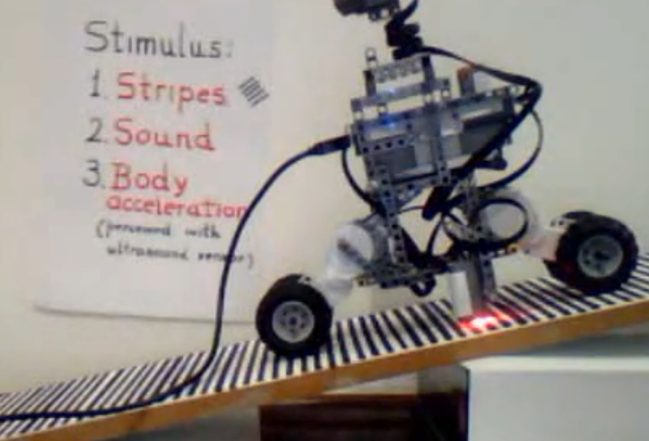
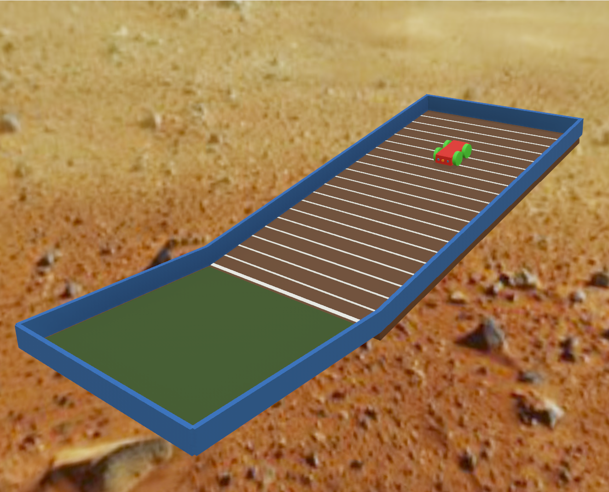

# A rede de quatro neurônios

Este documento apresenta a rede neural plástica utilizada no experimento de forma progressiva: primeiro a estrutura e os conceitos, depois cada transformação matemática na mesma ordem em que ela ocorre durante uma iteração real da simulação.

## O que essa rede faz

A rede recebe sinais do ambiente, escolhe uma das quatro ações motoras possíveis e modifica seu próprio estado para favorecer ações que no passado produziram movimentos em direção à meta.

Ela não usa camadas profundas, função de perda, dados rotulados nem retropropagação de erro. A adaptação ocorre a partir do retorno sensorial produzido pelas consequências das ações do próprio robô.

## Mas antes, um passo atrás: Por que?

### O ponto de partida - Doman e os Bebês

O ponto de partida não é a robótica. É uma observação sobre bebês.

Glenn Doman observou que crianças com lesões neurológicas, quando colocadas repetidamente em um plano inclinado, tendiam a desenvolver padrões de movimento em direção à descida. O estímulo da gravidade, combinado com o retorno sensorial produzido pelo próprio movimento, parecia contribuir para a organização motora mesmo em sistemas neurais comprometidos. O método ficou conhecido como *método do plano inclinado de Doman*.


Bebê em ação: https://www.youtube.com/watch?v=6yrWI3MedFc

### A pergunta do artigo de 2011

No artigo *Doman's Inclined Floor Method for Early Motor Organization Simulated with a Four Neurons Robot (2011)* de Ropero Peláez e Lucas Santana (2011) a pergunta colocada é: é possível reproduzir, ainda que de forma simplificada, o mecanismo pelo qual esses estímulos se traduzem em organização motora? E aqui entendemos a inversão do que uma rede neural normalmente se propõe, em vez de treiná-la para resolver um problema, a rede é construída para observar um fenômeno.

> **Isso é um ponto importante**: a rede não é um fim em si mesma, mas um meio para estudar plasticidade e organização motora emergente.

A resposta foi construir um robô ligado a quatro neurônios plásticos com arquitetura bem definida sobre um plano inclinado com estímulos também controlados. O robô recebe aceleração, estímulos visuais das faixas da rampa e o som de uma maraca quando se move em direção à meta. Esses estímulos modulam os mecanismos de plasticidade da rede que ao longo das iterações tende a favorecer as sequências motoras que os produziram.

O robô e a rede são meios de entender melhor plasticidade e organização motora em bebês.



Robô em ação: https://www.youtube.com/shorts/DoPYKvXyYS8

### Este projeto

Este projeto reproduz computacionalmente esse experimento, mantendo fidelidade ao artigo onde os detalhes foram publicados e documentando explicitamente onde foi necessário assumir hipóteses, atualizando os meios computacionais e de hardware, mantendo reprodutibilidade e código abertos.

### A direção aberta

Neste ponto o projeto abre uma porta interessante: a rede de 2011 foi construída com o que tínhamos disponível em neurociência e conceitos de plasticidade disponíveis naquele momento. Isso faz 10 anos. A neurociência da última década trouxe avanços profundos e descrições mais detalhadas de como a plasticidade opera em redes pequenas - incluindo mecanismos de metaplasticidade e homeostase que não estavam formalizados.

Reproduzir o artigo é o ponto de partida, mas ter uma plataforma onde a rede pode ser revisada, comparada e atualizada com esses achados mais recentes é o que torna o projeto relevante além da reprodução.




## Os quatro neurônios e o que cada um controla

Cada neurônio está associado a uma ação motora abstrata sobre dois conjuntos de rodas do robô:

| Neurônio | Ação                                     |
| -- | - |
| N1       | conjunto frontal, sentido horário        |
| N2       | conjunto frontal, sentido anti-horário   |
| N3       | conjunto traseiro, sentido horário       |
| N4       | conjunto traseiro, sentido anti-horário  |

O neurônio não comanda velocidades individuais de roda. Ele escolhe uma ação abstrata. Um adaptador separado traduz essa escolha nos comandos concretos enviados ao simulador.

**A competição entre os neurônios é, ao mesmo tempo, uma competição entre quatro ações motoras.**


## A matriz de conexões

A rede é totalmente interconectada: cada neurônio recebe sinais de todos os outros e de si mesmo.

A convenção da matriz é:

```text
W[i][j] = peso da conexão de Nj para Ni
linha  = neurônio que recebe
coluna = neurônio que envia
```

A matriz completa tem 4 × 4 = 16 entradas:

| **Recebe ↓ / Envia →** | **N1** | **N2** | **N3** | **N4** |
| - | --: | --: | --: | --: |
| **N1**                 |    0,7 |    w₁₂ |    w₁₃ |    w₁₄ |
| **N2**                 |    w₂₁ |    0,7 |    w₂₃ |    w₂₄ |
| **N3**                 |    w₃₁ |    w₃₂ |    0,7 |    w₃₄ |
| **N4**                 |    w₄₁ |    w₄₂ |    w₄₃ |    0,7 |

As quatro entradas da diagonal (N1→N1, N2→N2, etc.) são as **conexões autorrecorrentes**. Elas têm peso fixo **0,7** e nunca mudam durante o experimento.

As outras doze entradas são as **conexões plásticas**: iniciam com valores aleatórios entre 0,1 e 0,9 e podem aumentar ou diminuir a cada iteração.

> A escolha dos valores iniciais aleatórios é uma hipótese da reconstrução, pois o artigo não publica os valores iniciais das doze conexões modificáveis.


## As três entradas sensoriais

A rede recebe, a cada iteração, três sinais do ambiente:

| Canal         | O que representa                                                     |
| - | -- |
| Aceleração    | variação da aceleração longitudinal medida pelo acelerômetro         |
| Visão         | transições detectadas pelo sensor de luz nas faixas da rampa         |
| Som           | estímulo produzido por uma maraca após movimentos em direção à meta  |

Os três canais são somados e o resultado é apresentado igualmente a todos os quatro neurônios. Não há um sensor exclusivo de cada neurônio.


## Os dois mecanismos de plasticidade

A rede possui dois mecanismos distintos de adaptação que operam em paralelo a cada iteração:

| Característica     | Sináptica                                | Intrínseca                                |
| ------------------ | ---------------------------------------- | ----------------------------------------- |
| O que muda?        | Peso da conexão entre neurônios          | `shift` interno de cada neurônio          |
| Onde ocorre?       | Entre dois neurônios                     | Dentro do próprio neurônio                |
| Representação      | Matriz W (12 valores modificáveis)       | Vetor de quatro `shifts`                  |
| Efeito principal   | Altera quais transições são favorecidas  | Altera quão fácil é cada neurônio vencer  |
| Papel no sistema   | Formação de sequências motoras           | Regulação da excitabilidade individual    |

A **plasticidade sináptica** muda a eficácia da conexão: o efeito que um neurônio exerce sobre outro.

A **plasticidade intrínseca** muda a excitabilidade do neurônio em si: o quanto de ativação ele precisa para produzir uma saída elevada.


## O fluxo completo de uma iteração

A sequência abaixo descreve exatamente o que acontece dentro do método `step()` a cada iteração da simulação, na ordem em que cada transformação ocorre.


### Passos 1 a 3 - Receber e combinar os estímulos sensoriais

A rede recebe os valores brutos dos três canais. Antes de usá-los, cada canal passa por uma transformação linear independente:

$$
\widetilde{x}_k(t) = \bigl(x_k(t) - o_k\bigr)\, s_k, \qquad k \in \{a, v, s\}
$$

Onde $x_k(t)$ é o valor bruto do canal $k$, $o_k$ é um deslocamento de referência e $s_k$ é um fator de escala.

> **Em palavras:** subtraia um valor de referência e multiplique por uma escala. Isso permite que canais com grandezas diferentes entrem na rede em uma faixa comparável.

Os três valores normalizados são então somados em uma única entrada sensorial comum a todos os neurônios:

$$
S(t) = \widetilde{x}_a(t) + \widetilde{x}_v(t) + \widetilde{x}_s(t)
$$

> **Em palavras:** aceleração transformada + visão transformada + som transformado. Todos os quatro neurônios recebem exatamente esse mesmo total.


### Passos 4 e 5 - Calcular a ativação de cada neurônio

A ativação de cada neurônio combina a entrada sensorial atual com a atividade que a rede produziu na iteração anterior:

$$
a_i(t) = S(t) + \sum_{j=1}^{4} W_{ij}(t)\, O_j^c(t-1)
$$

Onde $W_{ij}(t)$ é o peso da conexão de $N_j$ para $N_i$, e $O_j^c(t-1)$ é a saída do neurônio $j$ após a competição da iteração anterior.

> **Em palavras:** some a entrada sensorial com a contribuição de cada neurônio anterior, pesada pelas conexões. Como a competição normalmente deixa apenas um neurônio ativo, em geral somente o vencedor da iteração anterior contribui para a soma recorrente.

Isso é o que permite à rede aprender **sequências**: se N2 venceu antes, a coluna N2 da matriz W determina quanto cada neurônio atual será favorecido agora.


### Passo 6 - Transformar ativação em saída pela função sigmoidal

A ativação de cada neurônio é convertida em uma saída entre 0 e 1:

$$
O_i(t) = \frac{1}{1 + \exp\!\bigl[-25\,(a_i(t) - \theta_i(t))\bigr]}
$$

Onde $\theta_i(t)$ é o `shift` individual do neurônio $i$ e 25 é o ganho da sigmoide (valor adotado do artigo).

> **Em palavras:** compare a ativação com o `shift` do neurônio. Se estiver bem acima do `shift`, a saída fica próxima de 1. Se estiver bem abaixo, próxima de 0. O ganho 25 torna essa transição bastante abrupta: uma pequena diferença entre ativação e `shift` já produz saídas claramente altas ou baixas.

O `shift` $\theta_i$ é o ponto em que a sigmoide do neurônio $i$ está centrada. Ele pode mudar a cada iteração pela plasticidade intrínseca, efetivamente deslocando a curva para a esquerda ou para a direita.


### Passo 7 - Escolher o neurônio vencedor

Após calcular as quatro saídas, a rede seleciona aquela com maior valor:

$$
w(t) = \underset{i \in \{1,2,3,4\}}{\operatorname{arg\,max}}\; O_i(t)
$$

> **Em palavras:** vence o neurônio com a maior saída sigmoidal. Em caso de empate exato, o vencedor é sorteado entre os empatados (hipótese operacional, pois o artigo não especifica esse caso).


### Passo 8 - Zerar os perdedores

Após a seleção, a saída competitiva é definida:

$$
O_i^c(t) =
\begin{cases}
O_i(t), & \text{se } i = w(t) \\
0,       & \text{se } i \neq w(t)
\end{cases}
$$

> **Em palavras:** o vencedor preserva seu valor sigmoidal. Todos os demais recebem zero. Isso implementa a competição: em cada iteração, apenas uma ação é selecionada.


### Passo 9 - Atualizar os pesos sinápticos

Com o vencedor definido, os pesos das conexões que chegam a ele são ajustados pela regra pré-sináptica de Grossberg:

$$
\Delta W_{ij}(t) = \varepsilon\, O_j^c(t-1)\, \bigl(a_i(t) - W_{ij}(t)\bigr)
$$

O novo peso é:

$$
W_{ij}(t+1) = W_{ij}(t) + \Delta W_{ij}(t)
$$

Onde $\varepsilon$ é a taxa de plasticidade sináptica e $O_j^c(t-1)$ é a saída competitiva do neurônio de origem na iteração anterior.

> **Em palavras:** se o neurônio de origem esteve ativo antes, o peso da conexão dele para o vencedor atual é ajustado em direção à ativação atual do vencedor. Se a ativação for maior que o peso existente, o peso aumenta. Se for menor, o peso diminui. Se o neurônio de origem não esteve ativo ($O_j^c(t-1) = 0$), o peso não muda.

O termo $(a_i - W_{ij})$ funciona como uma realimentação negativa: quanto maior o peso já existente, menor tende a ser o aumento adicional. O artigo relaciona essa propriedade à metaplasticidade.

**As conexões da diagonal permanecem fixas em 0,7 e são reafirmadas após cada passo**, porque o artigo estabelece que as autorrecorrências não são modificáveis.

Uma consequência direta: se o mesmo neurônio vencer duas iterações seguidas, a transição envolveria a diagonal, que é fixa, e nenhum peso modificável é alterado. A rede aprende principalmente transições entre neurônios diferentes.


### Passo 10 - Atualizar os `shifts` intrínsecos

Independentemente da plasticidade sináptica, o `shift` de cada neurônio é recalculado:

$$
\theta_i(t+1) = \frac{\xi\, O_i^c(t) + \theta_i(t)}{1 + \xi}
$$

Onde $\xi$ é a taxa de plasticidade intrínseca.

> **Em palavras:** o novo `shift` é uma média ponderada entre o `shift` anterior e a saída atual do neurônio. A taxa $\xi$ determina a velocidade de adaptação.

**Para o vencedor:** sua saída competitiva é positiva, então o `shift` se move em direção a esse valor. Se a saída for alta, o `shift` aumenta. Na iteração seguinte, esse neurônio precisará de mais ativação para produzir a mesma saída - fica mais difícil de vencer novamente.

**Para os perdedores:** a saída competitiva é zero, então a fórmula se reduz a:

$$
\theta_i(t+1) = \frac{\theta_i(t)}{1 + \xi}
$$

O `shift` diminui gradualmente. Com o `shift` menor, a sigmoide se desloca para a esquerda e o neurônio fica mais responsivo - mais fácil de voltar a competir.

Esse mecanismo funciona como uma regulação homeostática da excitabilidade:

```
neurônio vence muito  → shift aumenta → mais difícil vencer novamente
neurônio perde muito  → shift diminui → mais fácil voltar a competir
```


### Passo 11 - Guardar o estado para a próxima iteração

A saída competitiva $O_i^c(t)$ calculada nesta iteração é armazenada. Ela será usada como $O_j^c(t-1)$ nos passos 5 e 9 da próxima iteração.

> Este é o mecanismo de memória de curto prazo da rede: o único estado que persiste entre iterações são as saídas competitivas e os pesos acumulados.


### Passo 12 - Converter o vencedor em ação motora

O índice do neurônio vencedor é convertido diretamente em uma das quatro ações:

| Índice | Ação motora                              |
| --: | - |
| 0      | conjunto frontal, sentido horário        |
| 1      | conjunto frontal, sentido anti-horário   |
| 2      | conjunto traseiro, sentido horário       |
| 3      | conjunto traseiro, sentido anti-horário  |

Essa ação é enviada ao adaptador do robô, que a traduz nos comandos concretos de velocidade para cada motor. A rede só conhece o índice; os detalhes do hardware são responsabilidade do adaptador.


## O ciclo completo em forma causal

```
consequência da ação anterior (ambiente)
  → aceleração, visão e som              [passos 1–3]
  → soma sensorial S(t)                  [passo 3]
  → ativação a_i(t)                      [passos 4–5]
  → saída sigmoidal O_i(t)               [passo 6]
  → neurônio vencedor w(t)               [passo 7]
  → saída competitiva O_i^c(t)           [passo 8]
  → plasticidade sináptica W(t+1)        [passo 9]
  → plasticidade intrínseca θ(t+1)       [passo 10]
  → estado salvo para próxima iteração   [passo 11]
  → ação motora executada                [passo 12]
  → nova consequência do ambiente...
```


## Como a aprendizagem emerge

Imagine que a sequência de vencedores N1 → N3 → N2 produza descida na rampa.

A descida gera estímulos sensoriais mais intensos: maior aceleração, mais transições visuais e o som da maraca. Isso aumenta $S(t)$ e, por consequência, a ativação de todos os neurônios.

Com ativações maiores, as atualizações de peso pelo passo 9 tendem a ser mais expressivas. As conexões N1→N3 e N3→N2 são reforçadas ao longo de repetições.

Depois de muitas iterações bem-sucedidas, forma-se uma cadeia de pesos fortalecidos:

```
N1 favorece N3
N3 favorece N2
```

Essa cadeia representa uma sequência motora que o sistema passou a preferir porque ela foi consistentemente associada a estímulos mais intensos.


## O que vem do artigo e o que é hipótese da reconstrução

### Diretamente sustentado pelo artigo

- quatro neurônios excitatórios do tipo *rate-code*;
- rede totalmente interconectada;
- soma dos três estímulos sensoriais;
- quatro ações motoras;
- autorrecorrência fixa em 0,7;
- doze conexões modificáveis;
- sigmoide com ganho 25;
- regra pré-sináptica de Grossberg;
- plasticidade intrínseca;
- competição com apenas um neurônio ativo por iteração.

### Hipóteses ou decisões da reconstrução

- pesos iniciais sorteados uniformemente entre 0,1 e 0,9;
- $\varepsilon = 0{,}01$;
- $\xi = 0{,}01$;
- `shift` inicial = 0,5;
- usar a saída competitiva anterior como entrada pré-sináptica $I_j$;
- atualizar somente os pesos que chegam ao vencedor atual (`winner_only`);
- usar a saída pós-competição na plasticidade intrínseca;
- desempatar por sorteio;
- normalização linear explícita dos canais sensoriais.

Essas decisões não estão necessariamente erradas. O importante é tê-las identificadas como hipóteses para que possam ser testadas sistematicamente.
